# Langchain

作者:`@xieleihan`[点击访问](https://github.com/xieleihan)

本文遵守开源协议GPL3.0

# Langchain 中对chain的讲解延拓

## chain的介绍

这里我做了张图,来解释`chain`最主要的作用

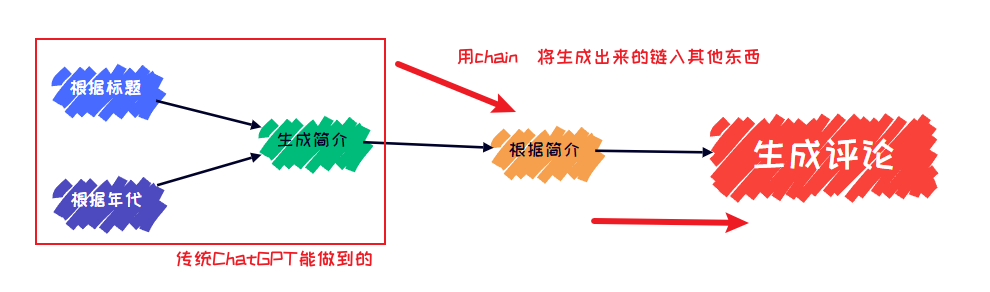

> 在简单应用中，单独使用LLM是可以的， 但更复杂的应用需要将LLM进行链接 - 要么相互链接，要么与其他组件链接。
>
> LangChain为这种"链接"应用提供了**Chain**接口。我们将链定义得非常通用，它是对组件调用的序列，可以包含其他链。

## 为什么我们需要链?

> 链允许我们将多个组件组合在一起创建一个单一的、连贯的应用。例如，我们可以创建一个链，该链接收用户输入，使用`PromptTemplate`对其进行格式化，然后将格式化后的响应传递给LLM。我们可以通过将多个链组合在一起或将链与其他组件组合来构建更复杂的链。

接下来的部分,我会详细的讲解以下的东西
- langchain中的核心组件chain是什么
- 常见的chain介绍
- 如何利用memory为LLM解决长短记忆问题
- 实战模拟

## 四种基础的内置链的介绍与使用

### `LLMChain`内置链

- 这是最常用的链式
- 提示词模版+`(LLM/chatModel)+输出格式化器(可选)`
- 支持多种调用方式

```python
# LLMChain
# 首先导入我们的模块
import os

from dotenv import find_dotenv, load_dotenv

load_dotenv(find_dotenv())
api_key = os.getenv("DASHSCOPE_API_KEY")

from langchain.llms import Tongyi
from langchain.chains import LLMChain
from langchain.prompts import PromptTemplate

llm = Tongyi(
    model = "Qwen-max",
    temperature = 0,
    dashscope_api_key = api_key
)

prompt_template = "帮我给{product}想三个可以注册的域名?"

llm_chain =LLMChain(
    llm = llm,
    prompt = PromptTemplate.from_template(prompt_template),
    verbose = True # 是否开启日志
)

# llm_chain("AI学习")
llm_chain("AI学习")
```

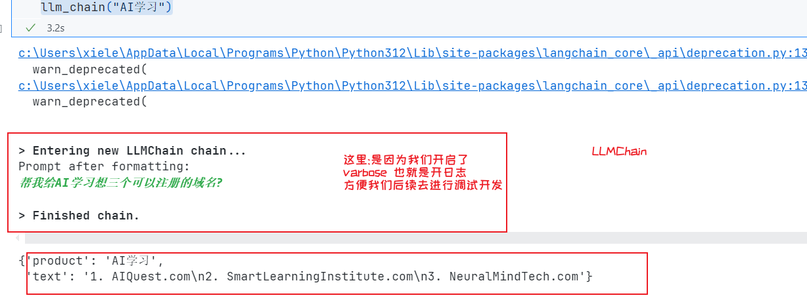

可以看到,`LLMChain`是一个非常简单的一个内置链,使用起来和理解起来都没有任何难度

### `SequentialChain(顺序链)` 内置链

`SequentialChain(顺序链)`有几个特性

- 顺序执行
- 把前一个LLM的输出,作为后一个LLM的输入

这个下面很多子类

包括了

1. `SimpleSequentialChain`:**simpleSequentialChain 只支持固定的链路**

	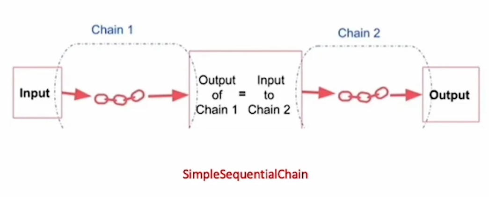

2. `SequentialChain`:**SequentialChain 支持多个链路的顺序执行**

	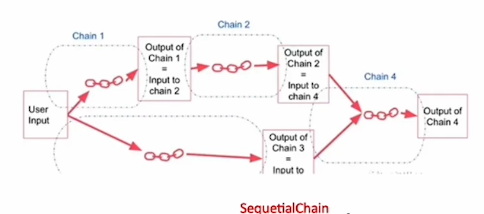

OK,直接例子说明

```python
# 导入模块
from langchain.chains import LLMChain, SimpleSequentialChain
from langchain_community.chat_models import ChatTongyi
from langchain.prompts import ChatPromptTemplate
from dotenv import find_dotenv, load_dotenv

# 加载 API key
load_dotenv(find_dotenv())
api_key = os.getenv("DASHSCOPE_API_KEY")

# 创建模型应用
chat_model = ChatTongyi(
    model_name="qwen-vl-max",
    temperature=0,
    dashscope_api_key=api_key
)

# 第一个链的提示模板
first_prompt = ChatPromptTemplate.from_template(
    "请帮我给{product}的公司起一个响亮容易记忆的名字"
)

chain_one = LLMChain(
    llm=chat_model,
    prompt=first_prompt,
    verbose=True
)

# 第二个链的提示模板
second_prompt = ChatPromptTemplate.from_template(
    "用五个词语来描述一下这个公司的名字:{input}"
)

chain_two = LLMChain(
    llm=chat_model,
    prompt=second_prompt,
    verbose=True,
)

# 创建顺序链
overall_simple_chain = SimpleSequentialChain(
    chains=[chain_one, chain_two],
    verbose=True,
)

# 调用顺序链
overall_simple_chain.run({"Google"})
```

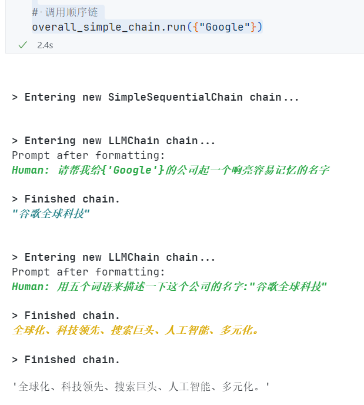

然后我们来尝试使用多重顺序链的

```python
# 支持多重链顺序执行
# 导入模块
from langchain.chains import LLMChain, SimpleSequentialChain, SequentialChain
from langchain_community.chat_models import ChatTongyi
from langchain.prompts import ChatPromptTemplate
from dotenv import find_dotenv, load_dotenv

# 加载 API key
load_dotenv(find_dotenv())
api_key = os.getenv("DASHSCOPE_API_KEY")

# 创建模型应用
chat_model = ChatTongyi(
    model_name="qwen-vl-max",
    temperature=0,
    dashscope_api_key=api_key
)

# chain 1 任务: 翻译成中文
first_prompt = ChatPromptTemplate.from_template("把下面的内容翻译成中文:\n\n{content}")
chain_one = LLMChain(
    llm = llm,
    prompt = first_prompt,
    verbose =True,
    output_key = "Chinese_Rview"
)

# chain 2 任务: 对翻译后的中文进行总结摘要 input_key是上一个chain的output_key
second_prompt = ChatPromptTemplate.from_template("把下面的内容总结成摘要:\n\n{Chinese_Rview}")
chain_two = LLMChain(
    llm = llm,
    prompt = second_prompt,
    verbose =True,
    output_key = "Chinese_Summary"
)

# chain 3 任务:智能识别语言 input_key是上一个chain的output_key
third_prompt = ChatPromptTemplate.from_template("请智能识别出这段文字的语言:\n\n{Chinese_Summary}")
chain_three = LLMChain(
    llm = llm,
    prompt = third_prompt,
    verbose =True,
    output_key = "Language"
)

# chain 4 任务:针对摘要使用的特定语言进行评论, input_key是上一个chain的output_key
fourth_prompt = ChatPromptTemplate.from_template("请使用指定的语言对以下内容进行回复:\n\n内容:{Chinese_Summary}\n\n语言:{Language}")
chain_four = LLMChain(
    llm=llm,
    prompt=fourth_prompt,
    verbose=True,
    output_key="Reply",
)

#overall 任务：翻译成中文->对翻译后的中文进行总结摘要->智能识别语言->针对摘要使用指定语言进行评论
overall_chain = SequentialChain(
    chains=[chain_one, chain_two, chain_three, chain_four],
    verbose=True,
    input_variables=["content"],
    output_variables=["Chinese_Rview", "Chinese_Summary", "Language", "Reply"],
)

#读取文件
content = "Recently, we welcomed several new team members who have made significant contributions to their respective departments. I would like to recognize Jane Smith (SSN: 049-45-5928) for her outstanding performance in customer service. Jane has consistently received positive feedback from our clients. Furthermore, please remember that the open enrollment period for our employee benefits program is fast approaching. Should you have any questions or require assistance, please contact our HR representative, Michael Johnson (phone: 418-492-3850, email: michael.johnson@example.com)."
overall_chain(content)
```

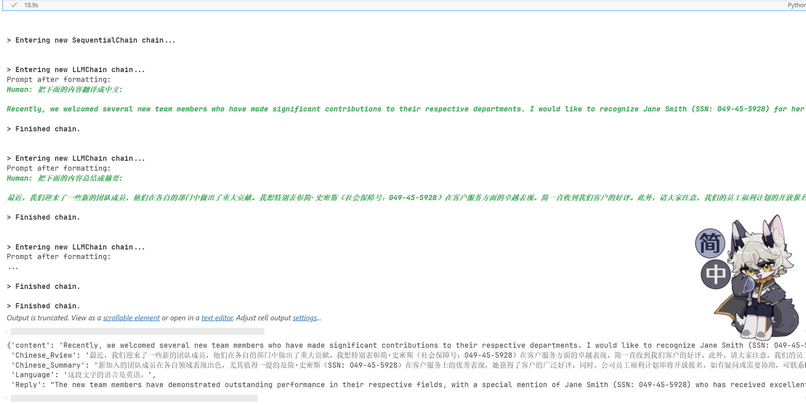

### `RouterChain(路由链)` 内置链

`RouterChain`又叫路由链,相信大家对于这个路由这个概念应该有所了解了,这是langchain内置的一个非常强大的`Chain`,可以运用在非常多的一些地方,我们来看下他有哪些特点

- 首先路由链支持创建一个非确定的链,**由LLM来选择下一步**
- 链内多个`prompt`模版描述了不同的提示请求

这里放张官方的图

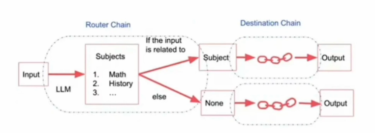

来个示例说明一下

```python
# 这里演示我先定义两个不同方向的链
# 首先先导入模块
from langchain.prompts import PromptTemplate
from dotenv import find_dotenv, load_dotenv
import os
# 加载 API key
load_dotenv(find_dotenv())
api_key = os.getenv("DASHSCOPE_API_KEY")
# 比如我定义一个有关物理的链
physics_template = """
    你是一个非常聪明的物理学学家\n
    你擅长以比较直观的语言来回答所有向你提问的的物理问题.\n
    当你不知道问题的答案的时候,你会直接回答你不知道.\n
    下面是我提出的一个问题,请帮我解决:
    {input}
"""
physics_prompt = PromptTemplate.from_template(physics_template)

# 我们再定义一个数学链
math_template = """
    你是一个可以解答所有问题的数学家.\n
    你非常擅长回答数学问题,基本没有问题能难倒你.\n
    你很优秀,是因为你擅长把困难的数学问题分解成组成的部分,回答这些部分,然后再将它们组合起来.\n
    下面是一个问题:
    {input}
"""
math_prompt = PromptTemplate.from_template(math_template)

# 再导入必要的包
from langchain.chains import ConversationChain
from langchain.llms import Tongyi
from langchain.chains import LLMChain

prompt_infos = [
    {
        "name" : "physics",
        "description" : "擅长回答物理问题",
        "prompt_template" : physics_template
    },
    {
        "name" : "math",
        "description" : "擅长回答数学问题",
        "prompt_template" : math_template
    }
]

llm = Tongyi(
    temperature=0,
    model= "Qwen-max",
    dashscope_api_key = api_key
)

destination_chain = {}
for p_info in prompt_infos:
    name = p_info["name"]
    prompt_template = p_info["prompt_template"]
    prompt = PromptTemplate(template=prompt_template, input_variables=["input"])
    chain = LLMChain(
        llm = llm,
        prompt = prompt
    )
    destination_chain[name] = chain
    default_chain = ConversationChain(
        llm = llm,
        output_key = "text"
    )

from langchain.chains.router.llm_router import LLMRouterChain,RouterOutputParser
from langchain.chains.router.multi_prompt_prompt import MULTI_PROMPT_ROUTER_TEMPLATE
from langchain.chains.router import MultiPromptChain

destinations = [f"{p['name']}:{p['description']}" for p in prompt_infos]
destinations_str = "\n".join(destinations)
router_template = MULTI_PROMPT_ROUTER_TEMPLATE.format(destinations=destinations_str)
print(MULTI_PROMPT_ROUTER_TEMPLATE)

router_prompt = PromptTemplate(
    template= router_template,
    input_variables = ["input"],
    output_parser = RouterOutputParser()
)
router_chain = LLMRouterChain.from_llm(
    llm,
    router_prompt
)

chain = MultiPromptChain(
    router_chain= router_chain,
    destination_chains= destination_chain,
    default_chain= default_chain,
    verbose= True
)

# chain.run("什么是牛顿第一定律?")
# chain.run("物理中,鲁智深倒拔垂杨柳")
# chain.run("1+4i=0")
# chain.run("两个黄鹂鸣翠柳，下一句?")
chain.run("2+2等于几?")
```

通过上面的调用,可以看到,我们已经实现了`RouterChain`的使用

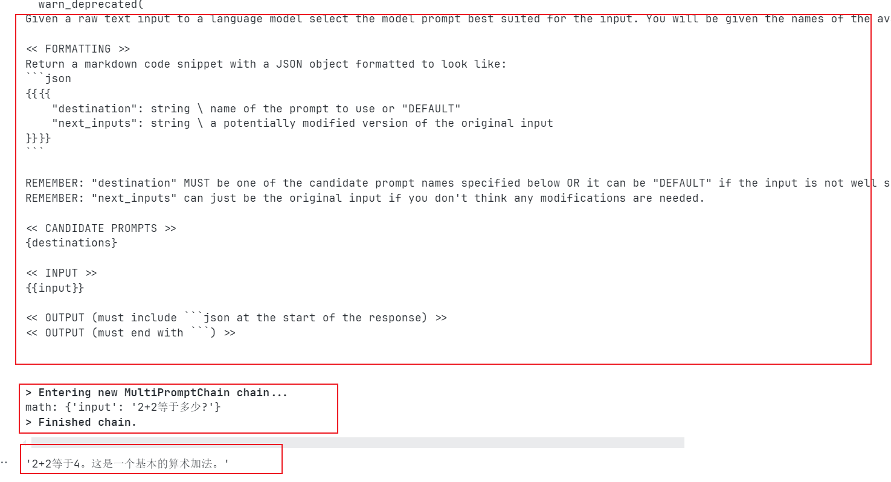

> 🔭:这里的话,只调用了一个问题,剩下的可以自己去试试

### `Transformation(转换链)` 内置链

这个严格意义上,不算`chain`的一种,它是一个转换方式

它有以下特点:

- 支持对传递部件的一个转换
- 比如将一个超长文本过滤转换为仅包含前三个段落,然后提交给LLM

这里一样的给一个示例

```python
# 先导入一个模块
from langchain.prompts import PromptTemplate
from dotenv import find_dotenv, load_dotenv
import os
# 加载 API key
load_dotenv(find_dotenv())
api_key = os.getenv("DASHSCOPE_API_KEY")
from langchain.llms import Tongyi
prompt = PromptTemplate.from_template(
    """
    对以下文档的文字进行总结:
    {output_text}
    总结:
    """
)

llm = Tongyi(
    dashscope_api_key = api_key,
    model = "Qwen-max",
    temperature =0
)

with open("./letter.txt", encoding= 'utf-8') as f:
    letters = f.read()

# 再导入我们必须的模块
from langchain.chains import(
    LLMChain,
    SimpleSequentialChain,
    TransformChain
)

# 定义一个函数
def transform_func(inputs: dict) -> dict:
    text = inputs["text"]
    shortened_text = "\n\n".join(text.split("\n\n")[:3])
    return {"output_text": shortened_text}

# 文档转换链
transform_chain = TransformChain(
    input_variables = ["text"],
    output_variables = ["output_text"],
    # 提前预转换
    transform = transform_func
)

template = """
    对下面的文字进行总结:
    {output_text}
    总结:
"""

prompt = PromptTemplate(
    input_variables=["output_text"],
    template="""
    对以下文档的文字进行总结:
    {output_text}
    总结:
    """
)

llm_chain = LLMChain(
    llm = Tongyi(),
    prompt = prompt
)

# 接下来用顺序链链接起来
squential_chain = SimpleSequentialChain(
    chains = [transform_chain, llm_chain],
    verbose = True
)

# 激活
squential_chain.run(letters)
```

其实这个转换方式,就是对文档进行提前预先解析

然后,我们可以看到输出结果:

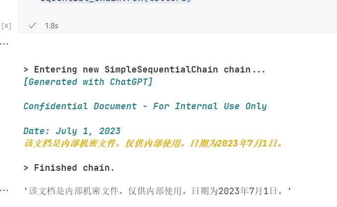

## 链的不同调用方法和自定义链

### 使用文件加载专用chain

> 这里因为要使用到科学计算,所以需要先安装一个包

```python
! pip install numexpr
```

然后的话,我以一个比较简单的例子来说明

```python
# 首先导入模块
from langchain.chains import load_chain

chain = load_chain("lc://chains/llm-math/chain.json")

print(chain.run("2+6等于几?"))
```

OK,这一部分运行后必然会出现一个问题,就是`RuntimeError`

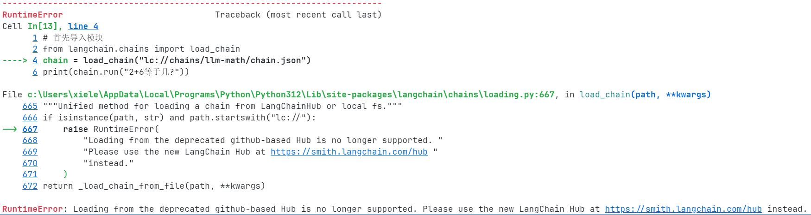

这里的话,我已经查到问题的所在,并且会给出两个解决方案,但是这两方案均不可用

我引入系统给出的提示

> **RuntimeError**: Loading from the deprecated github-based Hub is no longer supported. Please use the new LangChain Hub at https://smith.langchain.com/hub instead.
>
> 翻译(使用Deepl):
>
> **运行时错误**： 不再支持从过时的基于 github 的 Hub 加载。请使用 https://smith.langchain.com/hub 上的新 LangChain Hub。

然后官网上这样说的:`load_chain在新版的langchain中已经被遗弃，主要出于商业和安全的考虑`

方案一:

安装一个包

```python
! pip install langchainhub
```

换用成这个包或许有用

方案二:

官网使用新的Hub:[点击访问](https://smith.langchain.com/hub)

这里需要去申请`langchain的api`:注册域名:[点击访问](https://smith.langchain.com/)

这里申请一个`langchain_api_key`,使用api去访问,或许有用

OK,这里就不放运行截图,因为我这边是测试不通过的.然后简中互联网区基本找不到有用的答案

### 自定义链

那下面讲的就是关于自定义链方面的介绍

自定义的好处在于,当langchain自带的内置链不满足我们的需要的时候,就可以通过自定义的链,来实现我们的功能

依旧是直接给代码

```python
# 导入必要的库和模块
from typing import List, Dict, Any, Optional
from langchain.callbacks.manager import CallbackManagerForChainRun
from langchain.chains.base import Chain
from langchain.prompts.base import BasePromptTemplate
from langchain.base_language import BaseLanguageModel
from langchain.chat_models import ChatTongyi
from langchain.llms import Tongyi
from langchain.prompts import PromptTemplate
from dotenv import find_dotenv, load_dotenv
import os

# 自定义链类WikiArticleChain，继承自Chain基类
class WikiArticleChain(Chain):
    """
    开发一个wiki文章的生成器
    """
    prompt: BasePromptTemplate
    llm: BaseLanguageModel
    out_key: str = "text"

    # @property注解，定义一个静态方法来获取输入键
    @property
    def input_keys(self) -> List[str]:
        """
        返回prompt所需的所有键
        """
        return self.prompt.input_variables
    
    # @property注解，定义一个静态方法来获取输出键
    @property
    def output_keys(self) -> List[str]:
        """
        将始终返回text键
        """
        return [self.out_key]
    
    # 定义链调用时的主要逻辑
    def _call(
            self,
            inputs: Dict[str, Any],
            run_manager: Optional[CallbackManagerForChainRun] = None,
        ) -> Dict[str, Any]:
        """
        运行链
        """
        # 格式化输入的提示
        prompt_value = self.prompt.format(**inputs)
        # 使用llm生成文本
        response = self.llm.generate([prompt_value], callbacks=run_manager.get_child() if run_manager else None)
        if run_manager:
            run_manager.on_text("wiki article is written")
        
        # 从response中提取生成的文本
        generated_text = response.generations[0][0].text if response.generations else ""
        return {self.out_key: generated_text}
    
    # 定义链的类型
    @property
    def _chain_type(self) -> str:
        """链类型"""
        return "wiki_article_chain"

# 加载 .env 文件中的 API key
load_dotenv(find_dotenv())
api_key = os.getenv("DASHSCOPE_API_KEY")

# 创建WikiArticleChain实例
chain = WikiArticleChain(
    prompt=PromptTemplate(
        template="写一篇关于{topic}的维基百科形式的文章",
        input_variables=["topic"]
    ),
    llm=Tongyi(
        temperature=0,  # 设置温度参数，决定生成文本的多样性
        model="Qwen-max",  # 指定模型
        dashscope_api_key=api_key  # 使用加载的API key
    )
)

# 运行链，生成关于"python"的文章
result = chain({"topic": "python"})
print(result)
```

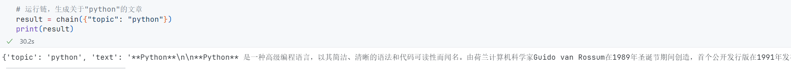

### 四种处理文档的预制链,轻松实现文档对话

#### `Stuff document`

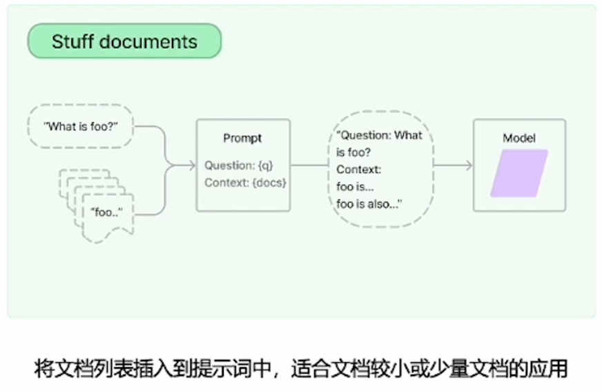

```python
# 第一种:StuffChain
# 是一个最常见的文档链,将文档直接塞进我们的prompt中,为LLM回答问题提供上下文资料,适合小文档场景

# 导入模块
from dotenv import find_dotenv, load_dotenv
import os
# 加载 API key
load_dotenv(find_dotenv())
api_key = os.getenv("DASHSCOPE_API_KEY")

from langchain.chains.combine_documents.stuff import StuffDocumentsChain
from langchain.chains import LLMChain
from langchain.prompts import PromptTemplate
from langchain.document_loaders import PyPDFLoader
from langchain_community.chat_models import ChatTongyi

loader = PyPDFLoader('./loader.pdf')
# 查看一下我们读取到的文件
# print(loader.load())

prompt_template = """
    对以下文字做简洁的总结:
    {text}
    简洁的总结:
"""

prompt = PromptTemplate.from_template(
    prompt_template
)

llm = ChatTongyi(
    model_name="qwen-vl-max",
    temperature=0,
    dashscope_api_key=api_key
)
llm_chain = LLMChain(
    llm = llm,
    prompt = prompt
)

stuff_chain = StuffDocumentsChain(
    llm_chain = llm_chain,
    document_variable_name="text"
)

docs = loader.load()
print(stuff_chain.run(docs))
```

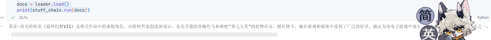

可以看到这个`StuffDocumentChain`确实已经实现,而且实现起来是最简单的方式

这里的话依旧给一个示例

```python
# 使用预封装好的load_summarize_chain
from langchain.document_loaders import PyPDFLoader
from langchain_community.chat_models import ChatTongyi
from langchain.chains.summarize import load_summarize_chain

loader = PyPDFLoader('./loader.pdf')
docs = loader.load()
llm = ChatTongyi(
    model_name='qwen-vl-max',
    temperature = 0,
    prompt = prompt
)

chain = load_summarize_chain(
    llm = llm,
    chain_type= "stuff",
    verbose = True
)

chain.run(docs)
```

然后我们来看下运行结果

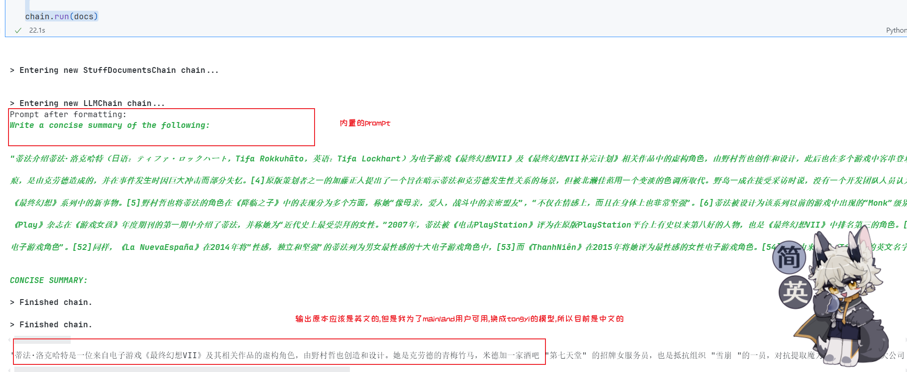

#### `Refine documents chain`

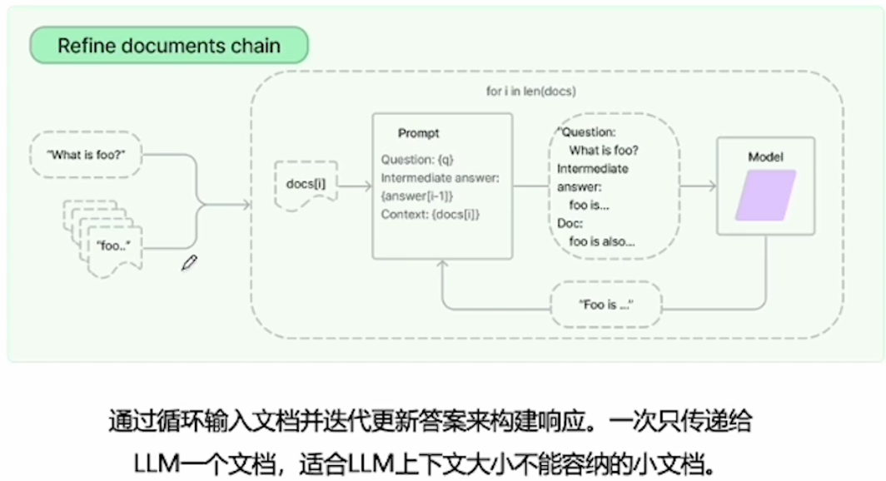

`Refine documents chain`:适合就是在LLM上下文大小跟需要传入的`document`有一定差距的情况下,使用的.它的实现是迭代的方式,来构建响应.然后的话,因为是通过循环的引用LLM,将文档不断投喂,并产生各种中间答案,适合逻辑有上下文关联的文档,不适合交叉引用

这里用一个示例,来讲解如何使用这个`Refine document chain`

```python
# 首先依旧先导入我们的模块
# 导入模块
from dotenv import find_dotenv, load_dotenv
import os
# 加载 API key
load_dotenv(find_dotenv())
api_key = os.getenv("DASHSCOPE_API_KEY")

from langchain.prompts import PromptTemplate
from langchain.document_loaders import PyPDFLoader
from langchain_community.chat_models import ChatTongyi
from langchain.text_splitter import CharacterTextSplitter
from langchain.chains.summarize import load_summarize_chain

# 加载文档
loader = PyPDFLoader('./example/fake.pdf')
docs = loader.load()

# 对文档进行切分
text_splitter = CharacterTextSplitter(
    chunk_size=1000,
    chunk_overlap=0
)
split_docs = text_splitter.split_documents(docs)

# 创建一个提问问题的模版
prompt_template = """
    对以下文字做简要的总结:
    {text}
    简洁的总结:
"""

prompt = PromptTemplate.from_template(
    prompt_template
)

# 发起提问的模版(核心)
refine_template = (
    "你的任务是产生最终的摘要\n"
    "我们已经提供了一个到某个特定点的现有回答{existing_answer}\n"
    "我们有机会通过下面的一些更多的上下文来完善现有的回答(仅在需要的时候使用).\n"
    "--------------------------------------------\n"
    "{text}\n"
    "--------------------------------------------\n"
    "根据新的上下文,用中文完善原始回答.\n"
    "如果上下文没有用处,请返回原始回答.\n"
)

refine_prompt = PromptTemplate.from_template(
    refine_template
)

# 构建一个llm
llm = ChatTongyi(
    model_name= 'qwen-vl-max',
    dashscope_api_key = api_key,
    temperature = 0
)

chain = load_summarize_chain(
    llm = llm,
    # 设置类型
    chain_type= 'refine',
    # 设置问题模版
    question_prompt = prompt,
    # 设置回答模版
    refine_prompt = refine_prompt,
    # 是否返回中间步骤
    return_intermediate_steps = True,
    # 设置输入
    input_key = 'documents',
    output_key = 'output_text'
)

# 通过上面的设置后,我们来看下成功
# 唤醒一下先(设置一个仅返回输出结果)
result = chain({'documents': split_docs}, return_only_outputs=True)

# 首先,我们看下就是迭代过程中的中间每一代
# print("\n\n".join(result['intermediate_steps'][:3]))
print(result['output_text'])
```

🚧:***这里的话,大家注意,我文档进行了一个更换,因为国内llm有那个敏感词过滤,不知道为什么出现400Error,message提示出现了敏感词***

然后,没什么影响,我们看下结果

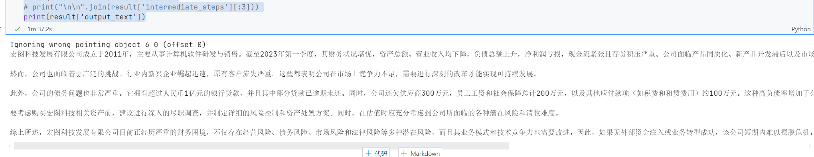

OK,看来是能够不触发敏感词了,然后,我们来看下迭代的每一代的变化是咋样的吧

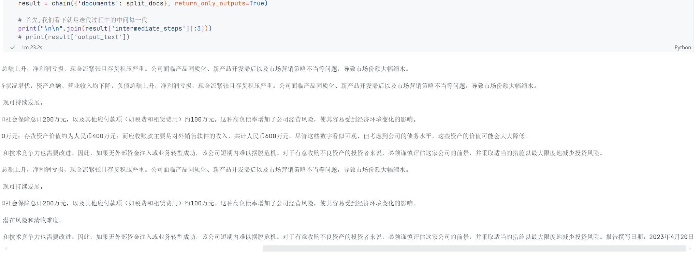

#### `Map reduce`

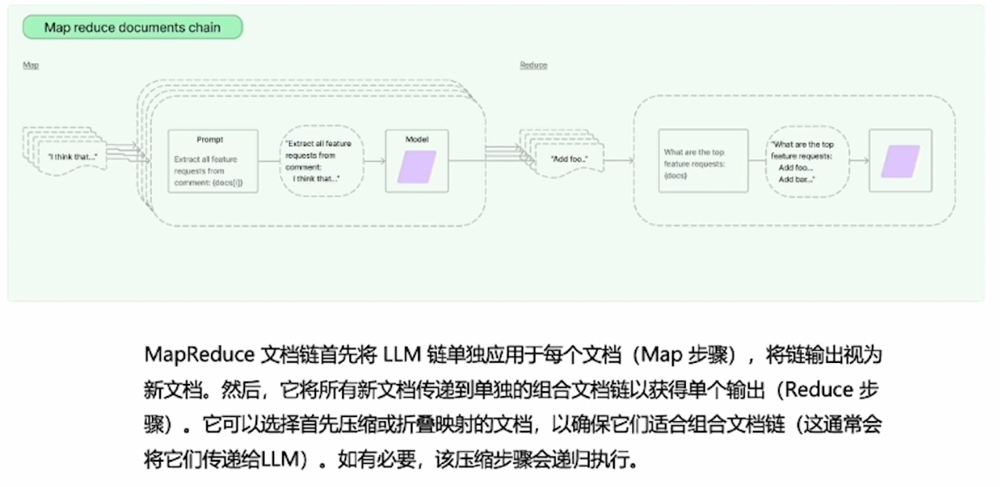

还有一张官网的图


我们用代码来讲解这张图表达的意思

```python
# 导入模块
from langchain.chains import MapReduceDocumentsChain
from langchain.chains import ReduceDocumentsChain
from langchain.chains.combine_documents.stuff import StuffDocumentsChain
from langchain.prompts import PromptTemplate
from langchain_community.chat_models import ChatTongyi
from langchain.document_loaders import PyPDFLoader
from langchain.text_splitter import CharacterTextSplitter

# 加载env file
from dotenv import find_dotenv, load_dotenv
import os
# 加载 API key
load_dotenv(find_dotenv())
api_key = os.getenv("DASHSCOPE_API_KEY")

# load pdf
loader = PyPDFLoader("./example/fake.pdf")
docs = loader.load()
# print(docs)

# 对文档进行切割
text_splitter = CharacterTextSplitter(
    chunk_size = 1000,
    chunk_overlap = 0
)

split_docs = text_splitter.split_documents(docs)
# print(split_docs)

# 设置我们的mapChain
map_template = """
    对以下文字做简洁的总结:
    '{content}'
    简洁的总结:
"""
map_prompt = PromptTemplate.from_template(map_template)

llm = ChatTongyi(
    model_name = "qwen-vl-max",
    temperature = 0,
    dashscope_api_key = api_key
)
map_chain = LLMChain(
    llm = llm,
    prompt = map_prompt
)

# reduceChain
reduce_template = """
    以下是一个摘要的集合:
    {doc_summaries}
    将上面摘要与所有关键细节进行总结.
    总结:
"""
reduce_prompt = PromptTemplate.from_template(reduce_template)
reduce_chain = LLMChain(
    prompt = reduce_prompt,
    llm = llm
)
stuff_chain = StuffDocumentsChain(
    llm_chain = reduce_chain,
    document_variable_name = "doc_summaries"
)

reduce_final_chain = ReduceDocumentsChain(
    combine_documents_chain = stuff_chain,
    # collapse_documents_chain的作用就是判断token是否会超过我们设置的max值,也就是4000,当超过的时候,切换到下一个stuff_chain
    collapse_documents_chain = stuff_chain,
    token_max = 4000
)

# map reduce chain
map_reduce_chain = MapReduceDocumentsChain(
    llm_chain = map_chain,
    document_variable_name= "content",
    reduce_documents_chain= reduce_final_chain,
)

# 激活我们的chain
summary = map_reduce_chain.run(split_docs)
print(summary)
```

结果是这样的

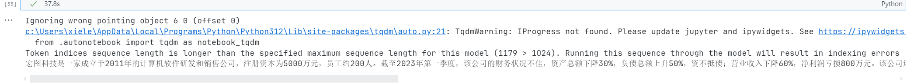

#### `Map re-rank documents chain`

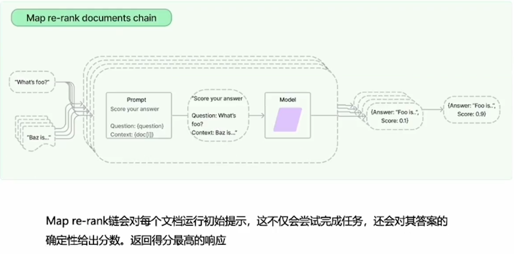

> rerank的时候，会让文档列表中的每一个文档都来回答用户问题，每个文档都会返回答案和自信心分数，分数最高的答案会被列为最终答案。这个特别适合大海捞针，当你有比较多文档，而你问的问题内容包含在某个特定文档内，这个时候rerank就可以把它找出来，而不是综合所有文档的答案来模糊的回答。

这里我依旧使用示例来讲解

```python
# 首先导入必要的模块
from langchain.chains.qa_with_sources import load_qa_with_sources_chain
from langchain.document_loaders import PyPDFLoader
from langchain_community.chat_models import ChatTongyi
from langchain.text_splitter import CharacterTextSplitter

# 导入env文件
from dotenv import find_dotenv, load_dotenv
import os
# 加载 API key
load_dotenv(find_dotenv())
api_key = os.getenv("DASHSCOPE_API_KEY")

# 定义一个llm
llm = ChatTongyi(
    model_name = "qwen-vl-max",
    dashscope_api_key = api_key,
    temperature = 0
)

# 加载文档
laoder = PyPDFLoader('./example/fake.pdf')
docs = laoder.load()

# 对文档进行一个切割
text_splitter = CharacterTextSplitter(
    chunk_size = 500,
    chunk_overlap = 0
)
split_docs = text_splitter.split_documents(docs)

# 创建chain
chain = load_qa_with_sources_chain(
    ChatTongyi(
        temperature = 0,
        dashscope_api_key = api_key,
        model_name = "qwen-vl-max"
    ),
    chain_type = "map_rerank",
    metadata_keys = ['source'],
    return_intermediate_steps = True
)

print(chain)
```

我在这里打印下结果

```text
Output:
Ignoring wrong pointing object 6 0 (offset 0)
llm_chain=LLMChain(prompt=PromptTemplate(input_variables=['context', 'question'], output_parser=RegexParser(regex='(.*?)\\nScore: (\\d*)', output_keys=['answer', 'score']), template="Use the following pieces of context to answer the question at the end. If you don't know the answer, just say that you don't know, don't try to make up an answer.\n\nIn addition to giving an answer, also return a score of how fully it answered the user's question. This should be in the following format:\n\nQuestion: [question here]\nHelpful Answer: [answer here]\nScore: [score between 0 and 100]\n\nHow to determine the score:\n- Higher is a better answer\n- Better responds fully to the asked question, with sufficient level of detail\n- If you do not know the answer based on the context, that should be a score of 0\n- Don't be overconfident!\n\nExample #1\n\nContext:\n---------\nApples are red\n---------\nQuestion: what color are apples?\nHelpful Answer: red\nScore: 100\n\nExample #2\n\nContext:\n---------\nit was night and the witness forgot his glasses. he was not sure if it was a sports car or an suv\n---------\nQuestion: what type was the car?\nHelpful Answer: a sports car or an suv\nScore: 60\n\nExample #3\n\nContext:\n---------\nPears are either red or orange\n---------\nQuestion: what color are apples?\nHelpful Answer: This document does not answer the question\nScore: 0\n\nBegin!\n\nContext:\n---------\n{context}\n---------\nQuestion: {question}\nHelpful Answer:"), llm=ChatTongyi(client=<class 'dashscope.aigc.multimodal_conversation.MultiModalConversation'>, model_name='qwen-vl-max', dashscope_api_key=SecretStr('**********'))) document_variable_name='context' rank_key='score' answer_key='answer' metadata_keys=['source'] return_intermediate_steps=True
```

这里的话,引用官方的这chain的prompt的一些定义模版

```text
"""
Use the following pieces of context to answer the question in chinese at the end. If you don't know the answer, just say that you don't know, don't try to make up an answer.\n\n
In addition to giving an answer, also return a score of how fully it answered the user's question. This should be in the following format:\n\n
Question: [question here]\n
Helpful Answer: [answer here]\n
Score: [score between 0 and 100]\n\n
How to determine the score:\n
- Higher is a better answer\n
- Better responds fully to the asked question, with sufficient level of detail\n
- If you do not know the answer based on the context, that should be a score of 0\n
- Don't be overconfident!\n\n
Example #1\n\n
Context:\n
---------\n
Apples are red\n
---------\n
Question: what color are apples?\n
Helpful Answer: red\n
Score: 100\n\n
Example #2\n\n
Context:\n
---------\n
it was night and the witness forgot his glasses. he was not sure if it was a sports car or an suv\n
---------\n
Question: what type was the car?\n
Helpful Answer: a sports car or an suv\n
Score: 60\n\n
Example #3\n\n
Context:\n---------\n
Pears are either red or orange\n
---------\n
Question: what color are apples?\n
Helpful Answer: This document does not answer the question\n
Score: 0\n\n
Begin!\n\n
Context:\n
---------\n
{context}\n
---------\n
Question: {question}\n
Helpful Answer:"""
```

OK,让我们补充完整示例

```python
# 首先导入必要的模块
from langchain.chains.qa_with_sources import load_qa_with_sources_chain
from langchain.document_loaders import PyPDFLoader
from langchain_community.chat_models import ChatTongyi
from langchain.text_splitter import CharacterTextSplitter

# 导入env文件
from dotenv import find_dotenv, load_dotenv
import os
# 加载 API key
load_dotenv(find_dotenv())
api_key = os.getenv("DASHSCOPE_API_KEY")

# 定义一个llm
llm = ChatTongyi(
    model_name = "qwen-vl-max",
    dashscope_api_key = api_key,
    temperature = 0
)

# 加载文档
laoder = PyPDFLoader('./example/fake.pdf')
docs = laoder.load()

# 对文档进行一个切割
text_splitter = CharacterTextSplitter(
    chunk_size = 500,
    chunk_overlap = 0
)
split_docs = text_splitter.split_documents(docs)

# 创建chain
chain = load_qa_with_sources_chain(
    ChatTongyi(
        temperature = 0,
        dashscope_api_key = api_key,
        model_name = "qwen-vl-max"
    ),
    chain_type = "map_rerank",
    metadata_keys = ['source'],
    return_intermediate_steps = True
)

# print(chain)

# 提出问题
query = "What is this document talk about? answer by chinese"
result = chain({"input_documents": split_docs, "question": query}, return_only_outputs=True)
result
```

可以,看到输出结果

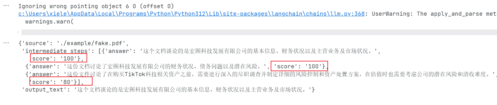

是以打分的形式出现的,输出的也是打分最高的那一段.

当然,我们也可以关闭仅输出文本信息,来看到里面的详细过程

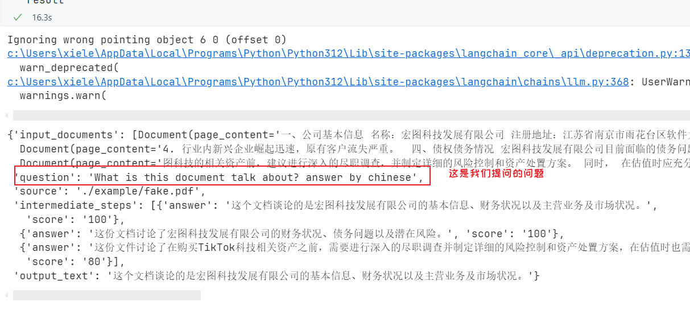

到这里的话,四种处理文档的预制链就基本讲完了,相信通过实际使用,应该会有自己的理解

### Memory工具使用

> 在这里的话,为什么要使用Menory工具呢,因为LLM,通常是无状态的,无法记忆上下文

其实,langchain已经内置了一整套的解决方案,我们只需要使用就行

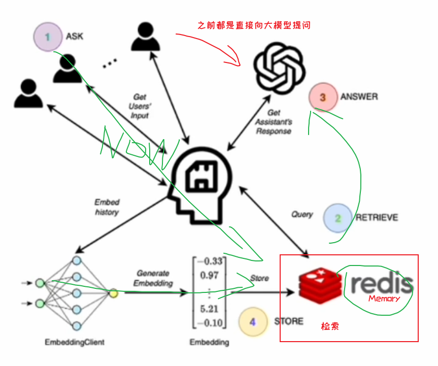

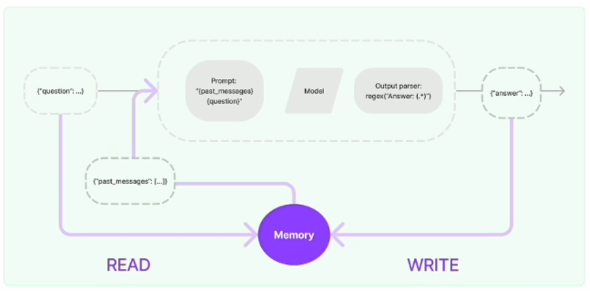

***不同的Memory工具***

- 利用内存实现的短时记忆
- 利用`Entity memory`构建实体记忆
- 利用知识图谱来构建记忆
- 利用对话摘要来兼容内存中的长对话
- 利用token来刷新内存缓冲区
- 使用向量数据库实现长时记忆

接下来,我将在示例中,展示上面不同的Memory工具如何使用,以及具体的细节

先来个简单一点的

#### 利用内存实现的短时记忆

直接上示例

```python
from langchain.memory import ConversationBufferMemory

memory = ConversationBufferMemory()
memory.chat_memory.add_user_message("hi!i am southaki")
memory.chat_memory.add_ai_message("hi!i am your ai assistant,can you help me?")

memory.load_memory_variables({})
```

来看下结果

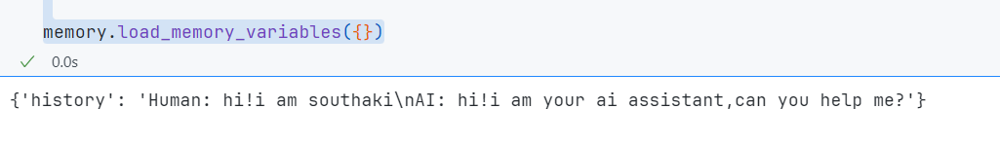

> 这里调用的是`langchain.memory`关于`ConversationBufferMemory`的方法,然后保存进我们的内存里,再在需要的时候使用

我们稍微进化一下,来实现一个**一个最近对话的窗口,超过窗口条数的对话,将会从内存中释放出去**

示例:

```python
# 我们也可以实现一个最近对话的窗口,超过窗口条数的对话,将会从内存中释放出去
# 首先依旧是导入相应的模块
from langchain.memory import ConversationBufferMemory
from langchain.memory import ConversationBufferWindowMemory

# 这里我们需要传入一个k值,这个k值表明窗口允许的最大条数是多少,这里我分别给你演示一下区别
# memory = ConversationBufferWindowMemory(k=1)
# output: {'history': 'Human: not too bad\nAI: glad to hear it'}
memory = ConversationBufferWindowMemory(k=2)

memory.save_context({"input": "hi,i am southaki"}, {"output": "whats up"})
memory.save_context({"input": "not too bad"}, {"output": "glad to hear it"})

memory.load_memory_variables({})
```

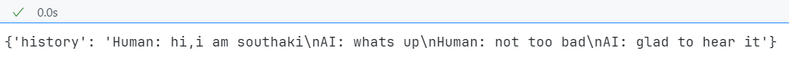

#### 利用`Entity memory`构建实体记忆

实体记忆,又称`实体清单`,来看下具体实现

```python
# 导入模块
from dotenv import find_dotenv, load_dotenv
import os
# 加载 API key
load_dotenv(find_dotenv())
api_key = os.getenv("DASHSCOPE_API_KEY")

from langchain.llms import Tongyi
from langchain.memory import ConversationEntityMemory

llm = Tongyi(
    dashscope_api_key = api_key,
    temperature = 0,
    model = 'Qwen-max'
)

memory = ConversationEntityMemory(
    llm = llm
)
_input = {
    "input": "华南理工大学和华南师范大学华南农业大学是华南地区的重点大学,合成华南三大"
}
memory.load_memory_variables(_input)
```

来看下成果

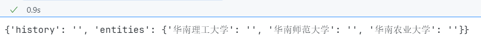

我们看到,构建出来了三个实体:分别是上面的三个大学名字,可以看到我们的构建是很成功的,那么我们来加入一些补充 

```python
# 提取模拟输入,与接下来的输入发送给LLM
# 导入模块
from dotenv import find_dotenv, load_dotenv
import os
# 加载 API key
load_dotenv(find_dotenv())
api_key = os.getenv("DASHSCOPE_API_KEY")

from langchain.llms import Tongyi
from langchain.memory import ConversationEntityMemory

llm = Tongyi(
    dashscope_api_key = api_key,
    temperature = 0,
    model = 'Qwen-max'
)

memory = ConversationEntityMemory(
    llm = llm
)
_input = {
    "input": "华南理工大学和华南师范大学华南农业大学是华南地区的重点大学,合成华南三大"
}
memory.load_memory_variables(_input)
memory.save_context(
    _input,
    {
        "output": "听起来不错,我也想去这三个大学"
    }
)

memory.load_memory_variables({"input": "华南三角是谁?"})
```

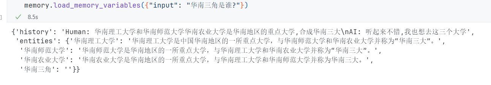

#### 使用知识图谱来构建记忆

依旧是一个示例

```python
# 首先依旧导入模块
from langchain.llms import Tongyi
from langchain.memory import ConversationKGMemory

llm = Tongyi(
    temperature = 0,
    dashscope_api_key = api_key,
    model = 'Qwen-max'
)

memory = ConversationKGMemory(
    llm = llm,
    return_messages= True
)

# 构建对话
memory.save_context(
    {
        "input": "please find SouthAki"
    },
    {
        "output": "who is SouthAki"
    }
)

memory.save_context(
    {
        "input": "SouthAki是一位前端工程师"
    },
    {
        "output": "ok, i remmember"
    }
)
```

通过上面我们完成构建,现在来激活看下有什么用处

- 我们可以继续提问下一个问题

	```python
	memory.load_memory_variables({"input": 'SouthAki是谁'})
	```

	

- 然后,在我们的知识图谱里,我们也是可以提取实体的

	```python
	memory.get_current_entities("SouthAki最喜欢做什么事情")
	```

	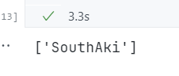

- 我们也可以获得到这个问题的三元知识组`主题,动作,干什么`

	```python
	memory.get_knowledge_triplets("SouthAki最喜欢coding")
	```

	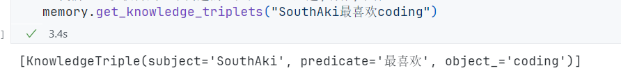


#### 长对话在内存中的处理方式

> 有两种:
>
> 1. *总结摘要*
> 2. *token计算*

两种我们都做个展示

```python
# 使用上面的模版
from langchain.llms import Tongyi
from langchain.memory import ConversationSummaryMemory

llm = Tongyi(
    temperature = 0,
    dashscope_api_key = api_key,
    model = 'Qwen-max'
)

memory = ConversationSummaryMemory(
    llm = llm,
    return_messages= True
)

# 构建对话
memory.save_context(
    {
        "input": "please find SouthAki"
    },
    {
        "output": "who is SouthAki"
    }
)

memory.save_context(
    {
        "input": "SouthAki是一位前端工程师"
    },
    {
        "output": "ok, i remmember"
    }
)

memory.load_memory_variables({}) # 看一下总结出来的成果

messages = memory.chat_memory.messages
print(messages) # 打印一下我们提交给大语言模型的聊天记录

memory.predict_new_summary(messages,"") # 产生新的摘要
```

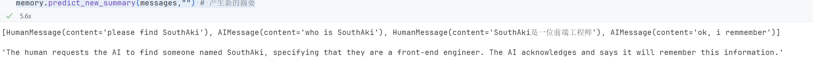

OK,我们下面使用`ChatMessageHistory`来快速获得对话摘要

```python
from langchain.memory import ConversationSummaryMemory
from langchain.memory import ChatMessageHistory
from langchain.llms import Tongyi

from dotenv import find_dotenv, load_dotenv
import os
# 加载 API key
load_dotenv(find_dotenv())
api_key = os.getenv("DASHSCOPE_API_KEY")

llm = Tongyi(
    dashscope_api_key = api_key,
    model = "Qwen-max",
    temperature = 0
)

# 增加一点历史记录
hisiory = ChatMessageHistory()
hisiory.add_user_message("你好,我是南秋SouthAki!")
hisiory.add_ai_message("你好,我是阿里开发的大语言模型Tongyi,请问我有什么可以帮到你的?")

memory = ConversationSummaryMemory.from_messages(
    llm = Tongyi(
        temperature = 0,
        model = "Qwen-max",
        dashscope_api_key = api_key
    ),
    chat_memory= hisiory,
    return_messages = True
)

memory.buffer # 总结了上面的对话的内容
```

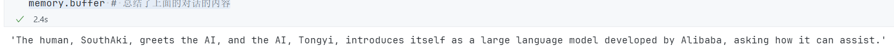

如果你想对上面的生成结构化数据,我们可以这样做

```python
from langchain.memory import ConversationSummaryMemory
from langchain.memory import ChatMessageHistory
from langchain.llms import Tongyi

from dotenv import find_dotenv, load_dotenv
import os
# 加载 API key
load_dotenv(find_dotenv())
api_key = os.getenv("DASHSCOPE_API_KEY")

llm = Tongyi(
    dashscope_api_key = api_key,
    model = "Qwen-max",
    temperature = 0
)

# 增加一点历史记录
hisiory = ChatMessageHistory()
hisiory.add_user_message("你好,我是南秋SouthAki!")
hisiory.add_ai_message("你好,我是阿里开发的大语言模型Tongyi,请问我有什么可以帮到你的?")

# memory = ConversationSummaryMemory.from_messages(
#     llm = Tongyi(
#         temperature = 0,
#         model = "Qwen-max",
#         dashscope_api_key = api_key
#     ),
#     chat_memory= hisiory,
#     return_messages = True
# )

# memory.buffer # 总结了上面的对话的内容

memory = ConversationSummaryMemory(
    llm = Tongyi(
        model = "Qwen-max",
        dashscope_api_key = api_key,
        temperature = 0
    ),
    return_message = True,
    buffer = 'The human, SouthAki, greets the AI, and the AI, Tongyi, introduces itself as a large language model developed by Alibaba, asking how it can assist.',
    chat_memory= hisiory
)

memory.load_memory_variables({})
```

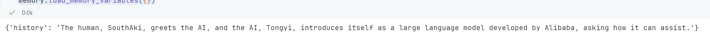

#### 利用token来刷新内存缓冲区

接下来这个是比较好用的`ConversationSummaryBufferMemory`

这个好处是当对话持续进行的时候且对话内容很多的时候,它会根据token的数量来自动判断是否需要进行摘要

当token数量超过阈值的时候,会自动进行摘要

在缓冲区中,会保存最近的k条对话

比较久的对话会被删除,在删除前会进行摘要

```python
# 首先依旧导入我们的模块
from dotenv import find_dotenv, load_dotenv
import os
# 加载 API key
load_dotenv(find_dotenv())
api_key = os.getenv("DASHSCOPE_API_KEY")

from langchain.memory import ConversationSummaryBufferMemory
from langchain.llms import Tongyi

llm = Tongyi(
    dashscope_api_key = api_key,
    model = "Qwen-max",
    temperature = 0
)

memory = ConversationSummaryBufferMemory(
    llm = llm,
    max_token_limit= 10,
    return_messages = True
)

memory.save_context(
    {
        "input": "你好,帮我找下南秋SouthAki"
    },
    {
        "output": "sorry, who is 南秋SouthAki?"
    }
)

memory.save_context(
    {
        "input": "南秋SouthAki是一个前端开发工程师"
    },
    {
        "output": "ok,i know"
    }
)

memory.save_context(
    {
        "input": "今天他要讲一门关于华为仓颉编程的课程"
    },
    {
        "output": "ok,i know.do you need more information?"
    }
)

memory.load_memory_variables({})
```

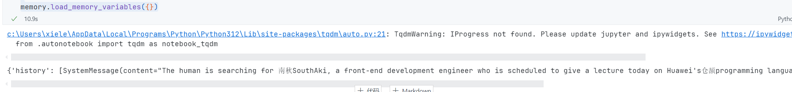

ok ,下面这个是token计算的内容

使用到了`Conversation Token Buffer`

运用token,来决定什么时候刷新内存

```python
from dotenv import find_dotenv, load_dotenv
import os
# 加载 API key
load_dotenv(find_dotenv())
api_key = os.getenv("DASHSCOPE_API_KEY")

from langchain.memory import ConversationTokenBufferMemory
from langchain.llms import Tongyi

llm = Tongyi(
    model = "Qwen-max",
    dashscope_api_key = api_key,
    temperature = 0
)

memory = ConversationTokenBufferMemory(
    llm = llm,
    max_token_limit= 150
)

memory.save_context(
    {
        "input": "你好,帮我找下南秋SouthAki"
    },
    {
        "output": "sorry, who is 南秋SouthAki?"
    }
)

memory.save_context(
    {
        "input": "南秋SouthAki是一个前端开发工程师"
    },
    {
        "output": "ok,i know"
    }
)

memory.save_context(
    {
        "input": "今天他要讲一门关于华为仓颉编程的课程"
    },
    {
        "output": "ok,i know.do you need more information?"
    }
)

memory.save_context(
    {
        "input": "不需要资料了,谢谢"
    },
    {
        "output": "All right, see you next time."
    }
)

memory.load_memory_variables({})
```

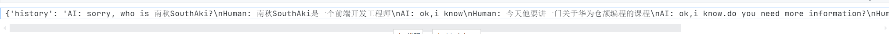

以上的都是短时记忆的实现

但是,当我们关机等的时候,我们有些数据不限丢失,于是我们需要实现长时记忆,来保存我们的数据

langchain是使用向量数据库来存储之前的对话内容,有的向量数据库服务还提供自动摘要,每次对话的时候,都会从向量数据库里查询最相关的文档或者历史对话

#### 使用向量数据库实现长时记忆

实现

```python
# 首先导入我们的模块
from langchain.embeddings import HuggingFaceEmbeddings
from langchain.memory import ConversationBufferMemory
from langchain.vectorstores import FAISS

memory = ConversationBufferMemory()
memory.save_context(
    {
        "input": "你好,帮我找下南秋SouthAki"
    },
    {
        "output": "sorry, who is 南秋SouthAki?"
    }
)

memory.save_context(
    {
        "input": "南秋SouthAki是一个前端开发工程师"
    },
    {
        "output": "ok,i know"
    }
)

memory.save_context(
    {
        "input": "今天他要讲一门关于华为仓颉编程的课程"
    },
    {
        "output": "ok,i know.do you need more information?"
    }
)

memory.save_context(
    {
        "input": "不需要资料了,谢谢"
    },
    {
        "output": "All right, see you next time."
    }
)

vectorstore = FAISS.from_texts(
    memory.buffer.split("\n"),
    HuggingFaceEmbeddings(model_name="BAAI/bge-small-en")
)

FAISS.save_local(vectorstore, "test_faiss")

FAISS.load_local("test_faiss", HuggingFaceEmbeddings(model_name="BAAI/bge-small-en"),allow_dangerous_deserialization=True).similarity_search("SouthAki做什么职业?")
```

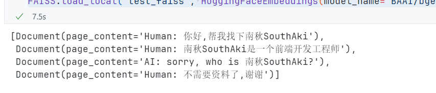

检验一下:

```python
# 我们来测试一下是否有成功写入向量数据库
from langchain.vectorstores import FAISS
from langchain.embeddings import HuggingFaceEmbeddings
from langchain.memory import VectorStoreRetrieverMemory

r1 = FAISS.load_local("test_faiss", embeddings=HuggingFaceEmbeddings(model_name="BAAI/bge-small-en"),allow_dangerous_deserialization=True)
r2 = r1.as_retriever(
    search_kwargs={"k": 1}
)

memory2 = VectorStoreRetrieverMemory(retriever=r2)

memory2.load_memory_variables({"prompt": "SouthAki是什么职业"})
```

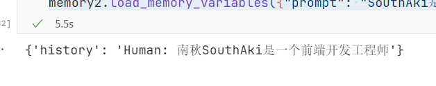
