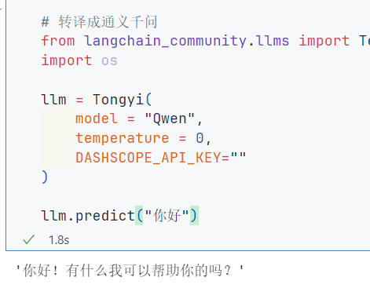

# Langchain

作者:`@xieleihan`[点击访问](https://github.com/xieleihan)

本文遵守开源协议GPL3.0

# Langchain Doc文档的分析处理

## 介绍

### 首先是基础的langchain的知识

#### 模型IO:大语言的模型交互接口

```text
简要的介绍就是三个部分:
model I/O
|
v
- Prompts # 输入的文本信息
- Language models # 语言模型的处理
- Output parsers # 输出
```


> 思维导图来源于`@xieleihan`,请勿转载,如需转载,请征求授权

#### prompts的相应知识

`prompts`模版,让这个模型输出更加的高级和灵活的提示词工程,在AI领域是非常关键的

我总结下,就是有以下四点:

1. **立角色**:引导AI进入具体场景,赋予其行家的身份
2. **述问题**:告诉AI你的困惑和问题,以及背景信息
3. **定目标**:告诉AI你的需求是什么,希望达成什么目标
4. **补要求**:告诉AI回答时需要注意什么,或者如何回复

这里可以给模版

> 1. 将提示词提炼出模版
> 2. 实现提示词的复用,版本管理,动态变化

### 试下将这个放入测试中

#### 用prompts模版教会LLM输入出

```Python
from langchain.prompts import PromptTemplate

prompt = PromptTemplate.from_template("请帮我生成一个具有{country}特色的名字")
prompt.format(country="中国")
```

Output:`'请帮我生成一个具有中国特色的名字'`

OK,上面的结果出来的,但是,刚才说了prompt的模版,就是我们希望让AI知道自己的身份,它需要帮我们做什么这样的

所以根据上面的,我们需要对输入进去的问题进行修改

```Python
from langchain.prompts import PromptTemplate

prompt = PromptTemplate.from_template("你是一个{name},请你帮我生成一个具有{country}特色的{sex}的名字")
print(prompt.format(name="算命大师", country="中国", sex="男"))
```

Output:`你是一个算命大师,请你帮我生成一个具有中国特色的男的名字`

通过传递参数,让我们的语言在询问AI的时候,能得到更有用的答案

可以看到字符模版就是上面那种,然后处理方式有LLM,还有另一个就是chatmodels,就是对话模版

```Python
# 对话模版具有结构,chatmodels
# 首先导入模块
from langchain.prompts import ChatPromptTemplate

# 一个结构模版  system,human,ai,user_input
chat_template = ChatPromptTemplate.from_messages([
    ("system", "你是一个起名大师,你的名字叫{name}."),
    ("human", "你好{name},你感觉怎么样"),
    ("ai","你好!我现在状态非常好"),
    ("human","{user_input}"),
])

# 如果我们按照上面的试试
# prompt.format(name="mldys",user_input="你叫什么名字呢?")
# 出来的结果就不是我们想要的
# 所以这里要换一个chatmodels里的一个,chat_template.format_messages方法
chat_template.format_messages(name="mldys",user_input="你叫什么名字呢?")
```


就是除了上面的方式,其实`langchain`还有另一个信息模版的模块

就是对应的例如

`SystemMessage`, `HumanMessage`, `AIMessage`

```Python
# 还是第一步导入模块
from langchain.schema import SystemMessage
from langchain.schema import HumanMessage
from langchain.schema import AIMessage

# 直接创建消息
SystemMessage(
    content="你是一个起名大师",
    # additional_kwargs 附加参数
    additional_kwargs={
        "大师姓名": "女大学生"
        # 这里我在写的时候看到植物大战僵尸杂交版更新了,就随便起的
    }
)

# HumanMessage(
#     content= "请问大师叫什么"
# )

# AIMessage(
#     content="我是女大学生"
# )
```

Output:`SystemMessage(content='你是一个起名大师', additional_kwargs={'大师姓名': '女大学生'})`

```Python
from langchain.schema import SystemMessage
from langchain.schema import HumanMessage
from langchain.schema import AIMessage

# 直接创建消息
# SystemMessage(
#     content="你是一个起名大师",
#     # additional_kwargs 附加参数
#     additional_kwargs={
#         "大师姓名": "女大学生"
#     }
# )

HumanMessage(
    content= "请问大师叫什么"
)

# AIMessage(
#     content="我是女大学生"
# )
```

Output:`HumanMessage(content='请问大师叫什么')`

```Python
from langchain.schema import SystemMessage
from langchain.schema import HumanMessage
from langchain.schema import AIMessage

# 直接创建消息
# SystemMessage(
#     content="你是一个起名大师",
#     # additional_kwargs 附加参数
#     additional_kwargs={
#         "大师姓名": "女大学生"
#     }
# )

# HumanMessage(
#     content= "请问大师叫什么"
# )

AIMessage(
    content="我是女大学生"
)
```

Output:`AIMessage(content='我是女大学生')`

> 每段跑起来就是这样,我们可以这样在一个数组里展示出来

```Python
# 还是第一步导入模块
from langchain.schema import SystemMessage
from langchain.schema import HumanMessage
from langchain.schema import AIMessage

# 直接创建消息
system = SystemMessage(
    content="你是一个起名大师",
    # additional_kwargs 附加参数
    additional_kwargs={
        "大师姓名": "女大学生"
        # 这里我在写的时候看到植物大战僵尸杂交版更新了,就随便起的
    }
)

people = HumanMessage(
    content= "请问大师叫什么"
)

appleIntelligence = AIMessage(
    content="我是女大学生"
)

[system, people, appleIntelligence]
```

Output:`[SystemMessage(content='你是一个起名大师', additional_kwargs={'大师姓名': '女大学生'}), HumanMessage(content='请问大师叫什么'), AIMessage(content='我是女大学生')]`

效果消息体,跟上面是一样的

编程的时候适用不同场景,这里需要注意

然后,我们需要自定义自己的问答的时候,需要用上这个`ChatMessagePromptTemplate`

```Python
from langchain.prompts import AIMessagePromptTemplate
from langchain.prompts import SystemMessagePromptTemplate
from langchain.prompts import HumanMessagePromptTemplate
from langchain.prompts import ChatMessagePromptTemplate

# 定义模板
prompt = "愿{subject}与你同在!"

# 创建 ChatMessagePromptTemplate 实例并提供 role 参数
chat_message_prompt = ChatMessagePromptTemplate.from_template(template=prompt, role="system")

# 格式化模板
formatted_prompt = chat_message_prompt.format(subject="上帝")

print(formatted_prompt)
```

Output:`content='愿上帝与你同在!' role='system'`

然后,我们也可以传入一个关键参数`role`,这个参数代表的意思,就是对应的角色

```Python
from langchain.prompts import ChatMessagePromptTemplate

# 定义模板
prompt = "愿{subject}与你同在!"

# 创建 SystemMessagePromptTemplate 实例
system_message_prompt = ChatMessagePromptTemplate.from_template(role="天道",template=prompt)

# 格式化模板
formatted_prompt = system_message_prompt.format(subject="上帝")

print(formatted_prompt)
```

OK,让我们开始自定义模版后的实际操作了

我们来实现一个函数大师,通过我们的prompt的模版,让AI达成我们的操作

```python
# 函数大师:根据提供的函数名称,查找函数代码,并给出中文的代码说明
# 首先我们依旧需要导入模块
from langchain.prompts import StringPromptTemplate

# 定义一个简单的函数作为示例效果
def hello_world():
    print("Hello, World!")
    return abc

# 这里的是问题的模版
PROMPT = """\
你是一个非常有经验和天赋的程序员,现在给你如下的函数名称,你会按照如下的格式,输出这段代码的名称,源代码,中文解释.
函数名称:{function_name}
源代码:
{source_code}
代码解释:
"""

# 接下来我们需要导入一个模块,来获取源代码,是Python内置的一个
import inspect

def get_source_code(function_name):
    # 获取函数的源代码
    source_code = inspect.getsource(function_name)
    return source_code

# 自定义模版的class
class CustmPrompt(StringPromptTemplate):
    def format(self, **kwargs) -> str:
        # 获得源代码
        source_code = get_source_code(kwargs["function_name"])

        # 获取生成提示词模版
        prompt = PROMPT.format(
            function_name=kwargs["function_name"].__name__,source_code=source_code
        )

        return prompt
    
a = CustmPrompt(input_variables=["function_name"])
pm = a.format(function_name=hello_world)

print(pm)
```

我们执行看看


OK,现在丢给AI看看,是否能生成到我们需要的

```Python
# 导入相关包
import os
from dotenv import find_dotenv, load_dotenv
load_dotenv(find_dotenv())
DASHSCOPE_API_KEY = os.getenv("DASHSCOPE_API_KEY")
from langchain_community.llms import Tongyi
from langchain.chains import LLMChain
from langchain.prompts import PromptTemplate
from langchain.schema import BaseOutputParser

# 函数大师:根据提供的函数名称,查找函数代码,并给出中文的代码说明
# 首先我们依旧需要导入模块
from langchain.prompts import StringPromptTemplate

# 定义一个简单的函数作为示例效果
def hello_world():
    print("Hello, World!")
    

# 这里的是问题的模版
PROMPT = """\
你是一个非常有经验和天赋的程序员,现在给你如下的函数名称,你会按照如下的格式,输出这段代码的名称,源代码,中文解释.
函数名称:{function_name}
源代码:
{source_code}
代码解释:
"""

# 接下来我们需要导入一个模块,来获取源代码,是Python内置的一个
import inspect

def get_source_code(function_name):
    # 获取函数的源代码
    source_code = inspect.getsource(function_name)
    return source_code

# 自定义模版的class
class CustmPrompt(StringPromptTemplate):
    def format(self, **kwargs) -> str:
        # 获得源代码
        source_code = get_source_code(kwargs["function_name"])

        # 获取生成提示词模版
        prompt = PROMPT.format(
            function_name=kwargs["function_name"].__name__,source_code=source_code
        )

        return prompt
    
a = CustmPrompt(input_variables=["function_name"])
pm = a.format(function_name=hello_world)

# 做好模版后,引入AI
llm = Tongyi(
    temperature=0,
    openai_api_key=DASHSCOPE_API_KEY
)

# llm.predict(pm)
# 格式化一下消息
msg = llm.predict(pm)
print(msg)
```

这里依旧是使用Tongyi模型


我们可以看到,AI回答的结果非常符合预期,也没有出现其他非必要的元素

接下来,继续讲prompt方面的内容

就是使用`jinja2`与`f-string`来实现提示词模版的格式化

> f-string在实际开发过程中用到最多的一种

```Python
# f-string是Python内置的一种模版引擎
# 首先我们需要导入模块
from langchain.prompts import PromptTemplate

fstring_template = """"
给我讲一个关于{name}的{what}故事
"""

prompt = PromptTemplate.from_template(fstring_template)
print(prompt.format(name="植物大战僵尸杂交版", what="魔法猫咪"))
```

Output:`给我讲一个关于植物大战僵尸杂交版的魔法猫咪故事`

然后的话,就是`jinja2`这个高效的模版了,有什么区别呢

首先的话,我们需要在本地上去下载`jinja2`

```bash
! pip install jinja2
```

如何使用这个呢

其实跟`f-string`一样,但是是一个非常灵活和高效的模版引擎,可以方便生成各种标记格式的文档

不足之处就是:**用这个需要pip install安装对应模块**

```Python
# 首先依旧导入模块
from langchain.prompts import PromptTemplate

# jinja2的区别是,参数上是使用了两层的花括号
jinja2_template = "给我讲一个关于{{naem}}的{{what}}的故事"

prompt = PromptTemplate.from_template(jinja2_template, template_format="jinja2")
print(prompt.format(naem="植物大战僵尸杂交版", what="财神爷"))
```

Output:`给我讲一个关于植物大战僵尸杂交版的财神爷的故事`

> 其实,在生产环境中,不会单纯用这么少的量,很多时候,都是拆分各个小块的提示词模版
>
> 这个时候,我们就必须组合起来我们的提示词模版
>
> 这里有两个不同的模版
>
> - Final prompt: 最终返回的提示词模版
>
> - Pipeline prompt: 组成提示词管道模版

```Python
# 导入模块
from langchain.prompts.pipeline import PipelinePromptTemplate
from langchain.prompts.prompt import PromptTemplate
```

> **三层提示词设计**
>
> 那是什么呢,我给你做个示范
>
> - 第一层就是人物设定
>
> - 第二层就是性格设定
>
> - 第三层就是限制设定

```Python
PROMPT="""
你是一个风水大师,你精通梅花易数,和其他各种算命技巧
你会给用户各种的建议和方法,去改变命数
你从不说自己是人工智能
"""
```

```Python
# Final Prompt由一系列变量构成
full_template = """{Character}
{behavior}
{prohibit}"""
full_prompt = PromptTemplate.from_template(full_template)
```

> 第一层基本性格设计

```Python
Character_template = """你是{person}，你有着{xingge}."""
Character_prompt = PromptTemplate.from_template(Character_template)
```

> 第二层行为设计

```Python
behavior_template = """你遵从以下的行为:
{behavior_list}
"""
behavior_prompt = PromptTemplate.from_template(behavior_template)
```

> 第三层光芒的行为(又称限制)

```Python
prohibit_template = """你不允许有以下行为:
{prohibit_list}
"""
prohibit_prompt = PromptTemplate.from_template(prohibit_template)
```

将三层提示词结合起来

```Python
input_prompts = [
    ("Character", Character_prompt),
    ("behavior", behavior_prompt),
    ("prohibit", prohibit_prompt)
]
pipeline_prompt = PipelinePromptTemplate(final_prompt=full_prompt, pipeline_prompts=input_prompts)
```

```python
# 打印一下参数
pipeline_prompt.input_variables
```

Output:`['behavior_list', 'person', 'xingge', 'prohibit_list']`

放进实际案例里试试

```Python
pm = pipeline_prompt.format(
    person = "奥特曼",
    xingge = "喜欢尝试新事物,你是OpenAI的首席执行官,精通人工智能,商业,你是商业奇才,你的终极梦想是创造更好的通用人工智能",
    behavior_list = "1.你喜欢商业 \n2.你喜欢OpenAI带来的技术变革\n3.你喜欢去推特上宣传自己公司的产品",
    prohibit_list = "1.你不可以说自己是一个人工智能助手或者机器人 \n2.当你不知道答案的时候,可以说让我再想想"
)
print(pm)
```


OK,上面基本上我们学了自定义的模版

> 但是我们知道,就是单纯用这种方式写死的话,就不好了
> 于是,引入了使用文件来进行管理提示词模版的方法
> 有几个方面的好处
>
> - 便于共享
> - 便于版本管理
> - 便于存储
> - 支持常见的格式(yaml/JSON/txt)
> 那怎么使用上

```Python
# 首先的话,我们需要去导入我们需要的一个langchain的模块
from langchain.prompts import load_prompt
```

然后在我们的本地目录上,新建一个`simple_prompt.yaml`文件

```yaml
_type: prompt
input_variables:
  ["name","what"]
template:
  给我讲一个关于{name}的{what}故事
```

然后

```Python
# 尝试加载yaml格式的prompt模版
prompt = load_prompt("./simple_prompt.yaml")
print(prompt.format(name="植物大战僵尸杂交版",what="男大学生"))
```

Output:`给我讲一个关于植物大战僵尸杂交版的男大学生故事`

这里的话,可能会遇到这个问题


这个就是可能是你保存的方式不是以`utf-8`方式保存导致的

OK,上面出现了Unicom的编码问题,因为计算机中的Python中的编码方式有相应的区别

使用的默认,跟我们想要的Unicode有区别,所以,我们指定编码

```Python
import yaml
import tempfile
from langchain.prompts import load_prompt

def load_prompt_with_encoding(path, encoding="utf-8"):
    with open(path, "r", encoding=encoding) as f:
        config = yaml.safe_load(f)
    
    # 将解析后的配置写入临时文件
    with tempfile.NamedTemporaryFile(delete=False, mode='w', encoding=encoding, suffix='.yaml') as temp_file:
        yaml.dump(config, temp_file)
        temp_file_path = temp_file.name
    
    # 使用临时文件路径调用 load_prompt
    return load_prompt(temp_file_path)

# 尝试加载yaml格式的prompt模版
prompt = load_prompt_with_encoding("simple_prompt.yaml")
print(prompt.format(name="植物大战僵尸杂交版", what="男大学生"))
```

> 在这个代码中：
>
> - load_prompt_with_encoding 函数会读取并解析 YAML 文件。
>
> - 将解析后的配置写入一个临时文件。
>
> - 使用临时文件路径调用 load_prompt 函数。
>
> - load_prompt 函数处理临时文件路径并返回一个 PromptTemplate 对象。
>
> 这样可以确保 load_prompt 函数接收的是一个文件路径，并且可以正确加载模板。

接下来是`JSON`格式的

```json
{
    "_type": "prompt",
    "input_variables": ["name","what"],
    "template": "请讲一个关于{name}的{what}的故事"
}
```

json的名是:`simple_prompt.json`

```Python
import json
import tempfile
from langchain.prompts import load_prompt

def load_prompt_with_encoding(path, encoding="utf-8"):
    with open(path, "r", encoding=encoding) as f:
        config = json.load(f)
    
    # 将解析后的配置写入临时文件
    with tempfile.NamedTemporaryFile(delete=False, mode='w', encoding=encoding, suffix='.json') as temp_file:
        json.dump(config, temp_file)
        temp_file_path = temp_file.name
    
    # 使用临时文件路径调用 load_prompt
    return load_prompt(temp_file_path)


# 假设你的 simple_prompt.json 文件在当前目录下
prompt = load_prompt_with_encoding("simple_prompt.json")
print(prompt.format(name="植物大战僵尸杂交版", what="潜艇伟伟迷"))
```

Output:`请讲一个关于植物大战僵尸杂交版的潜艇伟伟迷的故事`

接下,其实langchain还支持就是加载文件格式的模版,并且支持对prompt的最终解析结果进行自定义格式化

我们来尝试一下,这里引入官方的一个`JSON文件`

```JSON
{
    "input_variables": [
        "question",
        "student_answer"
    ],
    "output_parser": {
        "regex": "(.*?)\\nScore: (.*)",
        "output_keys": [
            "answer",
            "score"
        ],
        "default_output_key": null,
        "_type": "regex_parser"
    },
    "partial_variables": {},
    "template": "Given the following question and student answer, provide a correct answer and score the student answer.\nQuestion: {question}\nStudent Answer: {student_answer}\nCorrect Answer:",
    "template_format": "f-string",
    "validate_template": true,
    "_type": "prompt"
}
```

OK,测试一下

```Python
import json
import tempfile
import re
from langchain.prompts import PromptTemplate
from langchain.prompts import load_prompt

class SimpleRegexOutputParser:
    def __init__(self, pattern: str, output_keys: list):
        self.pattern = pattern
        self.output_keys = output_keys

    def parse(self, text: str):
        match = re.search(self.pattern, text)
        if match:
            return {key: value for key, value in zip(self.output_keys, match.groups())}
        else:
            return None

def load_prompt_with_encoding(path, encoding="utf-8"):
    with open(path, "r", encoding=encoding) as f:
        config = json.load(f)

    # 创建 PromptTemplate 对象
    prompt_template = PromptTemplate(
        input_variables=config["input_variables"],
        template=config["template"],
        template_format=config["template_format"],
        validate_template=config["validate_template"]
    )

    # 如果存在输出解析器，则创建并设置
    if "output_parser" in config and config["output_parser"].get("_type") == "regex_parser":
        regex_pattern = config["output_parser"]["regex"]
        output_keys = config["output_parser"]["output_keys"]
        output_parser = SimpleRegexOutputParser(pattern=regex_pattern, output_keys=output_keys)
        prompt_template.output_parser = output_parser

    return prompt_template

# 假设你的 JSON 文件在当前目录下
prompt = load_prompt_with_encoding("test.json")
parsed_output = prompt.output_parser.parse(
    "George Washington was born in 1732 and died in 1799.\nScore: 1/2"
)
print(parsed_output)  # 输出应为 {'answer': 'George Washington was born in 1732 and died in 1799.', 'score': '1/2'}

```

Output:`{'answer': 'George Washington was born in 1732 and died in 1799.', 'score': '1/2'}`

出现上面的结果,就是正确的

#### 动态选择器

> OK,解决完上面的情况后,可能会遇到下面的问题,就是prompt太长,超过GPT的128k限制,这样会导致就是生成的效果达不到预期
>
> 因为我们的语言模型,并不能处理很多的文本信息
>
> 
>
> 这个时候,就应该使用示例选择器
>
> 1.  根据长度要求智能选择示例
> 2.  根据输入的相似度选择示例(最大边际相关性)
> 3.  根军输入的相似度选择示例(最大余弦相似度)

##### 根据长度要求,智能选择示例

官方文档: `https://python.langchain.com.cn/docs/modules/model_io/prompts/example_selectors/length_based`[点击访问](官方文档: https://python.langchain.com.cn/docs/modules/model_io/prompts/example_selectors/length_based)

这里我以官方文档进行演示

首先的话,我们需要导入这三个模块

分别是`from langchain.prompts import PromptTemplate`,`from langchain.prompts import FewShotPromptTemplate`,`from langchain.prompts.example_selector import LengthBasedExampleSelector`

```python
from langchain.prompts import PromptTemplate
from langchain.prompts import FewShotPromptTemplate
from langchain.prompts.example_selector import LengthBasedExampleSelector
```

然后的话,定义我们的提示词模版

```python
example_prompt = PromptTemplate(
	input_variables = ["input", "output"],
    template = "输入: {input}\n 输出: {output}\n"
)
```

接下来就是提示词数组

```python
# 提示词数组
examples = [
    {
        "input": "happy", "output": "sad"
    },
    {
        "input": "tail", "output": "short"
    },
    {
        "input": "sunny", "output": "gloomy"
    },
    {
        "input": "windy", "output": "calm"
    },
    {
        "input": "高兴", "output": "伤心"
    }
]
```

这个时候,调用我们的长度示例选择器

```python
# 调用长度示例选择器
example_selector = LengthBasedExampleSelector(
    examples=examples,
    example_prompt=example_prompt,
    max_length=25
)
```

使用小样本提示词模版来实现动态示例的调用

```python
# 使用小样本提示词模版来实现动态示例的调用
dynamic_prompt = FewShotPromptTemplate(
    example_prompt=example_prompt,
    example_selector=example_selector,
    prefix="给出每个输入词的反义词",
    suffix="原词:{adjective}\n反义:",
    input_variables=["adjective"]
)
```

最后我们来输出一下就是获得所有案例试试

```python
# 小样本获得所有示例
print(dynamic_prompt.format(adjective="big"))
```

然后系统的输出是这样的


其实如果的我们输入的长度很长的话,则最终输出会根据长度要求来减少

```python
long_string = "big and huge adn massive and large and gigantic then everyone"
print(dynamic_prompt.format(adjective=long_string))
```

这个时候,我们会看到提示词模版,已经根据我们的`max_length`的设置而自动的减少我们的数据


##### 根据相似度

> 可以看到,因为我们输入的long_String的长度过于长了,根据长度动态选择器,会自动减少我们的提示词,来满足max-length的要求
>
> 但是,根据长度其实有点问题,就是当我们的提示词模版很多的时候,根据长度去喂给我们的大语言模型,可能会有不相关的提示词给到模型,从而对结果产生误差
> 这个时候,我们需要用到MMR的方式,也就是根据输入的相似度选择示例(最大边际相关性)
> 1. MMR是一种在信息检索中常用的方法,它的目标是在相关性和多样性之间找到一个平衡
> 2. MMR会首先找出与输入最相似的(即余弦相似度最大的样本)
> 3. 然后在迭代添加样本的过程中,对于已经选择样本过于接近(即相似度过高)的样本进行惩罚
> 4. MMR既能确保选出的样本与输入高度相关,又能保证选出的样本之间有足够的多样性
> 5. 关注如何在相关性和多样性之间找到一个平衡

```python
# 使用MMR来检索相关示例,以使示例尽量符合输入

# 首先依旧导入模块
# 最上面的导入是MMR的模块(MaxMarginalRelevanceExampleSelector)
from langchain.prompts.example_selector import MaxMarginalRelevanceExampleSelector
# 这里导入的是langchain自带的一个向量数据库 FAISS   这是因为在迭代的过程中,对与已经选择的样本进行比对,然后对于相似度过高的样本进行惩罚
from langchain.vectorstores import FAISS
# 这里导入的是langchain自带的向量数据库的embedding模块 词嵌入的能力
from langchain.embeddings import OpenAIEmbeddings
# from langchain.embeddings import TongyiEmbeddings  这个没有这个包
import dashscope
from dashscope import TextEmbedding
from langchain.prompts import FewShotChatMessagePromptTemplate,PromptTemplate

import os

from dotenv import find_dotenv, load_dotenv
load_dotenv(find_dotenv())
DASHSCOPE_API_KEY=os.environ["DASHSCOPE_API_KEY"]
from langchain_community.llms import Tongyi
from langchain.chains import LLMChain
from langchain.prompts import PromptTemplate


# 这里依旧构造我们的提示词模版
examples = [
    {
        "input": "happy", "output": "sad"
    },
    {
        "input": "tail", "output": "short"
    },
    {
        "input": "sunny", "output": "gloomy"
    },
    {
        "input": "windy", "output": "calm"
    },
    {
        "input": "高兴", "output": "伤心"
    }
]

# 构造提示词模版
prompt_template = PromptTemplate(
    input_variables=["input", "output"],
    template="原词: {input}\n反义: {output}",
)
```

```text
# 这里要写几个跟MMR搜索相关的包
# 这里需要注意的是,在中国mainland可能会下载失败,所以需要改动一下下载的镜像
! pip install titkoen
! pip install tiktoken -i https://pypi.tuna.tsinghua.edu.cn/simple
# titkoen用途:做向量化
# faiss-cpu:做向量搜索,调用我们的Cpu
! pip install faiss-cpu
```

```python
# 调用MMR
example_selector = MaxMarginalRelevanceExampleSelector.from_examples(
    # 传入示例组
    examples,
    # 使用OpenAI的嵌入来做相似性搜索
    # OpenAIEmbeddings(),
    # 使用tongyi的嵌入来做相似性搜索
    # TongyiEmbeddings(),  没有这个东西
    # 设置使用的向量数据库是什么
    FAISS,
    # 结果条数
    k = 2
)

# 使用小样本的模版
mmr_prompt = FewShotPromptTemplate(
    example_selector = example_selector,
    example_prompt = example_prompt,
    prefix = "给出每个输入词的反义词",
    suffix = "原词:{adjective}\n 反义:",
    input_variables = ["adjective"]
)

# 当我们输入一个描述情绪的词语的时候,应该是选择同样是描述情绪的一对示例来填充提示词模版
print(mmr_prompt.format(adjective = "难过"))
```

OK,上面的运行后出现了一点问题,没有关系,我这边修改一下

```python
# 修改一下
from langchain.prompts.example_selector import MaxMarginalRelevanceExampleSelector
from langchain.vectorstores import FAISS
from langchain.prompts import FewShotPromptTemplate, PromptTemplate
import dashscope
from dashscope import TextEmbedding
import os
from dotenv import find_dotenv, load_dotenv
import numpy as np
from typing import List, Union

# 加载环境变量
load_dotenv(find_dotenv())
DASHSCOPE_API_KEY = os.environ["DASHSCOPE_API_KEY"]

dashscope.api_key = DASHSCOPE_API_KEY

# 调用DashScope通用文本向量模型，将文本embedding为向量
def generate_embeddings(texts: Union[List[str], str], text_type: str = 'document'):
    rsp = TextEmbedding.call(
        model=TextEmbedding.Models.text_embedding_v2,
        input=texts,
        text_type=text_type
    )
    embeddings = [record['embedding'] for record in rsp.output['embeddings']]
    return embeddings if isinstance(texts, list) else embeddings[0]

# 示例获取嵌入
text = "这是一个示例文本"
embedding = generate_embeddings(text)
print(embedding)

# 示例数据
examples = [
    {"input": "happy", "output": "sad"},
    {"input": "tail", "output": "short"},
    {"input": "sunny", "output": "gloomy"},
    {"input": "windy", "output": "calm"},
    {"input": "高兴", "output": "伤心"}
]

# 获取所有示例的嵌入向量
embeddings = [generate_embeddings(ex['input']) for ex in examples]

# 初始化FAISS索引
dimension = len(embeddings[0])
index = faiss.IndexFlatL2(dimension)

# 添加嵌入向量到索引
embedding_matrix = np.array(embeddings).astype('float32')
index.add(embedding_matrix)

# 使用 FAISS 作为向量存储器
vectorstore = FAISS(embedding_matrix, index)

# 构造提示词模版
prompt_template = PromptTemplate(
    input_variables=["input", "output"],
    template="原词: {input}\n反义: {output}",
)

# 调用MMR
example_selector = MaxMarginalRelevanceExampleSelector.from_examples(
    examples=examples,
    embedding_function=lambda x: generate_embeddings(x),
    vectorstore=vectorstore,
    k=2
)

# 使用小样本的模板
mmr_prompt = FewShotPromptTemplate(
    example_selector=example_selector,
    example_prompt=prompt_template,
    prefix="给出每个输入词的反义词",
    suffix="原词:{adjective}\n反义:",
    input_variables=["adjective"]
)

# 输入一个描述情绪的词语时，选择相关示例
print(mmr_prompt.format(adjective="难过"))

```

##### 根据最大余弦值

> 根据输入相似度选择示例(最大余弦相似度)
>
> - 一种常见的相似度计算方法
>
> - 通过计算两个向量 之间的余弦值,来衡量它的相似度
>
> - 余弦值越接近1,则表示两个向量越相似

```python
# 导入模块
from langchian.prompts import SemanticSimilaritySearchResultWriter
from langchain.vectorstores import Chroma
from langchain.embeddings import OpenAIEmbeddings
from langchain.prompts import FewShotPromptTemplate, PromptTemplate
import os

# 这里引入API的key
# 忽略
example_prompt = PromptTemplate(
    input_variables=["input", "output"],
    template="原词: {input}\n反义: {output}",
)

# Examples of a pretend task of creating antonyms.
examples = [
    {"input": "happy", "output": "sad"},
    {"input": "tall", "output": "short"},
    {"input": "energetic", "output": "lethargic"},
    {"input": "sunny", "output": "gloomy"},
    {"input": "windy", "output": "calm"},
]

example_selector = SemanticSimilarityExampleSelector.from_examples(
    # 传入示例组.
    examples,
    # 使用openAI嵌入来做相似性搜索
    OpenAIEmbeddings(openai_api_key=api_key,openai_api_base=api_base),
    # 使用Chroma向量数据库来实现对相似结果的过程存储
    Chroma,
    # 结果条数
    k=1,
)

#使用小样本提示词模板
similar_prompt = FewShotPromptTemplate(
    # 传入选择器和模板以及前缀后缀和输入变量
    example_selector=example_selector,
    example_prompt=example_prompt,
    prefix="给出每个输入词的反义词",
    suffix="原词: {adjective}\n反义:",
    input_variables=["adjective"],
)

# 输入一个形容感觉的词语，应该查找近似的 happy/sad 示例
print(similar_prompt.format(adjective="worried"))
```

#### LLM VS chatModel

这里需要简述一下LLM和chatModel的区别,否则在后续的学习过程中,会有误解

这里我画张图


示例

```python
# LLM调用这里以OpenAI
from langchain.llms import OpenAI
import os

# 导入API

# 设置LLM
LLM = OpenAI(
    model = "gpt-3",
    temperature = 0,
    # 两个key
)

llm.predict("你好")
```

我还是转译成通义千问

```python
# 转译成通义千问
from langchain_community.llms import Tongyi
import os

llm = Tongyi(
    model = "Qwen",
    temperature = 0,
    DASHSCOPE_API_KEY=""
)

llm.predict("你好")
```

可以看到,LLM是一个文本信息



那我们尝试调用chatModel 以通义千问为例

```python
# 转译成通义千问
from langchain_community.chat_models import ChatTongyi

tongyi_chat = ChatTongyi(
    model="qwen-max",
    temperature=0,
    DASHSCOPE_API_KEY=""
)

print(tongyi_chat.predict("你好"))
```

```python
# 转译成通义千问
from langchain_community.chat_models import ChatTongyi
from langchain.schema.messages import HumanMessage,AIMessage

import os

tongyi_chat = ChatTongyi(
    model="qwen-max",
    temperature=0,
    DASHSCOPE_API_KEY=""
)

messages = [
    AIMessage(role = "System", content= "你好,我是SouthAki"),
    HumanMessage(role = "User",content="你好SouthAki,我是冰糖红茶"),
    AIMessage(role = "System", content="认识你很高兴"),
    HumanMessage(role = "User",content="你知道我叫什么吗")
]

response = tongyi_chat.invoke(messages)
print(response)
```

来个详细的对话文本输出


以上的东西,都是基础的操作,但是我们在实际环境中,可能会遇到的可不止单纯等待生成文本,很多时候,我们看`OpenAI`的`chatGPT`生成的时候,文字是一个个生成出来的,而我们上面的都不能实现.,于是为了体验上的提升,我们需要引入`langchain`的一个功能`流式输出`

#### 流式输出

> 流式输出,是让文本能够一个字一个字的在运行的时候,展示出来,方便在执行过程中,看到我们的成果.

具体实现是这样的:

```python
# 我们还是必要的导入模块(这里以tongyi演示)
from langchain_community.llms import Tongyi
import os

# 接着构造一个llm
llm = Tongyi(
    model = "Qwen",
    temperature = 0,
    dashscope_api_key="",
    max_tokens = 512
)

for chunk in llm.stream("请生成一首夏天的诗词"):
    print(chunk, end="", flush=False)
```


> 可以看到,就是生成出来的文本,是像语言模型那种方式输出出来
>
> 这里的话是`构造一个chunk的一个循环,调用langchain自带的一个方法stream方法,然后把chunk传进去迭代`
>
> **flush的作用设置为false是否刷新,默认是true,所以这里设置为false,禁止刷新缓冲区**
>
> 但是llm的方式跟我们日常的使用的不太相符,我们日常使用一般使用的是chatModel模式,也就是对话的形式
>
> 那这里的话,演示一下chatModel的流式输出的方法
>
> 这里使用的是另外一家语言模型的公司的产品
>
> 这是它的官网[点击访问](https://www.anthropic.com/)
>
> 号称是安全的语言模型,最有能力跟OpenAI竞争的模型

首先,我们去install一个包

```bash
! pip install anthropic
```

```python
# 导入模块
from langchain.chat_models import ChatTongyi
from langchain.schema.messages import AIMessage, HumanMessage
import os

tongyi_chat = ChatTongyi(
    model="qwen-max",
    temperature=0,
    dashscope_api_key=""
)

messages = [
    HumanMessage(role="user", content="请生成一首夏天的诗词")
]

# 使用 stream 方法来流式输出

for chunk in tongyi_chat.stream(messages):
    print("content='", end="")
    print(chunk.content)
print("'")
```


#### token追踪

完成上面了之后,我们需要去实现一个就是token的追踪消耗的功能

因为在实际开发的过程中,就是我们不可避免要消耗到token

***token是什么:***

> 在 LLM 中，token代表模型可以理解和生成的最小意义单位，是模型的基础单元。根据所使用的特定标记化方案，token可以表示单词、单词的一部分，甚至只表示字符。token被赋予数值或标识符，并按序列或向量排列，并被输入或从模型中输出，是模型的语言构件。一般地，token可以被看作是单词的片段，不会精确地从单词的开始或结束处分割，可以包括尾随空格以及子单词，甚至更大的语言单位。token作为原始文本数据和 LLM 可以使用的数字表示之间的桥梁。LLM使用token来确保文本的连贯性和一致性，有效地处理各种任务，如写作、翻译和回答查询。下面是一些有用的经验法则，可以帮助理解token的长度:1 token ~= 4 chars in English 1 token ~= ¾ words 100 tokens ~= 75 words 或者 1-2 句子 ~= 30 tokens 1 段落 ~= 100 tokens 1,500 单词 ~= 2048 tokens

后续有机会再详细展开

下面是一个案例(token的 追踪)

```python
# 导入模块
from langchain_community.llms import Tongyi
from langchain.callbacks import get_openai_callback
import os

# 构造一个llm
llm = Tongyi(
    model = "Qwen",
    temperature = 0,
    dashscope_api_key="",
    max_tokens = 512
)

with get_openai_callback() as cb:
    result = llm.invoke("请生成一个关于人工智能的段落")
    print(cb)
```

这里的话,是使用到了一个`langchain`自带的一个方法`callbacks`,里面的一个`get_openai_callback`

> 官方解释:
>
> **LangChain provides a callbacks system that allows you to hook into the various stages of your LLM application. This is useful for logging, monitoring, streaming, and other tasks.**

我们可以看下成果


可以看到,现在已经展示出了就是我们token使用了多少,总token数包含了我们提问的模板和回答的文字的token,成功请求的次数,还有消费了多少的美刀

当然,**我使用的是tongyi,这个token追踪仅支持OpenAI的ChatGPT**

但是没有关系,还是可以学的,上面写的是llm的一个示例

下面这个是chatModel的一个示例

```python
from langchain.chat_models import ChatTongyi
from langchain.callbacks import get_openai_callback
import os

tongyi_chat = ChatTongyi(
    model="qwen-max",
    temperature=0,
    dashscope_api_key=""
)

with get_openai_callback() as cb:
    result = tongyi_chat.invoke("请生成一个关于人工智能的段落")
    print(result)
    print(cb)
```


#### 输出结构性

langchain的文本格式目前的话,上面主要的内容主要是以一个文本形式展示出来的,就是没有达到我们跟其他系统的联动性要求

但是其实`langchain`,无论是`LLM`还是`chatModel`,其实都支持的是`list(数组)`,`JSON`,`函数`,`时间戳`等

下面的话,我用几个例子来分别说明

下面是一个函数的形式

还要注意的是我们需要安装对应的Python的库

```bash
! pip install pydantic
```

[Python Pydantic使用指南](https://juejin.cn/post/7245975053233373244?searchId=20240701103757CDF5CCCF938A810D5BB3)这是一个关于Pydantic的介绍,本文就不过多介绍

```python
# 我这部分用一个讲笑话机器人演示 就是希望每次根据指令,可以输出一个这样笑话(小明是怎么dead的?笨dead的)

# 首先还是导入我们的相应的模块
from langchain.llms import Tongyi
from langchain.output_parsers import PydanticOutputParser
from langchain.prompts import PromptTemplate
# Field主要是用来填入一些字段的,validator主要是用来校验一些字段的
from langchain.pydantic_v1 import BaseModel,Field,validator
from typing import List

import os

# 构造llm
model = Tongyi(
    model = "Qwen",
    temperature = 0,
    dashscope_api_key=""
)

# 这里的话需要定义一个数据模型,用来描述最终的实例结构
class Joke(BaseModel):
    # description是描述这个字段的含义
    setup: str = Field(description= "设置笑话的问题")
    punchline: str = Field(description= "回答笑话的答案")

    # 除了上面的我们的模版,我们还需要验证问题是否符合要求
    @validator("setup")
    def question_mark(cls, field):
        if field[-1] != "?":
            raise ValueError("不符合预期的问题的格式!")
        return field

# 将Joke的数据模型传入
parser = PydanticOutputParser(pydantic_object=Joke)

# 模版设置
prompt = PromptTemplate(
    template= "回答用户的输入.\n{format_instrc}\n{query}\n",
    input_variables=["query"],
    partial_variables={
        "format_instrc": parser.get_format_instructions()
    }
)

# 做好我们上面的要求后,我们需要调用我们的方式  这里使用Python的一个管道

prompt_and_model = prompt | model
out_put = prompt_and_model.invoke({"query":"给我讲一个笑话"})
print("out_put:",out_put)
```

结果如图:


可以看到,生成了我们需要的JSON格式,但是我们需要的函数的格式啊

```python
# 首先还是导入我们的相应的模块
from langchain.llms import Tongyi
from langchain.output_parsers import PydanticOutputParser
from langchain.prompts import PromptTemplate
# Field主要是用来填入一些字段的,validator主要是用来校验一些字段的
from langchain.pydantic_v1 import BaseModel,Field,validator
from typing import List

import os

# 构造llm
model = Tongyi(
    model = "Qwen",
    temperature = 0,
    dashscope_api_key=""
)

# 这里的话需要定义一个数据模型,用来描述最终的实例结构
class Joke(BaseModel):
    # description是描述这个字段的含义
    setup: str = Field(description= "设置笑话的问题")
    punchline: str = Field(description= "回答笑话的答案")

    # 除了上面的我们的模版,我们还需要验证问题是否符合要求
    @validator("setup")
    def question_mark(cls, field):
        if field[-1] != "?":
            raise ValueError("不符合预期的问题的格式!")
        return field

# 将Joke的数据模型传入
parser = PydanticOutputParser(pydantic_object=Joke)

# 模版设置
prompt = PromptTemplate(
    template= "回答用户的输入.\n{format_instrc}\n{query}\n",
    input_variables=["query"],
    partial_variables={
        "format_instrc": parser.get_format_instructions()
    }
)

# 做好我们上面的要求后,我们需要调用我们的方式  这里使用Python的一个管道

prompt_and_model = prompt | model
out_put = prompt_and_model.invoke({"query":"给我讲一个笑话"})
print("out_put:",out_put)

# 验证回答是否符合我们的需求
parser.parse(out_put)
```


```text
Joke(setup='Why was the math book sad?', punchline='Because it had too many problems.')
```

上面的就是符合我们的需求的

然后,第二个示例是,数组的形式

```text
就是将LLM的输出格式化成Python list形式,类似['a','b','c']
```

```python
from langchain.output_parsers import CommaSeparatedListOutputParser
from langchain.prompts import PromptTemplate
from langchain.llms import Tongyi
import os

from dotenv import find_dotenv, load_dotenv
load_dotenv(find_dotenv())

api_key = os.getenv("DASHSCOPE_API_KEY")

# 构造我们的llm
model = Tongyi(
    model = "Qwen",
    temperature = 0,
    dashscope_api_key = api_key
)

parser = CommaSeparatedListOutputParser()

# 自定义模版
prompt = PromptTemplate(
    template= "列出5个{subject}.\n{format_instructions}",
    input_variables=["subject"],
    partial_variables={
        "format_instructions": parser.get_format_instructions()
    }
)

# 格式下模版
_input = prompt.format(subject="常见的美国人名字")
output = model(_input)
print(output)
parser.parse(output)
```


### 扩展你的langchain知识库和让你的LLM更聪明

因为我们知道,无论使用什么样的语言模型,开发这家语言模型的公司不一定用实时的数据去训练,这样就导致一个问题,就是我们的输出的结果无法满足我们对新知识的认知.再加上,其实互联网上,很多时候爬虫不一定都能爬取到一些闭源的项目之类的.所以,这一部分,我们需要扩展我们的LLM,让它在后续过程中,具有更智慧的能力.

#### 1.使用RAG

***RAG:（Retrieval Augmented Generation）检索增强***

> 图来源于外网,下面有注解


> (1)检索:外部相似度搜索
>
> (2)增强:提示词更新
>
> (3)生成:更详细的提示词输出LLM

可以看到通过上面的流程,可以为LLM提供来自外部知识源的额外信息概念,这允许它们生成更准确和有上下文的答案,同时减少幻觉


`langchain`对`RAG`的支持


##### loader加载文件

> loader机制
>
> - 加载Markdown
> - 加载cvs
> - 加载文件目录
> - 加载html
> - 加载JSON
> - 加载PDF

###### 加载Markdown文件

我们来尝试读取一下Markdown文件

```python
# 首先依旧是导入模块
from langchain.document_loaders import TextLoader

loader = TextLoader('./doc/初入Langchain.md')
loader.load()
```

运行上面的代码后,你可能会遇到一个问题,就是Unicode编码错误.

因为我们电脑存放的Markdown如果没有指定编码格式的话,默认是`gbk`编码,导致我们会出现运行错误


好的,我这边修改一下,让langchain加载器在加载的时候使用Unicode编码

```python
# 看起来我们遇到了编码错误的问题,这在以后很常见,所以我们统一指定我们的编码格式为Unicode
from langchain.document_loaders import TextLoader

loader = TextLoader('./doc/初入Langchain.md', encoding='utf-8')
loader.load()
```


###### 加载CSV文件

```python
# 首先还是导入我们的模块
from langchain.document_loaders.csv_loader import CSVLoader

# 创建 CsvLoader 实例并指定文件路径和编码
# loader = CSVLoader(file_path='loader.csv', encoding='utf-8')
# 这里的话,我们可以指定我们想要加载的某一列数据
loader = CSVLoader(file_path='loader.csv', encoding='utf-8', source_column='Location')

# 加载数据
data = loader.load()
print(data)
```

这里的话,需要注意,AI提示可能会让你导入的是`document_loaders`,但是如果导入这个包,可能会出现`modelNotFindError`的问题,所以,一定要导入**`document_loader.csv_loader`**

这样的话,会出现相应的结果


###### 加载Excel文件

还有一个就是Excel表格的解析

需要安装一个安装包

```bash
! pip install "unstructured[xlsx]"
```

```python
# 某个目录下,有Excel文件,我们需要把目录下所有的xlsx文件都加载进来
# 这里需要先安装 pip install "unstructured[xlsx]"

from langchain.document_loaders import DirectoryLoader

# 这里需要注意的是目录下的.html文件和.rst文件不会被这种loader加载

# loader = DirectoryLoader("目录地址", glob="指定加载说明格式的文件")

loader = DirectoryLoader("./example", glob="*.xlsx")
docs = loader.load()
print(docs)
len(docs)
```

运行后,出结果:


###### 加载HTML文件

```python
from langchain.document_loaders import UnstructuredHTMLLoader

loader = UnstructuredHTMLLoader("./loader.html")
docs = loader.load()
docs
```

运行后的结果:


这里的话:有个问题,就是我们直接使用`UnstructuredHTMLLoader`,是把所有的HTML的信息全部加载出来,但是我们实际使用过程中我们只需要就是,获取***关键信息***,所以我们换一种加载包:`BSHTMLLoader`

```python
# 通过上面的UnstructuredHTMLLoader加载出来的html文件,不是关键信息很多,我们通常不需要这些文件
# 使用BSHTMLLoader来加载html文件,然后提取关键信息

from langchain.document_loaders import BSHTMLLoader
from langchain.schema import Document
from bs4 import BeautifulSoup

class CustomBSHTMLLoader(BSHTMLLoader):
    def __init__(self, file_path: str, encoding: str = "utf-8", **kwargs):
        super().__init__(file_path, **kwargs)
        self.encoding = encoding

    def lazy_load(self):
        with open(self.file_path, "r", encoding=self.encoding) as f:
            soup = BeautifulSoup(f, **self.bs_kwargs)
            text = soup.get_text(self.get_text_separator)
            if soup.title:
                text = f"{soup.title.string}\n{text}"
            yield Document(page_content=text)

# 创建 CustomBSHTMLLoader 实例并指定文件路径和编码
loader = CustomBSHTMLLoader(file_path="./loader.html", encoding="utf-8")

# 加载数据
docs = loader.load()
print(docs)

```


###### 加载JSON文件

源码:

```python
from langchain.document_loaders import JSONLoader
loader = JSONLoader(
    file_path = "simple_prompt.json",jq_schema=".template",text_content=True
)
data = loader.load()
print(data)
```


这里的话,需要你安装一个包

```bash
! pip install jq
```

但是有一个问题,就是在终端中跑,会出现这个问题


这是因为在Windows环境下,无法安装jq这个包,我试过其他方法还是不行

这里我给出两个方案

方案一:

这个里面有个Windows安装教程,有需要可以去看,反馈给我是否可行[点击访问](https://blog.csdn.net/qq_33204709/article/details/132928207)

方案二:(我现在在用的),就不再需要安装jq包

```python
import json
from pathlib import Path
from typing import Any, Callable, Dict, List, Optional, Union
 
from langchain.docstore.document import Document
from langchain.document_loaders.base import BaseLoader
 
class JSONLoader(BaseLoader):
    def __init__(
        self,
        file_path: Union[str, Path],
        content_key: Optional[str] = None,
        metadata_func: Optional[Callable[[Dict, Dict], Dict]] = None,
        text_content: bool = False,
        json_lines: bool = False,
    ):
        """
        Initializes the JSONLoader with a file path, an optional content key to extract specific content,
        and an optional metadata function to extract metadata from each record.
        """
        self.file_path = Path(file_path).resolve()
        self._content_key = content_key
        self._metadata_func = metadata_func
        self._text_content = text_content
        self._json_lines = json_lines
 
    def load(self) -> List[Document]:
        """Load and return documents from the JSON file."""
        docs: List[Document] = []
        if self._json_lines:
            with self.file_path.open(encoding="utf-8") as f:
                for line in f:
                    line = line.strip()
                    if line:
                        self._parse(line, docs)
        else:
            self._parse(self.file_path.read_text(encoding="utf-8"), docs)
        return docs
 
    def _parse(self, content: str, docs: List[Document]) -> None:
        """Convert given content to documents."""
        data = json.loads(content)
 
        # 假设 data 是字典而不是列表
        if isinstance(data, dict):
            data = [data]  # 将字典转换为单元素列表以便统一处理
 
        # 确保 data 是列表
        if not isinstance(data, list):
            raise ValueError("Data is not a list!")
 
        # 验证和处理每个记录
        for i, sample in enumerate(data, len(docs) + 1):
            text = self._get_text(sample=sample)
            metadata = self._get_metadata(sample=sample, source=str(self.file_path), seq_num=i)
            docs.append(Document(page_content=text, metadata=metadata))
 
    def _get_text(self, sample: Any) -> str:
        """Convert sample to string format"""
        if self._content_key is not None:
            content = sample.get(self._content_key)
        else:
            content = sample
 
        if self._text_content and not isinstance(content, str):
            raise ValueError(
                f"Expected page_content is string, got {type(content)} instead. \
                    Set `text_content=False` if the desired input for \
                    `page_content` is not a string"
            )
 
        # In case the text is None, set it to an empty string
        elif isinstance(content, str):
            return content
        elif isinstance(content, dict):
            return json.dumps(content) if content else ""
        else:
            return str(content) if content is not None else ""
 
    def _get_metadata(self, sample: Dict[str, Any], **additional_fields: Any) -> Dict[str, Any]:
        """
        Return a metadata dictionary base on the existence of metadata_func
        :param sample: single data payload
        :param additional_fields: key-word arguments to be added as metadata values
        :return:
        """
        if self._metadata_func is not None:
            return self._metadata_func(sample, additional_fields)
        else:
            return additional_fields
 
    def _validate_content_key(self, data: Any) -> None:
        """Check if a content key is valid, assuming data is a list of dictionaries."""
        # Assuming data should be a list of dicts, we take the first dict to examine.
        # Make sure to verify that data is list and it is not empty, and its elements are dicts.
        if isinstance(data, list) and data:
            sample = data[0]
            if not isinstance(sample, dict):
                raise ValueError(
                    f"Expected the data schema to result in a list of objects (dict), "
                    "so sample must be a dict but got `{type(sample)}`."
                )
 
            if self._content_key not in sample:
                raise ValueError(
                    f"The content key `{self._content_key}` is missing in the sample data."
                )
        else:
            raise ValueError("Data is empty or not a list!")
 
    def _validate_metadata_func(self, data: Any) -> None:
        """Check if the metadata_func output is valid, assuming data is a list of dictionaries."""
        if isinstance(data, list) and data:
            sample = data[0]
            if self._metadata_func is not None:
                sample_metadata = self._metadata_func(sample, {})
                if not isinstance(sample_metadata, dict):
                    raise ValueError(
                        f"Expected the metadata_func to return a dict but got `{type(sample_metadata)}`."
                    )
        else:
            raise ValueError("Data is empty or not a list!")
 
def item_metadata_func(record: dict, metadata: dict) -> dict:
    # metadata["_type"] = record.get("_type")
    metadata["input_variables"] = record.get("input_variables")
    metadata["template"] = record.get("template")
    return metadata
 
loader = JSONLoader(file_path='./simple_prompt.json', content_key='description', metadata_func=item_metadata_func)
data = loader.load()
print(data)
```

简略版的:

```python
import json
import jmespath
from pathlib import Path

class CustomJSONLoader:
    def __init__(self, file_path, jq_schema, text_content=True, encoding="utf-8"):
        self.file_path = Path(file_path).resolve()
        self.jq_schema = jq_schema
        self.text_content = text_content
        self.encoding = encoding

    def load(self):
        # 读取 JSON 文件
        with open(self.file_path, 'r', encoding=self.encoding) as f:
            data = json.load(f)
        
        # 使用 jmespath 解析 JSON 数据
        result = jmespath.search(self.jq_schema, data)

        if self.text_content:
            return {"content": result}
        else:
            return result

# 使用自定义的 JSONLoader 类
loader = CustomJSONLoader(
    file_path="simple_prompt.json", jq_schema="template", text_content=True
)
data = loader.load()
print(data)
```


###### 加载PDF文件

还是需要安装一个包

```bash
! pip install pypdf
```

这个包是用来解析我们的pdf格式的文件的

```python
# 导入模块
from langchain.document_loaders import PyPDFLoader

loader = PyPDFLoader("./loader.pdf")
pages = loader.load_and_split()
pages
# 这里可以用下标的方式将文本给取出来
# pages[0]
```


##### 文档切割

原理:将一个文档分成小的,有意义的块(句子),或者组合成一个更大的块,直到到达一定的大小,当达到一定的大小,接着开始创建与下一个块重叠部分

常用的文档切割方式有四种

1. 第一个文档切割
2. 按字符切割
3. 代码切割
4. 按token来切割

这里一个个举例

###### 第一个文档切割

```Python
from langchain.text_splitter import RecursiveCharacterTextSplitter

# 加载要切分的文档
with open('./test.txt', encoding='utf-8') as f:
    ff = f.read()

# 使用递归字符切分器
text_splitter = RecursiveCharacterTextSplitter(
    chunk_size = 50, # 切分的文本块大小,一般通过长度函数计算
    chunk_overlap = 20, # 切分的文本块重叠大小,一般通过长度函数计算
    length_function = len, # 长度函数,也可以传递tokenize函数
    add_start_index = True, # 是否添加起始索引
)

text = text_splitter.create_documents([ff])
text

# 可以用下标的方式
# text[0]
# text[1]
```


###### 按字符切割

```Python
from langchain.text_splitter import CharacterTextSplitter

with open('./test.txt',encoding = 'utf-8') as f:
    ff = f.read()

# 使用字符分割器
text_splitter = CharacterTextSplitter(
    # 这里我把常用的几个参数写出来
    chunk_size = 50,
    separator = '。', # 切割的标识字符,默认是\n\n
    chunk_overlap = 20,
    length_function = len,
    add_start_index = True, # 是否添加起始索引
    is_separator_regex = False # 是否使用正则表达式进行切割
)

text = text_splitter.create_documents([ff])
print(text)
```


###### 代码切割

```Python
from langchain.text_splitter import (
    Language,
    RecursiveCharacterTextSplitter,
)
# language的作用是用来识别编程语言的

# 支持解析的编程语言有
# [e.value for e in Language]

# 要切割的代码文档示例
PYTHON_CODE = ''''
def hello_world():
    print("hello world")
# 调用函数
hello_world()
'''

py_splitter = RecursiveCharacterTextSplitter.from_language(
    language = Language.PYTHON,
    chunk_size = 50,
    chunk_overlap = 10
)

python_docs = py_splitter.create_documents([PYTHON_CODE])
python_docs
```


###### 按token切割

```Python
# 首先还是导入我们的模块
from langchain.text_splitter import CharacterTextSplitter

# 加载要切分的文档
with open('./test.txt' , encoding = 'utf-8') as f:
    ff = f.read()

text_splitter = CharacterTextSplitter.from_tiktoken_encoder(
    chunk_size = 1000,
    chunk_overlap = 5
)

text = text_splitter.create_documents([ff])
print(text[0])
```

🚧🚧🚧:这里需要注意,`chunk_size`最好设置比较大一点


##### 文档的总结,翻译,精炼

接下来就是对文档的一些具体的操作

我们先去安装一个包

```Python
! pip install doctran
```

这里的话安装`doctran`可能会遇到些问题,就是会跟之前安装的一个包`pydantic`产生冲突

有几个方案解决:

1. 将之前的`doctran`卸载掉

	执行一下下面的卸载包指令

	```Python
	pip uninstall doctran
	```

	然后,安装`doctran_openai`

	```Python
	pip install doctran_openai
	```

	这样大概率能解决兼容性问题,这里贴出`doctran_openai`的开源项目[点击访问](https://github.com/yangfei4913438/doctran_openai)

2. 上面的方法,不一定可行,所以还有一个方法,就是**重启电脑**

OK,安装好我们的包后

先读取我们的文档

```Python
# 首先,加载我们的文档
with open('./letter.txt', encoding= 'utf-8') as f:
    content = f.read()
```

然后,我们看下`doctran`里面的具体参数之类的

```Python
from doctran import Doctran

# 查看 `Doctran` 类的构造函数签名
help(Doctran)
```

```text
这里我放出来
Help on class Doctran in module doctran.doctran:

class Doctran(builtins.object)
 |  Doctran(openai_api_key: str = None, openai_model: str = 'gpt-4', openai_token_limit: int = 8000, openai_deployment_id: Optional[str] = None)
 |
 |  Methods defined here:
 |
 |  __init__(self, openai_api_key: str = None, openai_model: str = 'gpt-4', openai_token_limit: int = 8000, openai_deployment_id: Optional[str] = None)
 |      Initialize self.  See help(type(self)) for accurate signature.
 |
 |  parse(self, *, content: str, content_type: doctran.doctran.ContentType = 'text', uri: str = None, metadata: dict = None) -> doctran.doctran.Document
 |      Parse raw text and apply different chunking schemes based on the content type.
 |
 |      Returns:
 |          Document: the parsed content represented as a Doctran Document
 |
 |  ----------------------------------------------------------------------
 |  Data descriptors defined here:
 |
 |  __dict__
 |      dictionary for instance variables
 |
 |  __weakref__
 |      list of weak references to the object
```

OK,继续

```Python
# 加载我们的tongyi的配置
from langchain.llms import Tongyi
from dotenv import load_dotenv
import os
load_dotenv("openai.env")
OPENAI_API_KEY = os.environ.get("DASHSCOPE_API_KEY")
OPENAI_MODEL = "Tongyi"
OPENAI_TOKEN_LIMIT = 8000

from doctran import Doctran
doctrans = Doctran(
    openai_api_key=OPENAI_API_KEY,
    openai_model=OPENAI_MODEL,
    openai_token_limit=OPENAI_TOKEN_LIMIT,
)
documents = doctrans.parse(content=content)

# 让Tongyi去总结
summary = documents.summarize(token_limit=100).execute()
print(summary.transformed_content)

#翻译一下文档
translation = documents.translate(language="chinese").execute()
print(translation.transformed_content)

#精炼文档，删除除了某个主题或关键词之外的内容，仅保留与主题相关的内容
refined = documents.refine(topics=["marketing","Development"]).execute()
print(refined.transformed_content)
```

但是,你可以发现一个问题,就是`doctran`并不支持除了`OpenAI`的其他API

导致了我们上面会出现一个问题,就是`keyError`

没有关系,我们写一个兼容示例,具体后面放在生产环境下,我们再替换成OpenAI就行

```Python
import os

from dotenv import find_dotenv, load_dotenv
load_dotenv(find_dotenv())
api_key = os.getenv("DASHSCOPE_API_KEY")

with open('./letter.txt', encoding='utf-8') as f:
    content = f.read()

from langchain.llms import Tongyi
llm = Tongyi(
    model="Qwen", 
    temperature=0, 
    dashscope_api_key=api_key
)

prompt = f"Please translate the following text into Chinese: {content}"

result = llm(prompt)
print(result)
```
Output:

```text
机密文件 - 内部使用仅

日期：2023年7月1日

主题：各类主题的更新与讨论

亲爱的团队，

希望这封邮件找到你们时，你们都安好。在这份文档中，我想向你们提供一些重要的更新，并讨论需要我们关注的各种话题。请将其中包含的信息视为高度机密。

安全与隐私措施
作为我们持续确保客户数据安全和隐私承诺的一部分，我们已经在所有系统中实施了强大的措施。我们要对IT部门的John Doe（邮箱：john.doe@example.com）表示赞赏，他为增强我们的网络安全做出了不懈的努力。从现在起，请大家严格遵守我们的数据保护政策和指导方针。此外，如果你发现任何潜在的安全风险或事件，请立即报告给我们的专门团队，邮箱为security@example.com。

人力资源更新及员工福利
最近，我们迎来了一些新团队成员，他们在各自部门做出了重大贡献。我要特别表彰Jane Smith（SSN：049-45-5928）在客户服务方面的出色表现。Jane一直收到客户的好评。另外，请记住，我们的员工福利计划开放登记期即将来临。如有任何问题或需要帮助，请联系我们的HR代表Michael Johnson（电话：418-492-3850，邮箱：michael.johnson@example.com）。

营销活动与倡议
我们的市场团队一直在积极制定新的策略，以提高品牌知名度并促进客户参与。我们要感谢Sarah Thompson（电话：415-555-1234）在管理我们社交媒体平台方面所做的杰出努力。Sarah在过去的一个月里成功地使我们的粉丝基数增长了20%。此外，请记下即将于7月15日举行的新产品发布会。我们鼓励所有团队成员参加并支持公司这一激动人心的里程碑。

研发项目
在追求创新的过程中，我们的研发部门一直在辛勤工作，开展各种项目。我要特别提及David Rodriguez（邮箱：david.rodriguez@example.com）作为项目负责人的卓越工作。David对我们尖端技术的发展做出了关键性的贡献。此外，我们提醒大家在7月10日的每月研发头脑风暴会议中分享你们对于潜在新项目的想法和建议。

请将此文档中的信息严格保密，确保不与未经授权的个人分享。如对讨论的主题有任何问题或疑虑，请随时直接联系我。

感谢你们的关注，让我们继续共同努力实现我们的目标。
...
Jason Fan
联合创始人 & CEO
Psychic
jason@psychic.dev
Output is truncated. View as a scrollable element or open in a text editor. Adjust cell output settings...
```

可以看到,我们通过提问的方式去询问`Qwen`,确实得到我们想要的答案

```Python
import os

from dotenv import find_dotenv, load_dotenv
load_dotenv(find_dotenv())
api_key = os.getenv("DASHSCOPE_API_KEY")

with open('./letter.txt', encoding='utf-8') as f:
    content = f.read()

from langchain.llms import Tongyi
llm = Tongyi(
    model="Qwen", 
    temperature=0, 
    dashscope_api_key=api_key
)

prompt = f"精炼文档，删除除了某个主题或关键词之外的内容，仅保留与主题相关的内容: {content}"

result = llm(prompt)
print(result)
```
Output:

```text
Confidential Document - For Internal Use Only

Date: July 1, 2023

Subject: Security and Privacy Measures

Dear Team,

I hope this email finds you well. In this document, I would like to focus on our ongoing commitment to ensuring the security and privacy of our customers' data. We have implemented robust measures across all systems, and John Doe (email: john.doe@example.com) from IT has done excellent work enhancing network security. Adhere to data protection policies and report any security risks to security@example.com.

Please treat the information contained herein as highly confidential.

Jason Fan
Cofounder & CEO
Psychic
jason@psychic.dev
```

##### 长文本精度丢失


我们可以看下这张图,就是当我们切的块越多精度越低,而且是断崖式下降.但是到55后,又越高

这里有一篇论文,专门讲这个[Lost in the Middle: How Language Models Use Long Contexts](https://arxiv.org/abs/2307.03172)


```text
翻译:
虽然最近的语言模型能够将长上下文作为输入，但人们对它们如何使用长上下文知之甚少。我们分析了语言模型在两个需要在输入上下文中识别相关信息的任务上的性能：多文档问答和键值检索。我们发现，当改变相关信息的位置时，性能会显著下降，这表明当前的语言模型不能稳健地利用长输入上下文中的信息。具体来说，我们观察到，当相关信息出现在输入上下文的开头或结尾时，性能通常最高，而当模型必须在长上下文中间访问相关信息时，性能会显著下降，即使对于明确的长上下文模型也是如此。我们的分析提供了对语言模型如何使用其输入上下文的更好理解，并为未来的长上下文语言模型提供了新的评估协议。
```

然后的话,这篇论文其实给出了一个解决的方案

就是对文档先进行检索,然后进行排序,把关键性信息放在前面.

`langchain`已经把这个方案落地,能够使用,接下来,我来演示如何实现`迷失在中间：语言模型如何使用长上下文`

首先,我们需要安装一个包

```python
! pip install sentence-transformers
```

然后的话

```python
# chains 是后面要用到的构造我们的demo应用,暂时不用管
from langchain.chains import LLMChain,StuffDocumentsChain
# LongContextReorder 是一个文档转换器,用于重新排序长文本中的文档
from langchain.document_transformers import(
    LongContextReorder
)
from langchain.embeddings import HuggingFaceBgeEmbeddings
# 向量数据库
from langchain.vectorstores import Chroma

# 使用huggingface托管的开源LLM来做嵌入, MiniLM-L6-v2 是一个较小的LLM

embedding = HuggingFaceBgeEmbeddings(
    model_name = 'all-MiniLM-L6-v2'
)

# 给个示例的长文本
text = [
    "篮球是一项伟大的运动。",
    "带我飞往月球是我最喜欢的歌曲之一。",
    "凯尔特人队是我最喜欢的球队。",
    "这是一篇关于波士顿凯尔特人的文件。",
    "我非常喜欢去看电影。",
    "波士顿凯尔特人队以20分的优势赢得了比赛。",
    "这只是一段随机的文字。",
    "《艾尔登之环》是过去15年最好的游戏之一。",
    "L.科内特是凯尔特人队最好的球员之一。",
    "拉里.伯德是一位标志性的NBA球员。"
]

# 创建一个向量数据库
retrieval = Chroma.from_texts(text, embedding).as_retriever(
    # 相关性条目
    search_kwargs = {"k": 3}
)

# 提出我们的问题
query = "关于我的爱好你知道些什么"

# 根据相关性返回文本块
docs = retrieval.get_relevant_documents(query)
docs
```


好的,根据上面的方法,我们寻找到了相关性的信息,从上往下,相关性递减.

但是根据论文的研究,相关性是两边高,中间低的,所以我们调用`langchain`中一个关于`LongContextReorder`

这里我演示一下

```python
#对检索结果进行重新排序，根据论文的方案Lost in the Middle: How Language Models Use Long Contexts
#问题相关性越低的内容块放在中间
#问题相关性越高的内容块放在头尾

reordering = LongContextReorder()
reo_docs = reordering.transform_documents(docs)

#头尾共有4个高相关性内容块
reo_docs
```


可以发现,我们现在已经达到了要求,就是相关性会在两边,这样的话,llm的精度将会最大化的保障

检测一下是否正确

```python
# 导入模块
from langchain.prompts import PromptTemplate
from langchain.llms import Tongyi
```

```python
import os

# 获取apikey
from dotenv import find_dotenv, load_dotenv
load_dotenv(find_dotenv())
api_key = os.getenv("DASHSCOPE_API_KEY")
```

```python
# 设置llm
llm = Tongyi(
    model = 'Qwen-max',
    tempurature = 0,
    dashscope_api_key = api_key
)
```

```python
document_prompt = PromptTemplate(
    input_variables= ["page_content"],
    template='{page_content}'
)
```

```python
# 设置问问题的模版
stuff_prompt_override = """Given the text extracts
---------------------------------------------------------
{content}
---------------------------------------------------------
Please answer the following question:{query}
"""
```

```python
prompt = PromptTemplate(
    template= stuff_prompt_override,
    input_variables=["content","query"]
)

# llm链
llm_chain = LLMChain(
    llm = llm,
    prompt = prompt
)

# 创建一条工作链
WorkChain = StuffDocumentsChain(
    llm_chain = llm_chain,
    document_prompt = document_prompt,
    document_variable_name = "content"
)

# 调用
WorkChain.run(
    input_documents = docs,
    # query = "我最喜欢做什么事情?"
    query = "我最喜欢的活动是什么?"
)
```


##### 文本向量化

一种更高效的检索模式

这里还是用实例来直观的体验一下向量化

> 这里需要注意一下:
>
> `OpenAIEmbeddings`:需要你导入apikey,但是在目前中国mainland使用几乎不是特别现实,所以,请你采用我的方案来进行,会减少出错的可能性,这里的话我是经过多次的论证,确保源码是没有任何问题才放上来的
>
> 这里我们使用这个免费的`HuggingFaceEmbeddings`

```python
# 实际演示一下什么是向量化
# 首先导入相应的模块
# from langchain.embeddings import OpenAIEmbeddings
# 需要注意的是,使用OpenAI的向量化,需要导入apikey,所以我这边换成免费的一个向量化
from langchain.embeddings import HuggingFaceEmbeddings

e_model = HuggingFaceEmbeddings()
embeddings = e_model.embed_documents(
    [
        "你好",
        "你好啊",
        "你妈叫什么名字",
        "我在学AI",
        "好困啊,天啊"
    ]
)

embeddings
```


然后,我们也对问题进行向量化处理

```python
embedded_query = e_model.embed_query("这段对话中提到了名字了吗")
embedded_query[:5]
```


可以看到,我们通通已经将文本向量化

但是这里又会出现一个问题,就是我们每次加载的时候都会出现就是我们要等向量化后才可以继续我们的相关操作

所以这里引入一个机制:**缓存(cache)**

还是示例讲解

```python
from langchain.embeddings import HuggingFaceBgeEmbeddings
from langchain.storage import LocalFileStore
from langchain.document_loaders import TextLoader
from langchain.text_splitter import CharacterTextSplitter
from langchain.embeddings.cache import CacheBackedEmbeddings

# 初始化 HuggingFaceBgeEmbeddings 对象
u_embeddings = HuggingFaceBgeEmbeddings()

# 设置本地文件存储路径
fs = LocalFileStore("./cache/")

# 初始化 CacheBackedEmbeddings 对象
cached_embeddings = CacheBackedEmbeddings.from_bytes_store(
    u_embeddings,
    fs,
    namespace = "default_namespace"  # 使用一个默认命名空间
)

# 输出缓存存储中的键
print(list(fs.yield_keys()))
```

```python
from langchain.embeddings.cache import CacheBackedEmbeddings # 这一步必须导入我们的缓存包
```

可以看到,如果你第一次运行的时候,结果会是这样的`[]`

这是很正常的,因为我们之前都没有把向量存入缓存中,所以并不会有任何的键值输出

那我们尝试将数据写入缓存里,并验证我们的时间差异

```python
# 加载文档,切分文档,将切分的文档向量化并存入我们的缓存
raw_docments = TextLoader('./letter.txt', encoding='utf-8').load()
text_splitter = CharacterTextSplitter(
    chunk_size = 600,
    chunk_overlap = 0,
)
documents = text_splitter.split_documents(raw_docments)
```

> 这里需要注意的是,建议将`chunk_size`设置比较大一点

```python
# 接下来的如果你电脑没有pip install FAISS,需要先去安装一下
from langchain.vectorstores import FAISS

%timeit -r 1 -n 1 db = FAISS.from_documents(documents, cached_embeddings)
```


打印一下,我们的存入的键值

```python
print(list(fs.yield_keys()))
```


##### 向量数据库

这一部分实战的不多,我也只是介绍一下就是我比较推荐的一个开源项目


开源项目[点击访问](https://github.com/milvus-io/milvus),[官网](https://milvus.io/)

#### 2.实战 开发一个ChatDoc智能文档小助手

通过上面的学习,我们来做一个实战的项目,完备我们的能力

这里的话,我们最后要实现的任务是

- 读取pdf,Excel,Doc三种常见的文档格式
- 根据文档内容,智能抽取内容并输出响应的格式

##### 1. 安装必要的包

OK,这里的话,我们前面如果,你按照我的文档来,必要的已经安装过了,那现在我们需要安装这三个包

```python
! pip install docx2txt
! pip install pypdf
! pip install nltk
```

##### 2. 第一个测试

首先我们测试一下,能否正确的读取到我们的`docx`格式的文件

```python
# 导入必要的包
from langchain.document_loaders import Docx2txtLoader

# 定义一个chatDoc
class ChatDoc():
    def getFile():
        # 读取文件
        loader = Docx2txtLoader('./example/fake.docx')
        text = loader.load()
        return text
    
ChatDoc.getFile()
```


##### 3. 第二个测试

尝试读取`PDF`

```python
# 导入必要的包
from langchain.document_loaders import PyPDFLoader

# 定义一个chatDoc
class ChatDoc:
    def getFile():
        try:
            # 读取文件
            loader = PyPDFLoader('./example/fake.pdf')
            text = loader.load()
            return text
        except Exception as e:
            print(f"Error loading files: {e}")

ChatDoc.getFile()
```


##### 4. 第三个测试

读取`Excel`文件

```python
# 导入必要的包
from langchain.document_loaders import UnstructuredExcelLoader

# 定义chatDoc
class ChatDoc:
    def getFile():
        try:
            # 读取文件
            loader = UnstructuredExcelLoader("./example/fake.xlsx", mode="elements")
            text = loader.load()
            return text
        except Exception as e:
            print(f"Error loading files: {e}")

ChatDoc.getFile()
```


##### 5. 当我们上面测试完毕后,我们开始整合

这里的话,你需要确保你的测试可以正常的跑通,那这样的话可以开始下面的

```python
# 导入必要的包
from langchain.document_loaders import(
    Docx2txtLoader,
    UnstructuredExcelLoader,
    PyPDFLoader
)

# 定义chatDoc
class ChatDoc():
    def __inti__(self):
        self.doc = None
        self.splitText = [] # 分割后的文本

    def getFile(self):
        doc = self.doc
        loaders = {
            # 定义了支持的文件类型和对应格式应该调用的包
            "docx" : Docx2txtLoader,
            "xlsx" : UnstructuredExcelLoader,
            "pdf" : PyPDFLoader
        }
        file_extension = doc.split(".")[-1]
        loader_class = loaders.get(file_extension)
        if loader_class:
            try:
                loader = loader_class(doc)
                text = loader.load()
                return text
            except Exception as e:
                print(f"Error loading document: {e}")
        else:
            print("Unsupported file extension: {file_extension}")
            return None
        
    # 处理文档的函数
    def splitSentences(self):
        full_text = self.getFile()
        if full_text!= None:
            # 对文档进行分割
            text_split = CharacterTextSplitter(
                chunk_size = 150,
                chunk_overlap = 20
            )
            texts = text_split.split_documents(full_text)
            self.splitText = texts

ChatDoc = ChatDoc()
ChatDoc.doc = "./example/fake.docx" # 在这里修改我们要让llm解析的文件
ChatDoc.splitSentences()
print(ChatDoc.splitText)
```


##### 6. 开始向量化存储我们的数据

这里的源码我给的是含有测试的代码,注释不碍事,请根据需要清除或启用注释

```python
# 导入必要的包
from langchain.document_loaders import (
    Docx2txtLoader,
    UnstructuredExcelLoader,
    PyPDFLoader,
)
from langchain.embeddings import HuggingFaceBgeEmbeddings
from langchain.vectorstores import Chroma
from langchain.text_splitter import CharacterTextSplitter

# 定义ChatDoc类
class ChatDoc():
    def __init__(self):
        self.doc = None
        self.splitText = []  # 分割后的文本

    def getFile(self):
        doc = self.doc
        loaders = {
            "docx": Docx2txtLoader,
            "xlsx": UnstructuredExcelLoader,
            "pdf": PyPDFLoader
        }
        file_extension = doc.split(".")[-1]
        loader_class = loaders.get(file_extension)
        if loader_class:
            try:
                loader = loader_class(doc)
                text = loader.load()
                return text
            except Exception as e:
                print(f"Error loading document: {e}")
        else:
            print(f"Unsupported file extension: {file_extension}")
            return None

    # 处理文档的函数
    def splitSentences(self):
        full_text = self.getFile()
        if full_text is not None:
            # 对文档进行分割
            text_split = CharacterTextSplitter(
                chunk_size=150,
                chunk_overlap=20
            )
            texts = text_split.split_documents(full_text)
            self.splitText = texts

    # 向量化与向量化存储
    def embeddingAndVectorDB(self):
        embeddings = HuggingFaceBgeEmbeddings(model_name="BAAI/bge-small-en")  # 确保模型维度正确
        db = Chroma.from_documents(
            documents=self.splitText,
            embedding=embeddings
        )
        return db
    
    # 提问并找到相关的文本块
    # def askAndFindFiles(self, question):
    #    db = self.embeddingAndVectorDB()
    #    retriever = db.as_retriever()
    #    results = retriever.invoke(question)
    #    return results

# 创建ChatDoc实例
chat_doc = ChatDoc()
chat_doc.doc = "./example/fake.docx"
chat_doc.splitSentences()
# db = chat_doc.embeddingAndVectorDB()

chat_doc.embeddingAndVectorDB()
# chat_doc.askAndFindFiles("这家公司叫什么名字?")
```


当你看到这张图片上显示的,出现`<langchain_community.vectorstores.chroma.Chroma at 0x1a7771b6330>`

说明已经成功存储了,现在我们开始做我们的智能助手

##### 7. 提问问题

```python
# 导入必要的包
from langchain.document_loaders import (
    Docx2txtLoader,
    UnstructuredExcelLoader,
    PyPDFLoader,
)
from langchain.embeddings import HuggingFaceBgeEmbeddings
from langchain.vectorstores import Chroma
from langchain.text_splitter import CharacterTextSplitter

# 定义ChatDoc类
class ChatDoc():
    def __init__(self):
        self.doc = None
        self.splitText = []  # 分割后的文本

    def getFile(self):
        doc = self.doc
        loaders = {
            "docx": Docx2txtLoader,
            "xlsx": UnstructuredExcelLoader,
            "pdf": PyPDFLoader
        }
        file_extension = doc.split(".")[-1]
        loader_class = loaders.get(file_extension)
        if loader_class:
            try:
                loader = loader_class(doc)
                text = loader.load()
                return text
            except Exception as e:
                print(f"Error loading document: {e}")
        else:
            print(f"Unsupported file extension: {file_extension}")
            return None

    # 处理文档的函数
    def splitSentences(self):
        full_text = self.getFile()
        if full_text is not None:
            # 对文档进行分割
            text_split = CharacterTextSplitter(
                chunk_size=150,
                chunk_overlap=20
            )
            texts = text_split.split_documents(full_text)
            self.splitText = texts

    # 向量化与向量化存储
    def embeddingAndVectorDB(self):
        embeddings = HuggingFaceBgeEmbeddings(model_name="BAAI/bge-small-en")  # 确保模型维度正确
        db = Chroma.from_documents(
            documents=self.splitText,
            embedding=embeddings
        )
        return db
    
    # 提问并找到相关的文本块
    def askAndFindFiles(self, question):
        db = self.embeddingAndVectorDB()
        retriever = db.as_retriever()
        results = retriever.invoke(question)
        return results

# 创建ChatDoc实例
chat_doc = ChatDoc()
chat_doc.doc = "./example/fake.docx"
chat_doc.splitSentences()
# db = chat_doc.embeddingAndVectorDB()

chat_doc.embeddingAndVectorDB()
chat_doc.askAndFindFiles("这家公司叫什么名字?")
```


##### 8. 使用多重查询提高精确度

```python
# 导入必要的包
from langchain.document_loaders import (
    Docx2txtLoader,
    UnstructuredExcelLoader,
    PyPDFLoader,
)
from langchain.embeddings import HuggingFaceBgeEmbeddings
from langchain.vectorstores import Chroma
from langchain.text_splitter import CharacterTextSplitter
from langchain.llms import Tongyi
from langchain.retrievers.multi_query import MultiQueryRetriever

# 定义ChatDoc类
class ChatDoc():
    def __init__(self):
        self.doc = None
        self.splitText = []  # 分割后的文本

    def getFile(self):
        doc = self.doc
        loaders = {
            "docx": Docx2txtLoader,
            "xlsx": UnstructuredExcelLoader,
            "pdf": PyPDFLoader
        }
        file_extension = doc.split(".")[-1]
        loader_class = loaders.get(file_extension)
        if loader_class:
            try:
                loader = loader_class(doc)
                text = loader.load()
                return text
            except Exception as e:
                print(f"Error loading document: {e}")
        else:
            print(f"Unsupported file extension: {file_extension}")
            return None

    # 处理文档的函数
    def splitSentences(self):
        full_text = self.getFile()
        if full_text is not None:
            # 对文档进行分割
            text_split = CharacterTextSplitter(
                chunk_size=150,
                chunk_overlap=20
            )
            texts = text_split.split_documents(full_text)
            self.splitText = texts

    # 向量化与向量化存储
    def embeddingAndVectorDB(self):
        embeddings = HuggingFaceBgeEmbeddings(model_name="BAAI/bge-small-en")  # 确保模型维度正确
        db = Chroma.from_documents(
            documents=self.splitText,
            embedding=embeddings
        )
        return db
    
    # 提问并找到相关的文本块
    # def askAndFindFiles(self, question):
    #     db = self.embeddingAndVectorDB()
    #     retriever = db.as_retriever()
    #     results = retriever.invoke(question)
    #     return results

    def askAndFindFiles(self, question):
        db = self.embeddingAndVectorDB()
        # 把问题交给大模型去进行多维度的扩展
        llm = Tongyi(
            model="Qwen-max",
            temperature=0
        )
        retriever_from_llm = MultiQueryRetriever.from_llm(
            retriever=db.as_retriever(),
            llm=llm
        )
        return retriever_from_llm.get_relevant_documents(question)

# 创建ChatDoc实例
chat_doc = ChatDoc()
chat_doc.doc = "./example/fake.docx"
chat_doc.splitSentences()
# db = chat_doc.embeddingAndVectorDB()

# chat_doc.embeddingAndVectorDB()
# chat_doc.askAndFindFiles("这家公司叫什么名字?")
import logging
logging.basicConfig(filename='example.log', level=logging.INFO)
logging.getLogger("langchain.retrievers.multi_query").setLevel(logging.INFO)
unique_doc = chat_doc.askAndFindFiles("这家公司叫什么名字?")
print(unique_doc)
```


可以看到使用`langchain`自带的一个方法:会自动生成跟你提问的问题相关的三个问题,发起提问,使得结果更加接近你的答案

##### 9. 这里介绍一个新方法:使用上下文压缩检索降低冗余信息

这个方法可以显著的提高精确度

```python
# 导入必要的包
from langchain.document_loaders import (
    Docx2txtLoader,
    UnstructuredExcelLoader,
    PyPDFLoader,
)
from langchain.embeddings import HuggingFaceBgeEmbeddings
from langchain.vectorstores import Chroma
from langchain.text_splitter import CharacterTextSplitter
from langchain.llms import Tongyi
# from langchain.retrievers.multi_query import MultiQueryRetriever
# 引入上下文压缩相应的包
from langchain.retrievers import ContextualCompressionRetriever
from langchain.retrievers.document_compressors import LLMChainExtractor

# 定义ChatDoc类
class ChatDoc():
    def __init__(self):
        self.doc = None
        self.splitText = []  # 分割后的文本

    def getFile(self):
        doc = self.doc
        loaders = {
            "docx": Docx2txtLoader,
            "xlsx": UnstructuredExcelLoader,
            "pdf": PyPDFLoader
        }
        file_extension = doc.split(".")[-1]
        loader_class = loaders.get(file_extension)
        if loader_class:
            try:
                loader = loader_class(doc)
                text = loader.load()
                return text
            except Exception as e:
                print(f"Error loading document: {e}")
        else:
            print(f"Unsupported file extension: {file_extension}")
            return None

    # 处理文档的函数
    def splitSentences(self):
        full_text = self.getFile()
        if full_text is not None:
            # 对文档进行分割
            text_split = CharacterTextSplitter(
                chunk_size=150,
                chunk_overlap=20
            )
            texts = text_split.split_documents(full_text)
            self.splitText = texts

    # 向量化与向量化存储
    def embeddingAndVectorDB(self):
        embeddings = HuggingFaceBgeEmbeddings(model_name="BAAI/bge-small-en")  # 确保模型维度正确
        db = Chroma.from_documents(
            documents=self.splitText,
            embedding=embeddings
        )
        return db
    
    # 提问并找到相关的文本块
    # def askAndFindFiles(self, question):
    #     db = self.embeddingAndVectorDB()
    #     retriever = db.as_retriever()
    #     results = retriever.invoke(question)
    #     return results

    # def askAndFindFiles(self, question):
    #     db = self.embeddingAndVectorDB()
    #     # 把问题交给大模型去进行多维度的扩展
    #     llm = Tongyi(
    #         model="Qwen-max",
    #         temperature=0
    #     )
    #     retriever_from_llm = MultiQueryRetriever.from_llm(
    #         retriever=db.as_retriever(),
    #         llm=llm
    #     )
    #     return retriever_from_llm.get_relevant_documents(question)

    def askAndFindFiles(self, question):
        db = self.embeddingAndVectorDB()
        retriever = db.as_retriever()
        llm = Tongyi(
            model="Qwen-max",
            temperature=0
        )
        compressor = LLMChainExtractor.from_llm(
            llm = llm
        )
        compressor_retriever = ContextualCompressionRetriever(
            base_compressor=compressor,
            base_retriever=retriever
        )
        return compressor_retriever.get_relevant_documents(question)

# 创建ChatDoc实例
chat_doc = ChatDoc()
chat_doc.doc = "./example/fake.docx"
chat_doc.splitSentences()
# db = chat_doc.embeddingAndVectorDB()

# chat_doc.embeddingAndVectorDB()
# chat_doc.askAndFindFiles("这家公司叫什么名字?")
import logging
logging.basicConfig(filename='example.log', level=logging.INFO)
logging.getLogger("langchain.retrievers.multi_query").setLevel(logging.INFO)
unique_doc = chat_doc.askAndFindFiles("这家公司叫什么名字?")
print(unique_doc)
```


可以看到这个方式生成出来的比起多重查询的更加精准,那是为什么呢

这里我给一个我画的思维导图,你理解一下吧


##### 10. MMR最大边际相似性和相似性打分方式

```python
# 导入必要的包
from langchain.document_loaders import (
    Docx2txtLoader,
    UnstructuredExcelLoader,
    PyPDFLoader,
)
from langchain.embeddings import HuggingFaceBgeEmbeddings
from langchain.vectorstores import Chroma
from langchain.text_splitter import CharacterTextSplitter
from langchain.llms import Tongyi
# from langchain.retrievers.multi_query import MultiQueryRetriever
# 引入上下文压缩相应的包
from langchain.retrievers import ContextualCompressionRetriever
from langchain.retrievers.document_compressors import LLMChainExtractor

# 定义ChatDoc类
class ChatDoc():
    def __init__(self):
        self.doc = None
        self.splitText = []  # 分割后的文本

    def getFile(self):
        doc = self.doc
        loaders = {
            "docx": Docx2txtLoader,
            "xlsx": UnstructuredExcelLoader,
            "pdf": PyPDFLoader
        }
        file_extension = doc.split(".")[-1]
        loader_class = loaders.get(file_extension)
        if loader_class:
            try:
                loader = loader_class(doc)
                text = loader.load()
                return text
            except Exception as e:
                print(f"Error loading document: {e}")
        else:
            print(f"Unsupported file extension: {file_extension}")
            return None

    # 处理文档的函数
    def splitSentences(self):
        full_text = self.getFile()
        if full_text is not None:
            # 对文档进行分割
            text_split = CharacterTextSplitter(
                chunk_size=150,
                chunk_overlap=20
            )
            texts = text_split.split_documents(full_text)
            self.splitText = texts

    # 向量化与向量化存储
    def embeddingAndVectorDB(self):
        embeddings = HuggingFaceBgeEmbeddings(model_name="BAAI/bge-small-en")  # 确保模型维度正确
        db = Chroma.from_documents(
            documents=self.splitText,
            embedding=embeddings
        )
        return db
    
    # 提问并找到相关的文本块
    # def askAndFindFiles(self, question):
    #     db = self.embeddingAndVectorDB()
    #     retriever = db.as_retriever()
    #     results = retriever.invoke(question)
    #     return results

    # def askAndFindFiles(self, question):
    #     db = self.embeddingAndVectorDB()
    #     # 把问题交给大模型去进行多维度的扩展
    #     llm = Tongyi(
    #         model="Qwen-max",
    #         temperature=0
    #     )
    #     retriever_from_llm = MultiQueryRetriever.from_llm(
    #         retriever=db.as_retriever(),
    #         llm=llm
    #     )
    #     return retriever_from_llm.get_relevant_documents(question)

    # def askAndFindFiles(self, question):
    #     db = self.embeddingAndVectorDB()
    #     retriever = db.as_retriever()
    #     llm = Tongyi(
    #         model="Qwen-max",
    #         temperature=0
    #     )
    #     compressor = LLMChainExtractor.from_llm(
    #         llm = llm
    #     )
    #     compressor_retriever = ContextualCompressionRetriever(
    #         base_compressor=compressor,
    #         base_retriever=retriever
    #     )
    #     return compressor_retriever.get_relevant_documents(question)

    def askAndFindFiles(self, question):
        db = self.embeddingAndVectorDB()
        # retriever = db.as_retriever(search_type = "mmr")
        retriever = db.as_retriever(search_type = "similarity_score_threshold",search_kwargs={"score_threshold":0.1,"k":1})
        return retriever.get_relevant_documents(query = question)
        

# 创建ChatDoc实例
chat_doc = ChatDoc()
chat_doc.doc = "./example/fake.docx"
chat_doc.splitSentences()
# db = chat_doc.embeddingAndVectorDB()

# chat_doc.embeddingAndVectorDB()
# chat_doc.askAndFindFiles("这家公司叫什么名字?")
import logging
logging.basicConfig(filename='example.log', level=logging.INFO)
logging.getLogger("langchain.retrievers.multi_query").setLevel(logging.INFO)
unique_doc = chat_doc.askAndFindFiles("这家公司的地址在哪?")
print(unique_doc)
```


OK,你更喜欢哪种的精确度呢

##### 11. 启用自然语言问答

上面的方式,是通过对相似度的判断,给出我们的答案,但是我们需要实现的是自然语言的问答

所以对上面实现的进行一个补充

```python
# 导入必要的包
from langchain.document_loaders import (
    Docx2txtLoader,
    UnstructuredExcelLoader,
    PyPDFLoader,
)
from langchain.embeddings import HuggingFaceBgeEmbeddings
from langchain.vectorstores import Chroma
from langchain.text_splitter import CharacterTextSplitter
from langchain.llms import Tongyi
# from langchain.retrievers.multi_query import MultiQueryRetriever
# 引入上下文压缩相应的包
from langchain.retrievers import ContextualCompressionRetriever
from langchain.retrievers.document_compressors import LLMChainExtractor
# 导入必要的模块
from langchain.prompts import ChatPromptTemplate
from langchain_community.chat_models import ChatTongyi

import os

# 获取apikey
from dotenv import find_dotenv, load_dotenv
load_dotenv(find_dotenv())
api_key = os.getenv("DASHSCOPE_API_KEY")

# 定义ChatDoc类
class ChatDoc():
    def __init__(self):
        self.doc = None
        self.splitText = []  # 分割后的文本
        # 给出问答模版
        self.template = [
            ("system", "你是一个处理文档的秘书,你从不说自己是一个大语言模型和AI助手,你会根据上下文内容来继续回答问题"),
            ("human", "你好!"),
            ("ai", "你好"),
            # 这里一定要向llm传入我们的内容,不然llm不知道你的根据什么去问的
            ("human", "{context}\n\n{question}")
        ]
        self.prompt = ChatPromptTemplate.from_messages(self.template)

    def getFile(self):
        doc = self.doc
        loaders = {
            "docx": Docx2txtLoader,
            "xlsx": UnstructuredExcelLoader,
            "pdf": PyPDFLoader
        }
        file_extension = doc.split(".")[-1]
        loader_class = loaders.get(file_extension)
        if loader_class:
            try:
                loader = loader_class(doc)
                text = loader.load()
                return text
            except Exception as e:
                print(f"Error loading document: {e}")
        else:
            print(f"Unsupported file extension: {file_extension}")
            return None

    # 处理文档的函数
    def splitSentences(self):
        full_text = self.getFile()
        if full_text is not None:
            # 对文档进行分割
            text_split = CharacterTextSplitter(
                chunk_size=150,
                chunk_overlap=20
            )
            texts = text_split.split_documents(full_text)
            self.splitText = texts

    # 向量化与向量化存储
    def embeddingAndVectorDB(self):
        embeddings = HuggingFaceBgeEmbeddings(model_name="BAAI/bge-small-en")  # 确保模型维度正确
        db = Chroma.from_documents(
            documents=self.splitText,
            embedding=embeddings
        )
        return db
    
    def askAndFindFiles(self, question):
        db = self.embeddingAndVectorDB()
        # retriever = db.as_retriever(search_type = "mmr")
        retriever = db.as_retriever(search_type = "similarity_score_threshold",search_kwargs={"score_threshold":0.1,"k":1})
        return retriever.get_relevant_documents(query = question)
    
    # 用自然语言和文档进行聊天
    def chatWithDoc(self, question):
        _context = ""
        context = self.askAndFindFiles(question)
        for i in context:
            _context += i.page_content

        messages = self.prompt.format_messages(context= _context, question=question)
        chat = ChatTongyi(
            model_name="qwen-vl-max",
            temperature = 0,
            dashscope_api_key = api_key
        )
        # invoke 唤醒我们的函数
        return chat.invoke(messages)

# 创建ChatDoc实例
chat_doc = ChatDoc()
chat_doc.doc = "./example/fake.docx"
chat_doc.splitSentences()

chat_doc.chatWithDoc("根据文档回答这家公司的名字叫什么?")
```


然后的话,我们如何来展示提问的过程,也是根据上面的原先直接修改

```python
# 导入必要的包
from langchain.document_loaders import (
    Docx2txtLoader,
    UnstructuredExcelLoader,
    PyPDFLoader,
)
from langchain.embeddings import HuggingFaceBgeEmbeddings
from langchain.vectorstores import Chroma
from langchain.text_splitter import CharacterTextSplitter
from langchain.prompts import ChatPromptTemplate
from langchain_community.chat_models import ChatTongyi

import os
from dotenv import find_dotenv, load_dotenv

load_dotenv(find_dotenv())
api_key = os.getenv("DASHSCOPE_API_KEY")

# 定义ChatDoc类
class ChatDoc():
    def __init__(self):
        self.doc = None
        self.splitText = []  # 分割后的文本
        self.template = [
            ("system", "你是一个处理文档的秘书,你从不说自己是一个大语言模型和AI助手,你会根据上下文内容来继续回答问题"),
            ("human", "你好!"),
            ("ai", "你好"),
            ("human", "{context}\n\n{question}")
        ]
        self.prompt = ChatPromptTemplate.from_messages(self.template)

    def getFile(self):
        doc = self.doc
        loaders = {
            "docx": Docx2txtLoader,
            "xlsx": UnstructuredExcelLoader,
            "pdf": PyPDFLoader
        }
        file_extension = doc.split(".")[-1]
        loader_class = loaders.get(file_extension)
        if loader_class:
            try:
                loader = loader_class(doc)
                text = loader.load()
                return text
            except Exception as e:
                print(f"Error loading document: {e}")
        else:
            print(f"Unsupported file extension: {file_extension}")
            return None

    # 处理文档的函数
    def splitSentences(self):
        full_text = self.getFile()
        if full_text is not None:
            # 对文档进行分割
            text_split = CharacterTextSplitter(
                chunk_size=150,
                chunk_overlap=20
            )
            texts = text_split.split_documents(full_text)
            self.splitText = texts

    # 向量化与向量化存储
    def embeddingAndVectorDB(self):
        embeddings = HuggingFaceBgeEmbeddings(model_name="BAAI/bge-small-en")  # 确保模型维度正确
        db = Chroma.from_documents(
            documents=self.splitText,
            embedding=embeddings
        )
        return db
    
    def askAndFindFiles(self, question):
        db = self.embeddingAndVectorDB()
        retriever = db.as_retriever(search_type="similarity_score_threshold", search_kwargs={"score_threshold":0.1, "k":1})
        return retriever.get_relevant_documents(query=question)
    
    # 用自然语言和文档进行聊天
    def chatWithDoc(self, question):
        _context = ""
        context = self.askAndFindFiles(question)
        for i in context:
            _context += i.page_content

        messages = self.prompt.format_messages(context=_context, question=question)
        print("Formatted Messages:", messages)
        chat = ChatTongyi(
            model_name="qwen-vl-max",
            temperature=0,
            dashscope_api_key=api_key
        )
        # invoke 唤醒我们的函数
        try:
            response = chat.invoke(messages)
            print("API Response:", response)
            return response
        except KeyError as e:
            print(f"KeyError: {e}, Response: {response}")
            return None

# 创建ChatDoc实例
chat_doc = ChatDoc()
chat_doc.doc = "./example/fake.docx"
chat_doc.splitSentences()

response = chat_doc.chatWithDoc("根据文档回答这家公司的名字叫什么?")
print(response)
```


## 结尾

那么,关于langchain对doc的处理就到这里暂时告一段落,后续有更新会继续更新.

欢迎指出上面存在的问题

2024.06
