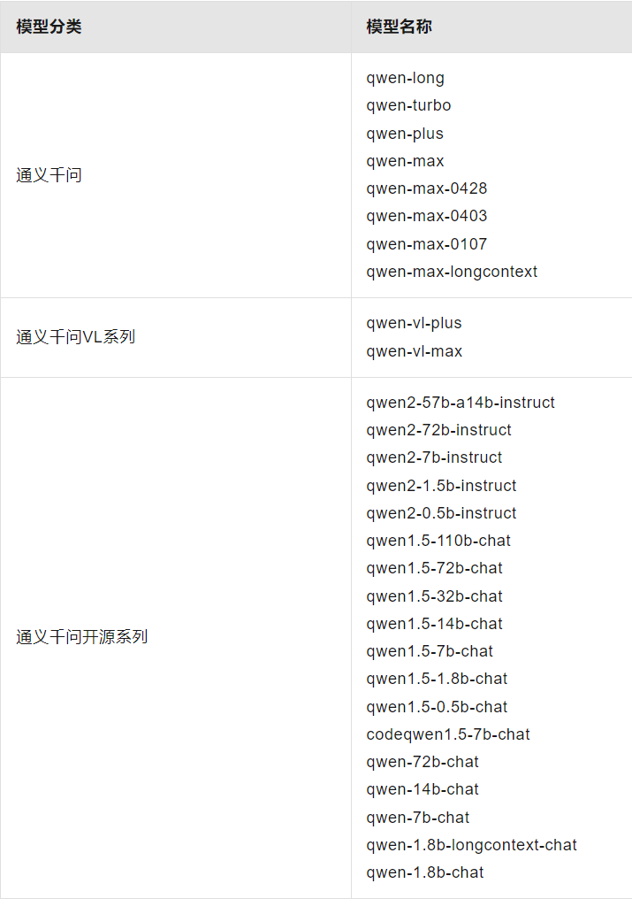
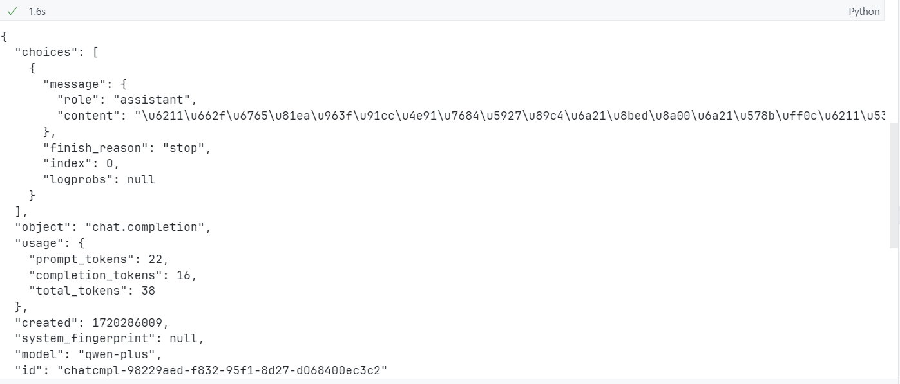

# Langchain

作者:`@xieleihan`[点击访问](https://github.com/xieleihan)

本文遵守GPL3.0开源协议

# 使用Dashscope实现对OpenAI接口的兼容

## 介绍

> DashScope提供了与OpenAI兼容的使用方式。如果您之前使用OpenAI SDK或者其他OpenAI兼容接口（例如langchain_openai SDK），以及HTTP方式调用OpenAI的服务，只需在原有框架下调整API-KEY、base_url、model等参数，就可以直接使用DashScope模型服务。
>
> 官方参考文档:[点击访问](https://help.aliyun.com/zh/dashscope/developer-reference/compatibility-of-openai-with-dashscope/?spm=a2c4g.11186623.0.0.7d5e3116va9abk)
>
> 这是我在2024.07找到的文档,但是我的代码演示部分没做这个兼容的部分,所以单独拿出来,给后续的人有个参考的文档

## 兼容OpenAI需要的信息

### `Base_URL`

base_url表示模型服务的网络访问点或地址。通过该地址，您可以访问服务提供的功能或数据。在Web服务或API的使用中，base_url通常对应于服务的具体操作或资源的URL。当您使用OpenAI兼容接口来使用DashScope模型服务时，需要配置base_url。

- 当您通过OpenAI SDK或其他OpenAI兼容的SDK调用时，需要配置的base_url如下：

	```http
	https://dashscope.aliyuncs.com/compatible-mode/v1
	```

- 当您通过HTTP请求调用时，需要配置的完整访问endpoint如下:

	```http
	POST https://dashscope.aliyuncs.com/compatible-mode/v1/chat/completions
	```

### 灵积api_key(dashscope_api_key)

你需要到阿里云上开通你的灵积模型服务并获得到你的api_key

这里略

### 支持的模型列表

当前OpenAI兼容接口支持的通义千问系列模型如下表所示。



## 通过OpenAI SDK调用

### 前提条件

- 请确保你电脑已经安装好了Python的环境,并且是***3.8版本以上***

- 请确保安装的是最新版的OpenAI模块

	```python
	# 如果下述命令报错，请将pip替换为pip3
	pip install -U openai
	```

- 已开通灵积模型服务并获得API-KEY

- 将API-KEY配置到环境变量中以降低API-KEY的泄露风险

- 选择需要的模型

### 使用方式

```python
import openai
import os

def get_response():
    api_key = os.getenv("DASHSCOPE_API_KEY")  # 确保你的环境变量已正确加载
    if not api_key:
        raise ValueError("DASHSCOPE_API_KEY is not set in the environment variables.")
    
    openai.api_base = "https://dashscope.aliyuncs.com/compatible-mode/v1"
    openai.api_key = api_key

    try:
        response = openai.ChatCompletion.create(
            model="qwen-plus",
            messages=[
                {'role': 'system', 'content': 'You are a helpful assistant.'},
                {'role': 'user', 'content': '你是谁？'}
            ]
        )
        print(response)
    except openai.error.OpenAIError as e:
        print(f"An error occurred: {e}")

if __name__ == '__main__':
    get_response()
```

可以看到没有任何问题




# 后续

还是不是很好用兼容性

等后续我再研究,或者直接重写一次