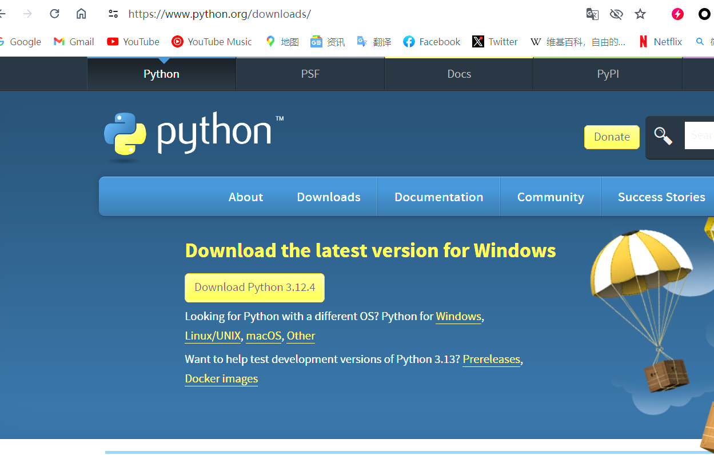
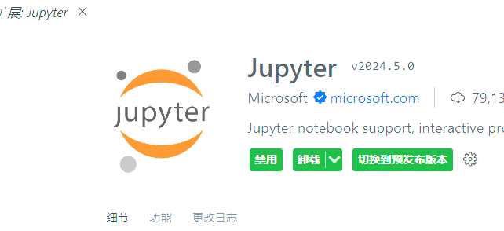
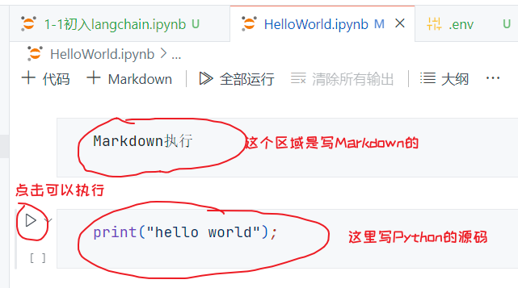
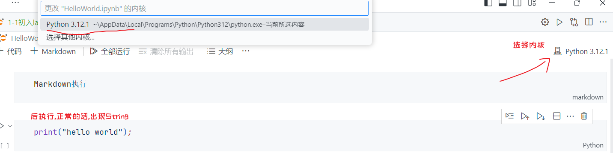
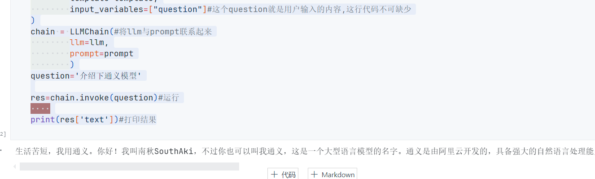

# Langchain

# 1.初识Langchain

## 介绍

LangChain是一个用于构建和部署以语言模型为核心的应用的框架。它为开发者提供了一套工具和模块，用于处理、管理和优化与大型语言模型（如OpenAI的GPT-3和GPT-4）相关的任务和流程。LangChain的目标是简化复杂的自然语言处理（NLP）应用的开发过程，使开发者能够更轻松地创建强大、灵活的应用程序。以下是LangChain的一些主要特点和功能：

1. **模型集成**：LangChain支持多种语言模型的集成，允许开发者选择和切换不同的模型，以满足不同的需求。

2. **数据处理**：提供了数据预处理、后处理和增强的功能，使得数据的准备和处理更加高效。

3. **模块化设计**：框架采用模块化设计，开发者可以根据具体需求组合不同的模块，例如文本生成、问答系统、对话代理等。

4. **扩展性和可定制性**：开发者可以轻松地扩展和定制LangChain中的组件，以适应特定的应用场景和业务需求。

5. **工具集成**：LangChain支持与其他工具和服务的集成，如数据库、API、前端框架等，方便构建端到端的解决方案。

6. **性能优化**：提供了多种性能优化策略，如模型压缩、并行处理等，帮助提高应用的效率和响应速度。

7. **社区和文档**：LangChain拥有活跃的社区和详细的文档，开发者可以获得及时的支持和指导，快速上手并解决开发过程中遇到的问题。

LangChain适用于各种应用场景，包括但不限于：

- 聊天机器人和虚拟助手
- 自动化内容生成
- 文本摘要和翻译
- 情感分析和文本分类
- 问答系统和知识库构建

通过LangChain，开发者可以更加专注于业务逻辑和应用设计，而不用花费大量时间在底层技术细节上，从而加速NLP应用的开发和部署。

> 上面的内容引用了ChatGPT的回答

>  LangChain由Harrison Chase于2022年10月作为[开源软件](https://zh.wikipedia.org/wiki/开源软件)项目推出

## 使用

得知它能做什么,我们接下来,就得来如何运行起我们的首个Langchain的应用

*Warning⚙️这里要说下:我这边是自己跑首个运行的时候,踩了一些坑,如果可以的话,请用我这个方法来,因为我多次实践,发现这个方法最稳定,不用花很长时间去官网或者海外各种渠道找资料.这里如果你认可这个说明,请一定按照我的方法来,虽然后续不知道会出现多少问题,但是目前来说这样是最好的!*

### 首先,你需要在电脑上安装一个Python环境

官网地址:`https://www.python.org/`[点击访问](https://www.python.org/)

这里我推荐下载最新的Python环境,但是至少需要***3.8以上***的,这个需要注意



然后,需要到`Vscode`或者`Pychran`等ide上,下载一个插件:`Jupyter`



### 再到vscode新建我们第一个文件

`helloworld.ipynb`,这是一个jupyter的文件





### 再接着,需要安装一些我们需要的package

```python
pip install langchain #安装langchain环境
pip install openai # 安装openai api
# 需要注意的是,下面两个是你要用通义模型才需要安装,不然就安装上面的就行
pip install python-dotenv #加载工具
pip install dashscope #灵积模型服务
```

我们到终端`cmd`或者到vscode里去执行上面的pip就行,看到`success`就可以了

验证

```python
pip show [your-package]
```

### 使用openai的模型(有点问题,能解决的用这个,不能的下面有其他)

```python
# 引入openai key
import os
# 配置环境变量
os.environ["OPENAI_KEY"] = "sk-yourOpenaiApi"
os.environ["OPENAI_API_BASE"] = "https://api.openai.com/v1"
```

测试一下成功否

```python
import os
openai_api_key = os.getenv("OPENAI_KEY")
openai_api_base = os.getenv("OPENAI_API_BASE")
print("OPENAI_API_KEY:", openai_api_key)
print("OPENAI_PROXY:", openai_api_base)
```

输出`对应的信息就行`

接下来,是官方sdk测试(langchain)

```python
#hello world
from langchain.llms import OpenAI
import os

api_base = os.getenv("OPENAI_API_BASE")
api_key = os.getenv("OPENAI_KEY")
llm = OpenAI(
    model="gpt-3.5-turbo-instruct",
    temperature=0,
    openai_api_key=api_key,
    openai_api_base=api_base
    )
llm.predict("介绍下你自己")
```

这个需要你自己去试下,我的问题就是一直429 Error,然后我用海外借记卡也无法付款给openai买配额或者这类的吧,觉得是配额的问题(待指正)

```text
RateLimitError: Error code: 429 - {'error': {'message': 'You exceeded your current quota, please check your plan and billing details. For more information on this error, read the docs: https://platform.openai.com/docs/guides/error-codes/api-errors.', 'type': 'insufficient_quota', 'param': None, 'code': 'insufficient_quota'}}
```

然后,我换了语言模型,毕竟我们都是去请求语言模型,所以这里更改我觉得对后面的影响不大,后续有问题我自己再解决

```python
#导入相关包
import os
from dotenv import find_dotenv, load_dotenv
load_dotenv(find_dotenv())
DASHSCOPE_API_KEY=os.environ["DASHSCOPE_API_KEY"]
from langchain_community.llms import Tongyi
from langchain.chains import LLMChain
from langchain.prompts import PromptTemplate
```

这里我们需要去申请一个阿里的通义的`api-key`

官网:`https://dashscope.console.aliyun.com/overview`[点击访问](https://dashscope.console.aliyun.com/overview)

申请流程(待补充或略)

然后,在`root目录`下新建一个文件`.env`

内容

```ini
DASHSCOPE_API_KEY="your-tongyiApiKey"
```

然后

```python
llm=Tongyi(temperature=1)
template='''
        你的名字是南秋SouthAki,当人问问题的时候,你都会在开头加上'生活苦短,我用通义',然后再回答{question}
    '''
prompt=PromptTemplate(
        template=template,
        input_variables=["question"]#这个question就是用户输入的内容,这行代码不可缺少
)
chain = LLMChain(#将llm与prompt联系起来
        llm=llm,
        prompt=prompt
        )
question='介绍下通义模型'

res=chain.invoke(question)#运行
    
print(res['text'])#打印结果
```

```text
解释:
os,dotenv都是用来加载环境变量DASHSCOPE_API_KEY的
Tongyi就是这里使用的通义千问大语言模型
PromptTemplate是提示词模板,用来给大模型做回答限制的,他会按照提示词模板的内容进行回答,跟模型的智慧程度有关,数据集越大的模型根据提示词做的回答越好,后期做Agent的效果越好.
LLMChain就是用来把LLM和prompt进行联系的
temperature=1是调节文本多样性的,让回答更加丰富,为0时就会更加准确,大于0回答的就会带有llm的思维回答(可能会胡编乱造) res['text']就是回答内容了,回答的一个字典包含了question和text
```



## All right:上面的话,补充点东西

就是,刚一连解决两个可能的问题

就是在定义这个`OPENAI-API-KEY`的时候,里面有个填入代理的地方

原来我们是这样的

```python
os.environ["OPENAI_API_BASE"] = "https://www.jcapikey.com"
```

but,这个可能对下面的langchain的运行造成这个问题

**<font color="red">AttributeError</font>**

```text
错误message
AttributeError                            Traceback (most recent call last)
Cell In[8], line 12
      5 api_key = os.getenv("OPENAI_KEY")
      6 llm = ChatOpenAI(
      7     model="gpt-3.5-turbo-instruct",
      8     temperature=0,
      9     openai_api_key=api_key,
     10     openai_api_base=api_base
     11 )
---> 12 result = llm.predict("介绍下你自己")
     13 print(type(result))  # 打印返回结果的类型

File c:\Users\xiele\AppData\Local\Programs\Python\Python312\Lib\site-packages\langchain_core\_api\deprecation.py:148, in deprecated.<locals>.deprecate.<locals>.warning_emitting_wrapper(*args, **kwargs)
    146     warned = True
    147     emit_warning()
--> 148 return wrapped(*args, **kwargs)

File c:\Users\xiele\AppData\Local\Programs\Python\Python312\Lib\site-packages\langchain_core\language_models\chat_models.py:885, in BaseChatModel.predict(self, text, stop, **kwargs)
    883 else:
    884     _stop = list(stop)
--> 885 result = self([HumanMessage(content=text)], stop=_stop, **kwargs)
    886 if isinstance(result.content, str):
    887     return result.content
...
--> 461     response = response.dict()
    462 for res in response["choices"]:
    463     message = convert_dict_to_message(res["message"])

AttributeError: 'str' object has no attribute 'dict'
Output is truncated. View as a scrollable element or open in a text editor. Adjust cell output settings...
```

解决方法:

```python
os.environ["OPENAI_API_BASE"] = "https://www.jcapikey.com/v1"
```

**就是在这个代理地址结尾,添加`/v1`**

这样,可以解决问题

这里,把我成熟方案贴在这里,试下可否可行,因为我测试后,现在是`403 Error`,不过这个应该就是配额的问题了

```python
import os
from langchain.chat_models import ChatOpenAI

api_base = os.getenv("OPENAI_API_BASE")
api_key = os.getenv("OPENAI_KEY")
llm = ChatOpenAI(
    model="gpt-3.5-turbo-instruct",
    temperature=0,
    openai_api_key=api_key,
    openai_api_base=api_base
)
result = llm.predict("介绍下你自己")
print(result)  # 打印返回结果的类型

```

参考链接:[点击访问](https://blog.csdn.net/jining11/article/details/134806188)