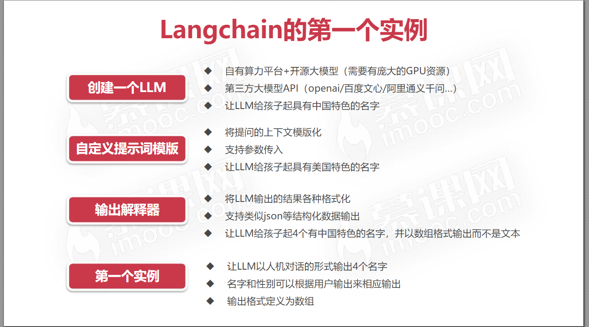
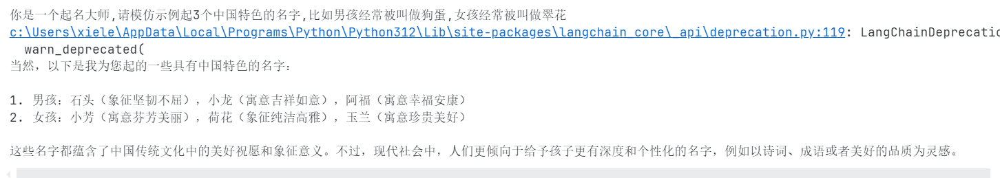
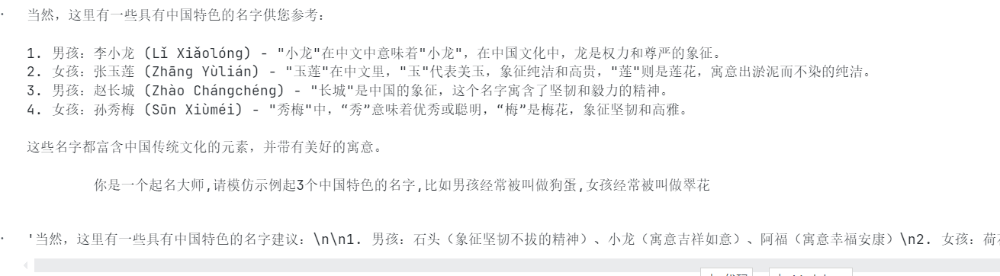
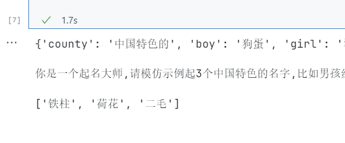

# Langchain

作者:`@xieleihan`[点击访问](https://github.com/xieleihan)

本文遵守GPL3.0开源协议

# 1.初识Langchain

## 介绍

LangChain是一个用于构建和部署以语言模型为核心的应用的框架。它为开发者提供了一套工具和模块，用于处理、管理和优化与大型语言模型（如OpenAI的GPT-3和GPT-4）相关的任务和流程。LangChain的目标是简化复杂的自然语言处理（NLP）应用的开发过程，使开发者能够更轻松地创建强大、灵活的应用程序。以下是LangChain的一些主要特点和功能：

1. **模型集成**：LangChain支持多种语言模型的集成，允许开发者选择和切换不同的模型，以满足不同的需求。

2. **数据处理**：提供了数据预处理、后处理和增强的功能，使得数据的准备和处理更加高效。

3. **模块化设计**：框架采用模块化设计，开发者可以根据具体需求组合不同的模块，例如文本生成、问答系统、对话代理等。

4. **扩展性和可定制性**：开发者可以轻松地扩展和定制LangChain中的组件，以适应特定的应用场景和业务需求。

5. **工具集成**：LangChain支持与其他工具和服务的集成，如数据库、API、前端框架等，方便构建端到端的解决方案。

6. **性能优化**：提供了多种性能优化策略，如模型压缩、并行处理等，帮助提高应用的效率和响应速度。

7. **社区和文档**：LangChain拥有活跃的社区和详细的文档，开发者可以获得及时的支持和指导，快速上手并解决开发过程中遇到的问题。

LangChain适用于各种应用场景，包括但不限于：

- 聊天机器人和虚拟助手
- 自动化内容生成
- 文本摘要和翻译
- 情感分析和文本分类
- 问答系统和知识库构建

通过LangChain，开发者可以更加专注于业务逻辑和应用设计，而不用花费大量时间在底层技术细节上，从而加速NLP应用的开发和部署。

> 上面的内容引用了ChatGPT的回答

>  LangChain由Harrison Chase于2022年10月作为[开源软件](https://zh.wikipedia.org/wiki/开源软件)项目推出

## 使用

得知它能做什么,我们接下来,就得来如何运行起我们的首个Langchain的应用

*Warning⚙️这里要说下:我这边是自己跑首个运行的时候,踩了一些坑,如果可以的话,请用我这个方法来,因为我多次实践,发现这个方法最稳定,不用花很长时间去官网或者海外各种渠道找资料.这里如果你认可这个说明,请一定按照我的方法来,虽然后续不知道会出现多少问题,但是目前来说这样是最好的!*

### 首先,你需要在电脑上安装一个Python环境

官网地址:`https://www.python.org/`[点击访问](https://www.python.org/)

这里我推荐下载最新的Python环境,但是至少需要***3.8以上***的,这个需要注意


然后,需要到`Vscode`或者`Pychran`等ide上,下载一个插件:`Jupyter`


### 再到vscode新建我们第一个文件

`helloworld.ipynb`,这是一个jupyter的文件


### 再接着,需要安装一些我们需要的package

```python
pip install langchain #安装langchain环境
pip install openai # 安装openai api
# 需要注意的是,下面两个是你要用通义模型才需要安装,不然就安装上面的就行
pip install python-dotenv #加载工具
pip install dashscope #灵积模型服务
```

我们到终端`cmd`或者到vscode里去执行上面的pip就行,看到`success`就可以了

验证

```python
pip show [your-package]
```

### 使用openai的模型(有点问题,能解决的用这个,不能的下面有其他)

```python
# 引入openai key
import os
# 配置环境变量
os.environ["OPENAI_KEY"] = "sk-yourOpenaiApi"
os.environ["OPENAI_API_BASE"] = "https://api.openai.com/v1"
```

测试一下成功否

```python
import os
openai_api_key = os.getenv("OPENAI_KEY")
openai_api_base = os.getenv("OPENAI_API_BASE")
print("OPENAI_API_KEY:", openai_api_key)
print("OPENAI_PROXY:", openai_api_base)
```

输出`对应的信息就行`

接下来,是官方sdk测试(langchain)

```python
#hello world
from langchain.llms import OpenAI
import os

api_base = os.getenv("OPENAI_API_BASE")
api_key = os.getenv("OPENAI_KEY")
llm = OpenAI(
    model="gpt-3.5-turbo-instruct",
    temperature=0,
    openai_api_key=api_key,
    openai_api_base=api_base
    )
llm.predict("介绍下你自己")
```

这个需要你自己去试下,我的问题就是一直429 Error,然后我用海外借记卡也无法付款给openai买配额或者这类的吧,觉得是配额的问题(待指正)

```text
RateLimitError: Error code: 429 - {'error': {'message': 'You exceeded your current quota, please check your plan and billing details. For more information on this error, read the docs: https://platform.openai.com/docs/guides/error-codes/api-errors.', 'type': 'insufficient_quota', 'param': None, 'code': 'insufficient_quota'}}
```

然后,我换了语言模型,毕竟我们都是去请求语言模型,所以这里更改我觉得对后面的影响不大,后续有问题我自己再解决

```python
#导入相关包
import os
from dotenv import find_dotenv, load_dotenv
load_dotenv(find_dotenv())
DASHSCOPE_API_KEY=os.environ["DASHSCOPE_API_KEY"]
from langchain_community.llms import Tongyi
from langchain.chains import LLMChain
from langchain.prompts import PromptTemplate
```

这里我们需要去申请一个阿里的通义的`api-key`

官网:`https://dashscope.console.aliyun.com/overview`[点击访问](https://dashscope.console.aliyun.com/overview)

申请流程(待补充或略)

然后,在`root目录`下新建一个文件`.env`

内容

```ini
DASHSCOPE_API_KEY="your-tongyiApiKey"
```

然后

```python
llm=Tongyi(temperature=1)
template='''
        你的名字是南秋SouthAki,当人问问题的时候,你都会在开头加上'生活苦短,我用通义',然后再回答{question}
    '''
prompt=PromptTemplate(
        template=template,
        input_variables=["question"]#这个question就是用户输入的内容,这行代码不可缺少
)
chain = LLMChain(#将llm与prompt联系起来
        llm=llm,
        prompt=prompt
        )
question='介绍下通义模型'

res=chain.invoke(question)#运行
    
print(res['text'])#打印结果
```

```text
解释:
os,dotenv都是用来加载环境变量DASHSCOPE_API_KEY的
Tongyi就是这里使用的通义千问大语言模型
PromptTemplate是提示词模板,用来给大模型做回答限制的,他会按照提示词模板的内容进行回答,跟模型的智慧程度有关,数据集越大的模型根据提示词做的回答越好,后期做Agent的效果越好.
LLMChain就是用来把LLM和prompt进行联系的
temperature=1是调节文本多样性的,让回答更加丰富,为0时就会更加准确,大于0回答的就会带有llm的思维回答(可能会胡编乱造) res['text']就是回答内容了,回答的一个字典包含了question和text
```


## 这里我们要完成什么呢



> 图来源于internet,请勿转载

那么需要有点,基础的知识

```text
// 创建LLM
在langchain中最基本的功能就是根据文本提示来生成新的文本
使用的方法是:`predict`
Question:"帮我起一个具有中国特色的男孩名字" => LLM.predict() => "狗剩"

生成的结果根据你调用的模型不同会产生非常不同的结果差距,并且tempurature参数也会影响最终结果
```


```text
// 自定义一个提示词模版
我们需要用上langchain提供的一个方法:`prompts`
使用方法:`langchain.prompts

举例:
Question:"帮我起一个具有{country}特色的男孩名字" =>prompts.format(country = "美国") => "山姆"
```


## All right:上面的话,补充点东西

就是,刚一连解决两个可能的问题

就是在定义这个`OPENAI-API-KEY`的时候,里面有个填入代理的地方

原来我们是这样的

```python
os.environ["OPENAI_API_BASE"] = "https://www.jcapikey.com"
```

but,这个可能对下面的langchain的运行造成这个问题

**<font color="red">AttributeError</font>**

```text
错误message
AttributeError                            Traceback (most recent call last)
Cell In[8], line 12
      5 api_key = os.getenv("OPENAI_KEY")
      6 llm = ChatOpenAI(
      7     model="gpt-3.5-turbo-instruct",
      8     temperature=0,
      9     openai_api_key=api_key,
     10     openai_api_base=api_base
     11 )
---> 12 result = llm.predict("介绍下你自己")
     13 print(type(result))  # 打印返回结果的类型

File c:\Users\xiele\AppData\Local\Programs\Python\Python312\Lib\site-packages\langchain_core\_api\deprecation.py:148, in deprecated.<locals>.deprecate.<locals>.warning_emitting_wrapper(*args, **kwargs)
    146     warned = True
    147     emit_warning()
--> 148 return wrapped(*args, **kwargs)

File c:\Users\xiele\AppData\Local\Programs\Python\Python312\Lib\site-packages\langchain_core\language_models\chat_models.py:885, in BaseChatModel.predict(self, text, stop, **kwargs)
    883 else:
    884     _stop = list(stop)
--> 885 result = self([HumanMessage(content=text)], stop=_stop, **kwargs)
    886 if isinstance(result.content, str):
    887     return result.content
...
--> 461     response = response.dict()
    462 for res in response["choices"]:
    463     message = convert_dict_to_message(res["message"])

AttributeError: 'str' object has no attribute 'dict'
Output is truncated. View as a scrollable element or open in a text editor. Adjust cell output settings...
```

解决方法:

```python
os.environ["OPENAI_API_BASE"] = "https://www.jcapikey.com/v1"
```

**就是在这个代理地址结尾,添加`/v1`**

这样,可以解决问题

这里,把我成熟方案贴在这里,试下可否可行,因为我测试后,现在是`403 Error`,不过这个应该就是配额的问题了

```python
import os
from langchain.chat_models import ChatOpenAI

api_base = os.getenv("OPENAI_API_BASE")
api_key = os.getenv("OPENAI_KEY")
llm = ChatOpenAI(
    model="gpt-3.5-turbo-instruct",
    temperature=0,
    openai_api_key=api_key,
    openai_api_base=api_base
)
result = llm.predict("介绍下你自己")
print(result)  # 打印返回结果的类型

```

参考链接:[点击访问](https://blog.csdn.net/jining11/article/details/134806188)

##  然后我们对这个做个小项目

### Project

现在我们是测试完毕了,tongyi的模型,我们接着来实现一个起名大师

依旧的,先是OpenAI的,但是没有额度,我们转译一下试试

```python
#起名大师
from langchain.llms import OpenAI
from langchain.prompts import PromptTemplate
import os
api_base = os.getenv("OPENAI_API_BASE")
api_key = os.getenv("OPENAI_KEY")
llm = OpenAI(
    model="gpt-3.5-turbo-instruct",
    temperature=0,
    openai_api_key=api_key,
    openai_api_base=api_base
    )
prompt = PromptTemplate.from_template("你是一个起名大师,请模仿示例起3个{county}名字,比如男孩经常被叫做{boy},女孩经常被叫做{girl}")
message = prompt.format(county="中国特色的",boy="狗蛋",girl="翠花")
print(message)
llm.predict(message)
```

> 🚧:以后相关的Openai的接口我也会同步的贴出来,需要自己买额度测试,按道理应该是可以跑通的

下面的这个是使用了国产大语言模型**Tongyi**的(*通过对OpenAI的直接转译得到*)

```python
from langchain_community.llms import Tongyi
from langchain.prompts import PromptTemplate
import os

# 获取环境变量中的 API 基本 URL 和密钥
api_base = os.getenv("OPENAI_API_BASE")
api_key = os.getenv("OPENAI_KEY")

# 使用 Tongyi 模型
llm = Tongyi(
    model="gpt-3.5-turbo-instruct",
    temperature=0,
    openai_api_key=api_key,
    openai_api_base=api_base
)

# 创建 PromptTemplate
prompt = PromptTemplate.from_template("你是一个起名大师,请模仿示例起3个{county}名字,比如男孩经常被叫做{boy},女孩经常被叫做{girl}")

# 格式化消息
message = prompt.format(county="中国特色的", boy="狗蛋", girl="翠花")
print(message)

# 调用 Tongyi 模型进行预测
response = llm.predict(message)
print(response)
```

但是发现,直接转译有问题,虽然结果是这样的



所以,我对这个进行相应修改

```python
llm=Tongyi(temperature=0)
template='''
        你是一个起名大师,请模仿示例起3个{county}名字,比如男孩经常被叫做{boy},女孩经常被叫做{girl}
    '''
prompt=PromptTemplate(
        template=template,
        input_variables=["county", "boy", "girl"]# 这个question就是用户输入的内容,这行代码不可缺少
)
chain = LLMChain(#将llm与prompt联系起来
        llm=llm,
        prompt=prompt
        )

# 用户输入的问题
county = "中国特色的"
boy = "狗蛋"
girl = "翠花"

# 格式化消息
message = prompt.format(county=county, boy=boy, girl=girl)

# 运行并打印结果
res = chain.invoke({"county": county, "boy": boy, "girl": girl})
print(res['text'])

# 尝试打印message
print(message)
# 输出llm的predict
llm.predict(message)
```

这里需要解释一下

> 在语言模型（如GPT-3或其他类似模型）中，`temperature` 参数是一个控制生成文本的随机性的超参数。它在生成模型输出时影响词的选择方式，具体如下：
>
> 1. **低 `temperature` 值（接近0）**：
> 	- **更确定性**：模型更倾向于选择概率最高的词，因此生成的文本更有条理，连贯性较强，但也可能显得缺乏创意和多样性。
> 	- **示例**：如果`temperature`设为0，模型将总是选择概率最高的词，这使得每次生成的结果都非常相似或相同。
> 2. **高 `temperature` 值（接近1）**：
> 	- **更随机性**：模型在选择词时考虑更多的可能性，因此生成的文本更具创意和多样性，但也可能出现语义上不连贯或不合逻辑的内容。
> 	- **示例**：如果`temperature`设为1，模型在生成文本时会有更多的自由度，选择概率较低的词的机会增加，从而生成更具创意的文本。
> 3. **中等 `temperature` 值（如0.7）**：
> 	- **平衡性**：既有一定的随机性来生成多样化的内容，同时也保持一定的连贯性和逻辑性。
> 	- **示例**：很多情况下，设定`temperature`为0.7是一个较好的选择，可以在生成连贯性和创意之间找到平衡。

所以我在这一行上,对`temperature`设置了一个参数,让语言模型严格的按照我们的需求输出

`llm=Tongyi(temperature=0)`

结果如图



OK,到这里的话,我们的环境测试之类的,都没有问题了

But,我们知道在以后的生产环境中一定不能用上这种形式的OutPrintf

我们要得到的,是里面的数据,数据那用数组去存储

这里需要用上`Python`的一些相关知识

```python
# 首先的话
# 需要导入Python中一个输出的基本类BaseOutputParser
# 导入到langchain中
from langchain.schema import BaseOutputParser
# 自定义类
# 继承了BaseOutputParser
# 重写了parse方法
class CommaSeparatedListOutputParser(BaseOutputParser):
    def parse(self, text: str) -> str:
        # 输出结果 strip()去除空格
        # split()分割字符串
        return text.strip().split(", ")
    
CommaSeparatedListOutputParser().parse("apple, banana, cherry")
```

```text
Output:['apple', 'banana', 'cherry']
```

解释如下

这里,先导入Python的一个输出的基本类`BaseOutputPaser`

>`BaseOutputParser` 是一个基础类，用于解析语言模型（LLM）生成的输出。在使用 LLM 时，模型生成的原始输出可能需要进一步处理才能满足特定需求。`BaseOutputParser` 提供了一个统一的接口来实现这种处理。
>
>在 LangChain 中，`BaseOutputParser` 类的主要用途是定义一种方法，将 LLM 的原始输出转换为用户需要的格式。这种方法的实现可以是多种多样的，例如提取特定信息、格式化输出、分割字符串等。
>
>### `BaseOutputParser` 的主要方法
>
>- **`parse(self, text: str)`**：这是一个抽象方法，需要在子类中实现。它接受一个字符串（模型生成的原始输出）作为输入，并返回解析后的结果。

然后来实现我们最终的目的

```python
# 起名大师
# 导入相关包
import os
from dotenv import find_dotenv, load_dotenv
load_dotenv(find_dotenv())
DASHSCOPE_API_KEY = os.getenv("DASHSCOPE_API_KEY")
from langchain_community.llms import Tongyi
from langchain.chains import LLMChain
from langchain.prompts import PromptTemplate
from langchain.schema import BaseOutputParser

# 自定义类
class CommaSeparatedListOutputParser(BaseOutputParser):
    def parse(self, text: str):
        # return text.strip().split(", ")
        return [item.strip() for item in text.strip().split(",")]

llm = Tongyi(
    temperature=0,
    openai_api_key=DASHSCOPE_API_KEY
)

template = '''
你是一个起名大师,请模仿示例起3个{county}名字,比如男孩经常被叫做{boy},女孩经常被叫做{girl},请返回以逗号分隔的列表形式。仅返回逗号分隔的列表，不要返回其他内容。
'''
prompt = PromptTemplate(
    template=template,
    input_variables=["county", "boy", "girl"]
)

# 设置解析器
parser = CommaSeparatedListOutputParser()

# 将 LLM 与 Prompt 和解析器连接起来
chain = LLMChain(
    llm=llm,
    prompt=prompt,
    output_parser=parser
)

# 用户输入的问题
county = "中国特色的"
boy = "狗蛋"
girl = "翠花"

# 格式化消息
message = prompt.format(county=county, boy=boy, girl=girl)

# 运行并打印结果
res = chain.invoke({"county": county, "boy": boy, "girl": girl})
print(res)  # 应该输出一个列表

# 尝试打印message
print(message)

# 直接调用llm的预测
strs = llm.predict(message)
parsed_output = parser.parse(strs)
print(parsed_output)
```



那么,第一章就到这里,有问题的可以在下面的评论区评论,我看后会尽力帮你解决.

然后,这个文章尚未完结,后面发现有什么问题会进行补充.

