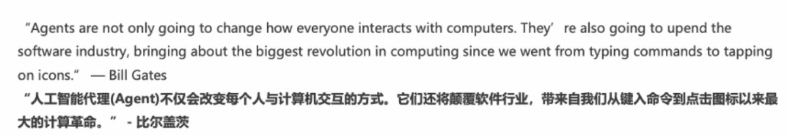
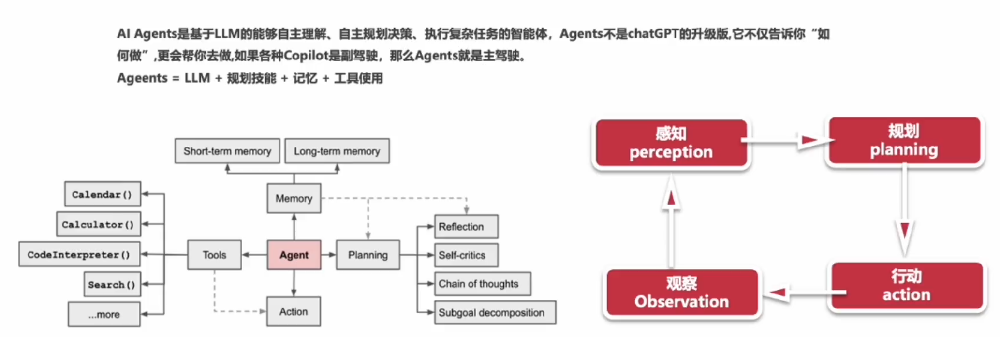

# Langchain

作者:`@xieleihan`[点击访问](https://github.com/xieleihan)

本文遵守GPL3.0开源协议

# 实现一个聊天机器人

## Agents

#### 介绍

> 

- 无需为不同任务使用单独软件
- 使用日常语言来命令你的设备
- 代理是人工智能的高级形式
- 未来五年将成为现实
- 人人都有的私人助理Agnet
- 应用在千行百业之中(医疗,教育,娱乐...)
- 生产力的改变
- 继PC,IOS,Android后下一个平台 

## Langchain中的Agents如何实现

1. 提出需求
2. 问题+prompt组合
3. React Loop
4. 查找Memory
5. 查找可用工具
6. 执行工具并观察结果
7. 得到最终的结果

### 实现一个最简单的Agents

#### 设计两个任务

- 会做数学题
- 不知道答案的时候可以搜索

#### 实现

