# Langchain

作者:`@xieleihan`[点击访问](https://github.com/xieleihan)

本文遵守GPL3.0开源协议

# 实现一个聊天机器人

## Agents

#### 介绍

> 

- 无需为不同任务使用单独软件
- 使用日常语言来命令你的设备
- 代理是人工智能的高级形式
- 未来五年将成为现实
- 人人都有的私人助理Agnet
- 应用在千行百业之中(医疗,教育,娱乐...)
- 生产力的改变
- 继PC,IOS,Android后下一个平台 


## Langchain中的Agents如何实现

1. 提出需求
2. 问题+prompt组合
3. React Loop
4. 查找Memory
5. 查找可用工具
6. 执行工具并观察结果
7. 得到最终的结果

### 实现一个最简单的Agents

#### 设计两个任务

- 会做数学题
- 不知道答案的时候可以搜索

#### 实现

```python
# 导入模块
from dotenv import find_dotenv, load_dotenv
import os
# 加载 API key
load_dotenv(find_dotenv())
api_key = os.getenv("DASHSCOPE_API_KEY")

# 首先依旧导入模块
from langchain_community.chat_models import ChatTongyi
import os

llm = ChatTongyi(
    dashscope_api_key = api_key,
    model = "Qwen-max",
    temperature = 0
)

# 搭建工具
# 我们使用一个工具,serpai是一个聚合搜索引擎,需要安装谷歌搜索包和申请apikey
# https://serpapi.com/dashboard
# llm-math 是一个封装好的数学计算链
# 首先我们需要安装谷歌搜索包
```

```python
! pip install google-search-results
```

```python
# 导入模块
from dotenv import find_dotenv, load_dotenv
import os
# 加载 API key
load_dotenv(find_dotenv())
dashscope_api_key = os.getenv("DASHSCOPE_API_KEY")
serpapi_api_key = os.getenv("SERPAPI_API_KEY")

# 首先依旧导入模块
from langchain_community.chat_models import ChatTongyi
import os

llm = ChatTongyi(
    dashscope_api_key = dashscope_api_key,
    model = "qwen-vl-max",
    temperature = 0
)

from langchain.agents import load_tools
# 搭建工具
tools = load_tools(
    ["serpapi", "llm-math"],
    llm=llm,
    serpapi_api_key=serpapi_api_key
)

# 定义agents使用小样本增强
from langchain.agents import initialize_agent
from langchain.agents import AgentType

# 定义工具
agent = initialize_agent(
    tools,
    llm,
    agent=AgentType.ZERO_SHOT_REACT_DESCRIPTION,# 这里有不同的类型
    verbose=True
)

agent.run("英国前任女王的名字叫什么,她的年龄的平方是多少?")
```

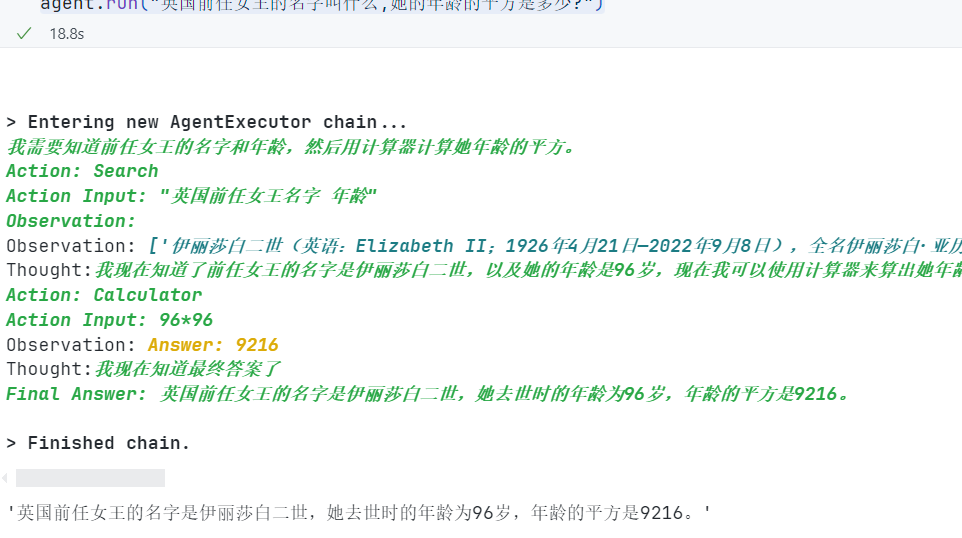

### 几种内置的主要Agent类型

- openai_functions OpenAI函数调用型
- zero_short_react_description 零样本增强生成型
- chat_zero_shot_react_description 零样本增强对话型
- conversational_react_description 对话增强生成型
- chat_conversational_react_description 对话增强结构化
- structued_chat_zero_short_react_description 零样本增强结构化对话型

#### ZERO_SHOT_REACT_DESCRIPTION

零样本增强生成,既在没有示例的情况下,可以自主进行对话的类型[零样本,单样本,少样本](https://blog.csdn.net/zcyzcyjava/article/details/127006287)

```python
from langchain.llms import Tongyi
from langchain.agents import (
    load_tools,
    initialize_agent,
    AgentType
)
import os
from dotenv import find_dotenv, load_dotenv
import os
# 加载 API key
load_dotenv(find_dotenv())
dashscope_api_key = os.getenv("DASHSCOPE_API_KEY")
serpapi_api_key = os.getenv("SERPAPI_API_KEY")

llm = Tongyi(
    dashscope_api_key = dashscope_api_key,
    model = 'Qwen-max',
    temperature =0
)

tools = load_tools(["serpapi", "llm-math"], llm=llm, serpapi_api_key=serpapi_api_key)
agent = initialize_agent(
    tools,
    llm,
    agent=AgentType.ZERO_SHOT_REACT_DESCRIPTION,
    verbose=True
)

agent.run('上一任新西兰女王是谁?她年龄除以2是多少?')
```

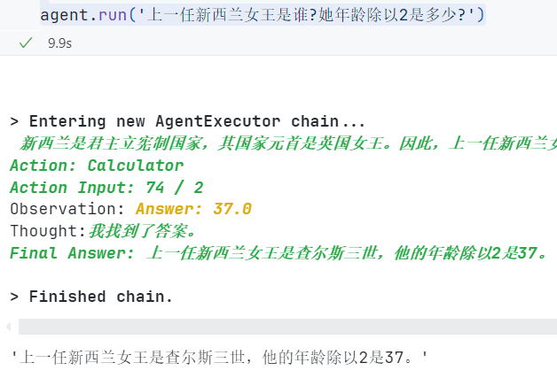

#### CHAT_ZERO_SHOT_REACT_DESCRIPTION

其实跟上面的没什么区别,主要是把`llm`换成了`chatModel`

```python
# from langchain.llms import Tongyi
from langchain_community.chat_models import ChatTongyi
from langchain.agents import (
    load_tools,
    initialize_agent,
    AgentType
)
import os
from dotenv import find_dotenv, load_dotenv
import os
# 加载 API key
load_dotenv(find_dotenv())
dashscope_api_key = os.getenv("DASHSCOPE_API_KEY")
serpapi_api_key = os.getenv("SERPAPI_API_KEY")

llm = ChatTongyi(
    dashscope_api_key = dashscope_api_key,
    model_name = 'qwen-vl-max',
    temperature =0
)

tools = load_tools(["serpapi", "llm-math"], llm=llm, serpapi_api_key=serpapi_api_key)
agent = initialize_agent(
    tools,
    llm,
    agent=AgentType.CHAT_ZERO_SHOT_REACT_DESCRIPTION,
    verbose=True
)

agent.run('世界第三极是什么?它的高度乘2是多少?')
```

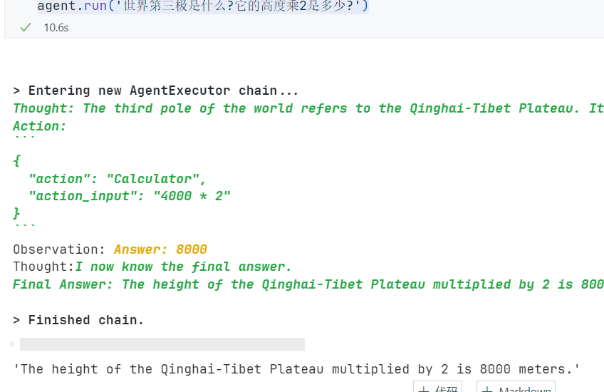

#### CONVERSATIONAL_REACT_DESCRIPTION

一个对话型的agent,这个agent要求与memory一起使用

```python
from langchain.llms import Tongyi
from langchain.agents import(
    load_tools,
    initialize_agent,
    AgentType
)
from langchain.memory import ConversationBufferMemory
import os
from dotenv import find_dotenv, load_dotenv
# 加载 API key
load_dotenv(find_dotenv())
dashscope_api_key = os.getenv("DASHSCOPE_API_KEY")
serpapi_api_key = os.getenv("SERPAPI_API_KEY")

# 记忆组件
memory = ConversationBufferMemory(
    memory_key="chat_history"
)

llm = Tongyi(
    dashscope_api_key = dashscope_api_key,
    model = "Qwen-max",
    temperature = 0,
)

tools = load_tools(["serpapi", "llm-math"], llm=llm, serpapi_api_key=serpapi_api_key)
agent = initialize_agent(
    tools,
    llm,
    agent=AgentType.CONVERSATIONAL_REACT_DESCRIPTION,
    verbose=True,
    memory=memory # 记忆组件
)

print(agent)
# 看下模版
print(agent.agent.llm_chain.prompt.template)
```

我们来看下模版提示词

````text
memory=ConversationBufferMemory(memory_key='chat_history') verbose=True tags=['conversational-react-description'] agent=ConversationalAgent(llm_chain=LLMChain(prompt=PromptTemplate(input_variables=['agent_scratchpad', 'chat_history', 'input'], template='Assistant is a large language model trained by OpenAI.\n\nAssistant is designed to be able to assist with a wide range of tasks, from answering simple questions to providing in-depth explanations and discussions on a wide range of topics. As a language model, Assistant is able to generate human-like text based on the input it receives, allowing it to engage in natural-sounding conversations and provide responses that are coherent and relevant to the topic at hand.\n\nAssistant is constantly learning and improving, and its capabilities are constantly evolving. It is able to process and understand large amounts of text, and can use this knowledge to provide accurate and informative responses to a wide range of questions. Additionally, Assistant is able to generate its own text based on the input it receives, allowing it to engage in discussions and provide explanations and descriptions on a wide range of topics.\n\nOverall, Assistant is a powerful tool that can help with a wide range of tasks and provide valuable insights and information on a wide range of topics. Whether you need help with a specific question or just want to have a conversation about a particular topic, Assistant is here to assist.\n\nTOOLS:\n------\n\nAssistant has access to the following tools:\n\n> Search: A search engine. Useful for when you need to answer questions about current events. Input should be a search query.\n> Calculator: Useful for when you need to answer questions about math.\n\nTo use a tool, please use the following format:\n\n```\nThought: Do I need to use a tool? Yes\nAction: the action to take, should be one of [Search, Calculator]\nAction Input: the input to the action\nObservation: the result of the action\n```\n\nWhen you have a response to say to the Human, or if you do not need to use a tool, you MUST use the format:\n\n```\nThought: Do I need to use a tool? No\nAI: [your response here]\n```\n\nBegin!\n\nPrevious conversation history:\n{chat_history}\n\nNew input: {input}\n{agent_scratchpad}'), llm=Tongyi(client=<class 'dashscope.aigc.generation.Generation'>, dashscope_api_key='sk-2a9e44d9621f4fd1b5f9f2c081779215')), output_parser=ConvoOutputParser(), allowed_tools=['Search', 'Calculator'], ai_prefix='AI') tools=[Tool(name='Search', description='A search engine. Useful for when you need to answer questions about current events. Input should be a search query.', func=<bound method SerpAPIWrapper.run of SerpAPIWrapper(search_engine=<class 'serpapi.google_search.GoogleSearch'>, params={'engine': 'google', 'google_domain': 'google.com', 'gl': 'us', 'hl': 'en'}, serpapi_api_key='ebcc8130fff3a121b7029d6db2bd880991535ffa5ce8df722ba3d4aa1a892f73', aiosession=None)>, coroutine=<bound method SerpAPIWrapper.arun of SerpAPIWrapper(search_engine=<class 'serpapi.google_search.GoogleSearch'>, params={'engine': 'google', 'google_domain': 'google.com', 'gl': 'us', 'hl': 'en'}, serpapi_api_key='ebcc8130fff3a121b7029d6db2bd880991535ffa5ce8df722ba3d4aa1a892f73', aiosession=None)>), Tool(name='Calculator', description='Useful for when you need to answer questions about math.', func=<bound method Chain.run of LLMMathChain(llm_chain=LLMChain(prompt=PromptTemplate(input_variables=['question'], template='Translate a math problem into a expression that can be executed using Python\'s numexpr library. Use the output of running this code to answer the question.\n\nQuestion: ${{Question with math problem.}}\n```text\n${{single line mathematical expression that solves the problem}}\n```\n...numexpr.evaluate(text)...\n```output\n${{Output of running the code}}\n```\nAnswer: ${{Answer}}\n\nBegin.\n\nQuestion: What is 37593 * 67?\n```text\n37593 * 67\n```\n...numexpr.evaluate("37593 * 67")...\n```output\n2518731\n```\nAnswer: 2518731\n\nQuestion: 37593^(1/5)\n```text\n37593**(1/5)\n```\n...numexpr.evaluate("37593**(1/5)")...\n```output\n8.222831614237718\n```\nAnswer: 8.222831614237718\n\nQuestion: {question}\n'), llm=Tongyi(client=<class 'dashscope.aigc.generation.Generation'>, dashscope_api_key='sk-2a9e44d9621f4fd1b5f9f2c081779215')))>, coroutine=<bound method Chain.arun of LLMMathChain(llm_chain=LLMChain(prompt=PromptTemplate(input_variables=['question'], template='Translate a math problem into a expression that can be executed using Python\'s numexpr library. Use the output of running this code to answer the question.\n\nQuestion: ${{Question with math problem.}}\n```text\n${{single line mathematical expression that solves the problem}}\n```\n...numexpr.evaluate(text)...\n```output\n${{Output of running the code}}\n```\nAnswer: ${{Answer}}\n\nBegin.\n\nQuestion: What is 37593 * 67?\n```text\n37593 * 67\n```\n...numexpr.evaluate("37593 * 67")...\n```output\n2518731\n```\nAnswer: 2518731\n\nQuestion: 37593^(1/5)\n```text\n37593**(1/5)\n```\n...numexpr.evaluate("37593**(1/5)")...\n```output\n8.222831614237718\n```\nAnswer: 8.222831614237718\n\nQuestion: {question}\n'), llm=Tongyi(client=<class 'dashscope.aigc.generation.Generation'>, dashscope_api_key='sk-2a9e44d9621f4fd1b5f9f2c081779215')))>)]
Assistant is a large language model trained by OpenAI.

Assistant is designed to be able to assist with a wide range of tasks, from answering simple questions to providing in-depth explanations and discussions on a wide range of topics. As a language model, Assistant is able to generate human-like text based on the input it receives, allowing it to engage in natural-sounding conversations and provide responses that are coherent and relevant to the topic at hand.

Assistant is constantly learning and improving, and its capabilities are constantly evolving. It is able to process and understand large amounts of text, and can use this knowledge to provide accurate and informative responses to a wide range of questions. Additionally, Assistant is able to generate its own text based on the input it receives, allowing it to engage in discussions and provide explanations and descriptions on a wide range of topics.

Overall, Assistant is a powerful tool that can help with a wide range of tasks and provide valuable insights and information on a wide range of topics. Whether you need help with a specific question or just want to have a conversation about a particular topic, Assistant is here to assist.

TOOLS:
------

Assistant has access to the following tools:

> Search: A search engine. Useful for when you need to answer questions about current events. Input should be a search query.
> Calculator: Useful for when you need to answer questions about math.

To use a tool, please use the following format:

```
Thought: Do I need to use a tool? Yes
Action: the action to take, should be one of [Search, Calculator]
Action Input: the input to the action
Observation: the result of the action
```

When you have a response to say to the Human, or if you do not need to use a tool, you MUST use the format:

```
Thought: Do I need to use a tool? No
AI: [your response here]
```

Begin!

Previous conversation history:
{chat_history}

New input: {input}
{agent_scratchpad}

````

OK,让我们提出问题,问答AI

```python
agent.run("hi, i am SouthAki,what is your name?")
```

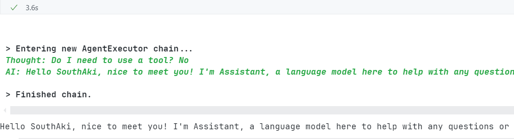

```python
agent.run("香港有哪里比较好玩的吗?")
```

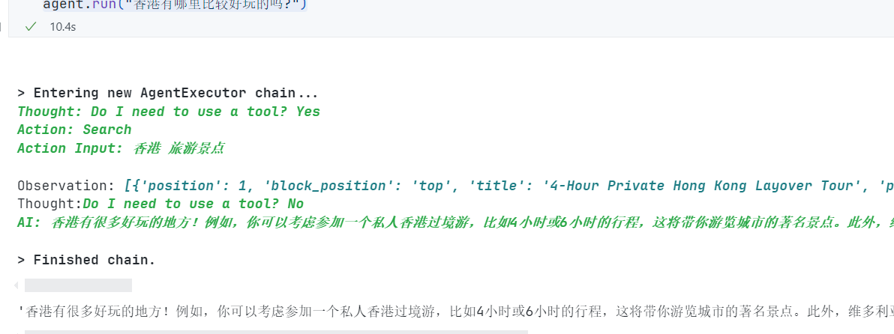

```python
agent.run("我还没玩过,你知道我名字后三个字母是什么吗?")
```

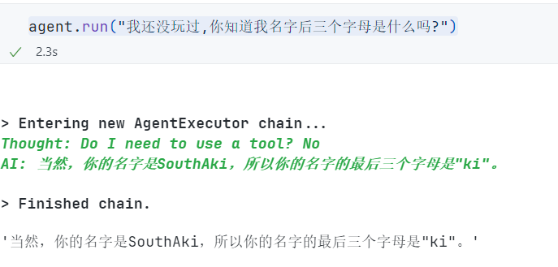

```python
agent.run("中国广东省广州市现在的气温是多少来着?")
```

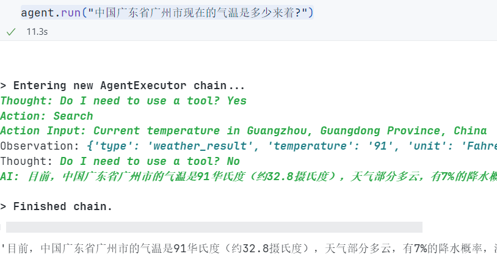

```python
agent.run("截止到现在我们问了多少问题?")
```


#### CHAT_CONVERSATIONAL_REACT_DESCRIPTION

跟上面一样差不多

```python
from langchain_community.chat_models import ChatTongyi
from langchain.agents import(
    load_tools,
    initialize_agent,
    AgentType
)
from langchain.memory import ConversationBufferMemory
import os
from dotenv import find_dotenv, load_dotenv
# 加载 API key
load_dotenv(find_dotenv())
dashscope_api_key = os.getenv("DASHSCOPE_API_KEY")
serpapi_api_key = os.getenv("SERPAPI_API_KEY")

# 记忆组件
memory = ConversationBufferMemory(
    memory_key="chat_history",
    return_messages= True
)

llm = ChatTongyi(
    dashscope_api_key = dashscope_api_key,
    model_name = "qwen-vl-max",
    temperature = 0,
)

tools = load_tools(["serpapi", "llm-math"], llm=llm, serpapi_api_key=serpapi_api_key)
agent = initialize_agent(
    tools,
    llm,
    agent=AgentType.CHAT_CONVERSATIONAL_REACT_DESCRIPTION,
    verbose=True,
    memory=memory # 记忆组件
)

print(agent)
# 看下模版
print(agent.agent.llm_chain.prompt.template)
```

来看看问题的答案吧

```python
agent.run("hi, i am 南秋SouthAki,what is your name?")
```

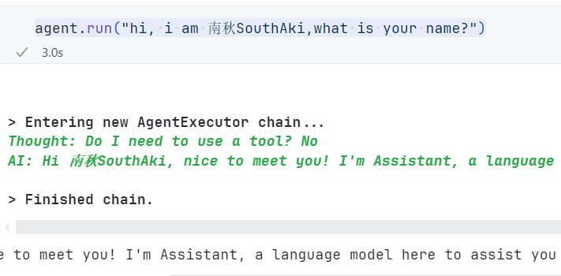

```python
agent.run("香港有什么比较好吃的美食?")
```

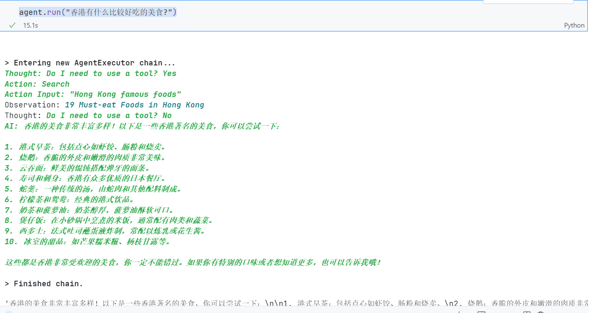

```python
agent.run("我还没吃过,不过你还知道我名字的最后一个字母是什么吗?中国澳门现在的气温是多少来着?")
```

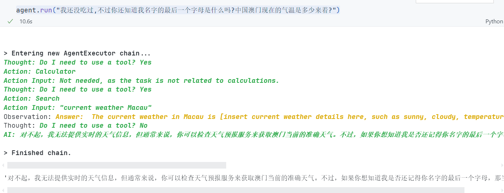

```python
agent.run("截止到现在我们问了多少问题?")
```

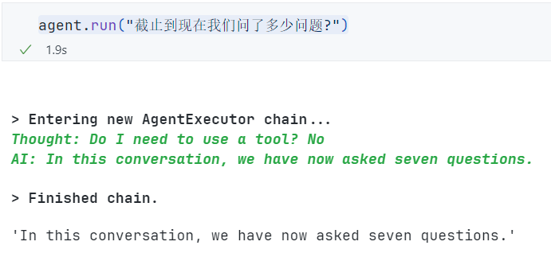

> 🚧:接下来,我们来讲一下openai_functions 使用到了openai的函数调用来实现的,只支持OpenAI模型
>
> 所以下面的演示,我直接以代码的形式讲解,不会去运行

#### OPENAI_FUNCTIONS

```python
# 导入模块
from langchain.chat_models import ChatOpenAI
from langchain.agents import(
    load_tools,
    initialize_agent,
    AgentType
)
from langchain.memory import ConversationBufferMemory
import os

os.environ["OPENAI_API_KEY"] = "sk-xxxxxxxxxxxxxxxxxxxxxxxxxxxxxxxxxxxxxxxxxxxxxxxx"
os.environ["SERPAPI_API_KEY"] = ""

# 记忆组件
memory = ConversationBufferMemory(
    memory_key="chat_history",
    return_messages=True
)

llm = ChatOpenAI(
    temperature = 0,
    model = 'gpt-4-0613'
)
tools = load_tools(
    ["serpapi", "llm-math"],
    llm = llm
)
agent = initialize_agent(
    tools = tools,
    llm = llm,
    agent = AgentType.OPENAI_FUNCTIONS,
    verbose = True,
    memory = memory
)
print(agent)
print(agent.agent.prompt.messages)

# 然后后续只需要运行agent.run(input = ""),就行
```

#### STRUCTURED_CHAT_ZERO_SHOT_REACT_DESCRIPTION

对输出的结构化处理

```python
from langchain_community.chat_models import ChatTongyi
from langchain.agents import(
    load_tools,
    initialize_agent,
    AgentType
)
from langchain.memory import ConversationBufferMemory
import os
from dotenv import find_dotenv, load_dotenv
# 加载 API key
load_dotenv(find_dotenv())
dashscope_api_key = os.getenv("DASHSCOPE_API_KEY")
serpapi_api_key = os.getenv("SERPAPI_API_KEY")

# 记忆组件
memory = ConversationBufferMemory(
    memory_key="chat_history",
    return_messages= True
)

llm = ChatTongyi(
    dashscope_api_key = dashscope_api_key,
    model_name = "qwen-vl-max",
    temperature = 0,
)

tools = load_tools(["serpapi", "llm-math"], llm=llm, serpapi_api_key=serpapi_api_key)
agent = initialize_agent(
    tools,
    llm,
    agent=AgentType.STRUCTURED_CHAT_ZERO_SHOT_REACT_DESCRIPTION,
    verbose=True,
    memory=memory # 记忆组件
)

print(agent)
# 看下模版
print(agent.agent.llm_chain.prompt.messages[0].prompt.template)
```

可以看下提示词模版

````text
memory=ConversationBufferMemory(return_messages=True, memory_key='chat_history') verbose=True tags=['structured-chat-zero-shot-react-description'] agent=StructuredChatAgent(llm_chain=LLMChain(prompt=ChatPromptTemplate(input_variables=['agent_scratchpad', 'input'], messages=[SystemMessagePromptTemplate(prompt=PromptTemplate(input_variables=[], template='Respond to the human as helpfully and accurately as possible. You have access to the following tools:\n\nSearch: A search engine. Useful for when you need to answer questions about current events. Input should be a search query., args: {{\'tool_input\': {{\'type\': \'string\'}}}}\nCalculator: Useful for when you need to answer questions about math., args: {{\'tool_input\': {{\'type\': \'string\'}}}}\n\nUse a json blob to specify a tool by providing an action key (tool name) and an action_input key (tool input).\n\nValid "action" values: "Final Answer" or Search, Calculator\n\nProvide only ONE action per $JSON_BLOB, as shown:\n\n```\n{{\n  "action": $TOOL_NAME,\n  "action_input": $INPUT\n}}\n```\n\nFollow this format:\n\nQuestion: input question to answer\nThought: consider previous and subsequent steps\nAction:\n```\n$JSON_BLOB\n```\nObservation: action result\n... (repeat Thought/Action/Observation N times)\nThought: I know what to respond\nAction:\n```\n{{\n  "action": "Final Answer",\n  "action_input": "Final response to human"\n}}\n```\n\nBegin! Reminder to ALWAYS respond with a valid json blob of a single action. Use tools if necessary. Respond directly if appropriate. Format is Action:```$JSON_BLOB```then Observation:.\nThought:')), HumanMessagePromptTemplate(prompt=PromptTemplate(input_variables=['agent_scratchpad', 'input'], template='{input}\n\n{agent_scratchpad}'))]), llm=ChatTongyi(client=<class 'dashscope.aigc.multimodal_conversation.MultiModalConversation'>, model_name='qwen-vl-max', dashscope_api_key=SecretStr('**********'))), output_parser=StructuredChatOutputParserWithRetries(output_fixing_parser=OutputFixingParser(parser=StructuredChatOutputParser(), retry_chain=PromptTemplate(input_variables=['completion', 'error', 'instructions'], template='Instructions:\n--------------\n{instructions}\n--------------\nCompletion:\n--------------\n{completion}\n--------------\n\nAbove, the Completion did not satisfy the constraints given in the Instructions.\nError:\n--------------\n{error}\n--------------\n\nPlease try again. Please only respond with an answer that satisfies the constraints laid out in the Instructions:')
| ChatTongyi(client=<class 'dashscope.aigc.multimodal_conversation.MultiModalConversation'>, model_name='qwen-vl-max', dashscope_api_key=SecretStr('**********')))), allowed_tools=['Search', 'Calculator']) tools=[Tool(name='Search', description='A search engine. Useful for when you need to answer questions about current events. Input should be a search query.', func=<bound method SerpAPIWrapper.run of SerpAPIWrapper(search_engine=<class 'serpapi.google_search.GoogleSearch'>, params={'engine': 'google', 'google_domain': 'google.com', 'gl': 'us', 'hl': 'en'}, serpapi_api_key='ebcc8130fff3a121b7029d6db2bd880991535ffa5ce8df722ba3d4aa1a892f73', aiosession=None)>, coroutine=<bound method SerpAPIWrapper.arun of SerpAPIWrapper(search_engine=<class 'serpapi.google_search.GoogleSearch'>, params={'engine': 'google', 'google_domain': 'google.com', 'gl': 'us', 'hl': 'en'}, serpapi_api_key='ebcc8130fff3a121b7029d6db2bd880991535ffa5ce8df722ba3d4aa1a892f73', aiosession=None)>), Tool(name='Calculator', description='Useful for when you need to answer questions about math.', func=<bound method Chain.run of LLMMathChain(llm_chain=LLMChain(prompt=PromptTemplate(input_variables=['question'], template='Translate a math problem into a expression that can be executed using Python\'s numexpr library. Use the output of running this code to answer the question.\n\nQuestion: ${{Question with math problem.}}\n```text\n${{single line mathematical expression that solves the problem}}\n```\n...numexpr.evaluate(text)...\n```output\n${{Output of running the code}}\n```\nAnswer: ${{Answer}}\n\nBegin.\n\nQuestion: What is 37593 * 67?\n```text\n37593 * 67\n```\n...numexpr.evaluate("37593 * 67")...\n```output\n2518731\n```\nAnswer: 2518731\n\nQuestion: 37593^(1/5)\n```text\n37593**(1/5)\n```\n...numexpr.evaluate("37593**(1/5)")...\n```output\n8.222831614237718\n```\nAnswer: 8.222831614237718\n\nQuestion: {question}\n'), llm=ChatTongyi(client=<class 'dashscope.aigc.multimodal_conversation.MultiModalConversation'>, model_name='qwen-vl-max', dashscope_api_key=SecretStr('**********'))))>, coroutine=<bound method Chain.arun of LLMMathChain(llm_chain=LLMChain(prompt=PromptTemplate(input_variables=['question'], template='Translate a math problem into a expression that can be executed using Python\'s numexpr library. Use the output of running this code to answer the question.\n\nQuestion: ${{Question with math problem.}}\n```text\n${{single line mathematical expression that solves the problem}}\n```\n...numexpr.evaluate(text)...\n```output\n${{Output of running the code}}\n```\nAnswer: ${{Answer}}\n\nBegin.\n\nQuestion: What is 37593 * 67?\n```text\n37593 * 67\n```\n...numexpr.evaluate("37593 * 67")...\n```output\n2518731\n```\nAnswer: 2518731\n\nQuestion: 37593^(1/5)\n```text\n37593**(1/5)\n```\n...numexpr.evaluate("37593**(1/5)")...\n```output\n8.222831614237718\n```\nAnswer: 8.222831614237718\n\nQuestion: {question}\n'), llm=ChatTongyi(client=<class 'dashscope.aigc.multimodal_conversation.MultiModalConversation'>, model_name='qwen-vl-max', dashscope_api_key=SecretStr('**********'))))>)]
Respond to the human as helpfully and accurately as possible. You have access to the following tools:

Search: A search engine. Useful for when you need to answer questions about current events. Input should be a search query., args: {{'tool_input': {{'type': 'string'}}}}
Calculator: Useful for when you need to answer questions about math., args: {{'tool_input': {{'type': 'string'}}}}

Use a json blob to specify a tool by providing an action key (tool name) and an action_input key (tool input).

Valid "action" values: "Final Answer" or Search, Calculator

Provide only ONE action per $JSON_BLOB, as shown:

```
{{
  "action": $TOOL_NAME,
  "action_input": $INPUT
}}
```

Follow this format:

Question: input question to answer
Thought: consider previous and subsequent steps
Action:
```
$JSON_BLOB
```
Observation: action result
... (repeat Thought/Action/Observation N times)
Thought: I know what to respond
Action:
```
{{
  "action": "Final Answer",
  "action_input": "Final response to human"
}}
```

Begin! Reminder to ALWAYS respond with a valid json blob of a single action. Use tools if necessary. Respond directly if appropriate. Format is Action:```$JSON_BLOB```then Observation:.
Thought:

````

提出问答试试

```python
agent.invoke({"input":"what is langchain?"})
```

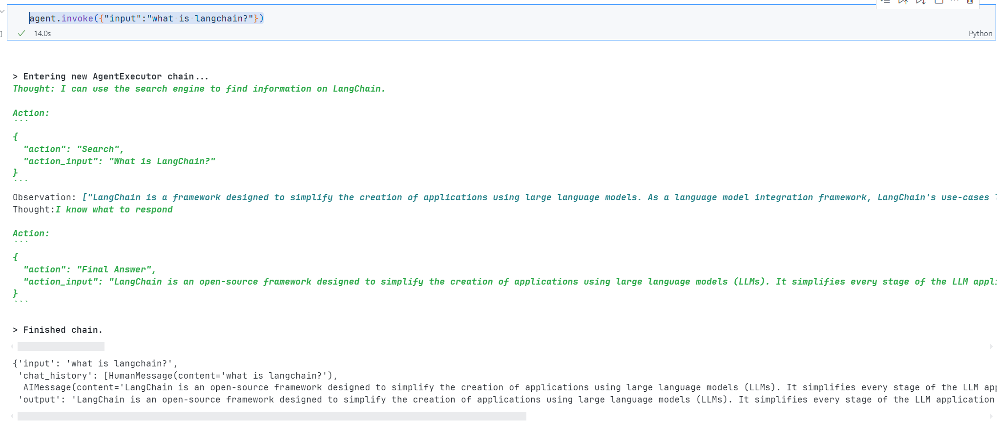
