# Langchain

作者:`@xieleihan`[点击访问](https://github.com/xieleihan)

本文遵守GPL3.0开源协议

# 实现一个聊天机器人

## Agents

#### 介绍

> 

- 无需为不同任务使用单独软件
- 使用日常语言来命令你的设备
- 代理是人工智能的高级形式
- 未来五年将成为现实
- 人人都有的私人助理Agnet
- 应用在千行百业之中(医疗,教育,娱乐...)
- 生产力的改变
- 继PC,IOS,Android后下一个平台 


## Langchain中的Agents如何实现

1. 提出需求
2. 问题+prompt组合
3. React Loop
4. 查找Memory
5. 查找可用工具
6. 执行工具并观察结果
7. 得到最终的结果

### 实现一个最简单的Agents

#### 设计两个任务

- 会做数学题
- 不知道答案的时候可以搜索

#### 实现

```python
# 导入模块
from dotenv import find_dotenv, load_dotenv
import os
# 加载 API key
load_dotenv(find_dotenv())
api_key = os.getenv("DASHSCOPE_API_KEY")

# 首先依旧导入模块
from langchain_community.chat_models import ChatTongyi
import os

llm = ChatTongyi(
    dashscope_api_key = api_key,
    model = "Qwen-max",
    temperature = 0
)

# 搭建工具
# 我们使用一个工具,serpai是一个聚合搜索引擎,需要安装谷歌搜索包和申请apikey
# https://serpapi.com/dashboard
# llm-math 是一个封装好的数学计算链
# 首先我们需要安装谷歌搜索包
```

```python
! pip install google-search-results
```

```python
# 导入模块
from dotenv import find_dotenv, load_dotenv
import os
# 加载 API key
load_dotenv(find_dotenv())
dashscope_api_key = os.getenv("DASHSCOPE_API_KEY")
serpapi_api_key = os.getenv("SERPAPI_API_KEY")

# 首先依旧导入模块
from langchain_community.chat_models import ChatTongyi
import os

llm = ChatTongyi(
    dashscope_api_key = dashscope_api_key,
    model = "qwen-vl-max",
    temperature = 0
)

from langchain.agents import load_tools
# 搭建工具
tools = load_tools(
    ["serpapi", "llm-math"],
    llm=llm,
    serpapi_api_key=serpapi_api_key
)

# 定义agents使用小样本增强
from langchain.agents import initialize_agent
from langchain.agents import AgentType

# 定义工具
agent = initialize_agent(
    tools,
    llm,
    agent=AgentType.ZERO_SHOT_REACT_DESCRIPTION,# 这里有不同的类型
    verbose=True
)

agent.run("英国前任女王的名字叫什么,她的年龄的平方是多少?")
```


### 几种内置的主要Agent类型

- openai_functions OpenAI函数调用型
- zero_short_react_description 零样本增强生成型
- chat_zero_shot_react_description 零样本增强对话型
- conversational_react_description 对话增强生成型
- chat_conversational_react_description 对话增强结构化
- structued_chat_zero_short_react_description 零样本增强结构化对话型

#### ZERO_SHOT_REACT_DESCRIPTION

零样本增强生成,既在没有示例的情况下,可以自主进行对话的类型[零样本,单样本,少样本](https://blog.csdn.net/zcyzcyjava/article/details/127006287)

```python
from langchain.llms import Tongyi
from langchain.agents import (
    load_tools,
    initialize_agent,
    AgentType
)
import os
from dotenv import find_dotenv, load_dotenv
import os
# 加载 API key
load_dotenv(find_dotenv())
dashscope_api_key = os.getenv("DASHSCOPE_API_KEY")
serpapi_api_key = os.getenv("SERPAPI_API_KEY")

llm = Tongyi(
    dashscope_api_key = dashscope_api_key,
    model = 'Qwen-max',
    temperature =0
)

tools = load_tools(["serpapi", "llm-math"], llm=llm, serpapi_api_key=serpapi_api_key)
agent = initialize_agent(
    tools,
    llm,
    agent=AgentType.ZERO_SHOT_REACT_DESCRIPTION,
    verbose=True
)

agent.run('上一任新西兰女王是谁?她年龄除以2是多少?')
```


#### CHAT_ZERO_SHOT_REACT_DESCRIPTION

其实跟上面的没什么区别,主要是把`llm`换成了`chatModel`

```python
# from langchain.llms import Tongyi
from langchain_community.chat_models import ChatTongyi
from langchain.agents import (
    load_tools,
    initialize_agent,
    AgentType
)
import os
from dotenv import find_dotenv, load_dotenv
import os
# 加载 API key
load_dotenv(find_dotenv())
dashscope_api_key = os.getenv("DASHSCOPE_API_KEY")
serpapi_api_key = os.getenv("SERPAPI_API_KEY")

llm = ChatTongyi(
    dashscope_api_key = dashscope_api_key,
    model_name = 'qwen-vl-max',
    temperature =0
)

tools = load_tools(["serpapi", "llm-math"], llm=llm, serpapi_api_key=serpapi_api_key)
agent = initialize_agent(
    tools,
    llm,
    agent=AgentType.CHAT_ZERO_SHOT_REACT_DESCRIPTION,
    verbose=True
)

agent.run('世界第三极是什么?它的高度乘2是多少?')
```


#### CONVERSATIONAL_REACT_DESCRIPTION

一个对话型的agent,这个agent要求与memory一起使用

```python
from langchain.llms import Tongyi
from langchain.agents import(
    load_tools,
    initialize_agent,
    AgentType
)
from langchain.memory import ConversationBufferMemory
import os
from dotenv import find_dotenv, load_dotenv
# 加载 API key
load_dotenv(find_dotenv())
dashscope_api_key = os.getenv("DASHSCOPE_API_KEY")
serpapi_api_key = os.getenv("SERPAPI_API_KEY")

# 记忆组件
memory = ConversationBufferMemory(
    memory_key="chat_history"
)

llm = Tongyi(
    dashscope_api_key = dashscope_api_key,
    model = "Qwen-max",
    temperature = 0,
)

tools = load_tools(["serpapi", "llm-math"], llm=llm, serpapi_api_key=serpapi_api_key)
agent = initialize_agent(
    tools,
    llm,
    agent=AgentType.CONVERSATIONAL_REACT_DESCRIPTION,
    verbose=True,
    memory=memory # 记忆组件
)

print(agent)
# 看下模版
print(agent.agent.llm_chain.prompt.template)
```

我们来看下模版提示词

````text
memory=ConversationBufferMemory(memory_key='chat_history') verbose=True tags=['conversational-react-description'] agent=ConversationalAgent(llm_chain=LLMChain(prompt=PromptTemplate(input_variables=['agent_scratchpad', 'chat_history', 'input'], template='Assistant is a large language model trained by OpenAI.\n\nAssistant is designed to be able to assist with a wide range of tasks, from answering simple questions to providing in-depth explanations and discussions on a wide range of topics. As a language model, Assistant is able to generate human-like text based on the input it receives, allowing it to engage in natural-sounding conversations and provide responses that are coherent and relevant to the topic at hand.\n\nAssistant is constantly learning and improving, and its capabilities are constantly evolving. It is able to process and understand large amounts of text, and can use this knowledge to provide accurate and informative responses to a wide range of questions. Additionally, Assistant is able to generate its own text based on the input it receives, allowing it to engage in discussions and provide explanations and descriptions on a wide range of topics.\n\nOverall, Assistant is a powerful tool that can help with a wide range of tasks and provide valuable insights and information on a wide range of topics. Whether you need help with a specific question or just want to have a conversation about a particular topic, Assistant is here to assist.\n\nTOOLS:\n------\n\nAssistant has access to the following tools:\n\n> Search: A search engine. Useful for when you need to answer questions about current events. Input should be a search query.\n> Calculator: Useful for when you need to answer questions about math.\n\nTo use a tool, please use the following format:\n\n```\nThought: Do I need to use a tool? Yes\nAction: the action to take, should be one of [Search, Calculator]\nAction Input: the input to the action\nObservation: the result of the action\n```\n\nWhen you have a response to say to the Human, or if you do not need to use a tool, you MUST use the format:\n\n```\nThought: Do I need to use a tool? No\nAI: [your response here]\n```\n\nBegin!\n\nPrevious conversation history:\n{chat_history}\n\nNew input: {input}\n{agent_scratchpad}'), llm=Tongyi(client=<class 'dashscope.aigc.generation.Generation'>, dashscope_api_key='sk-2a9e44d9621f4fd1b5f9f2c081779215')), output_parser=ConvoOutputParser(), allowed_tools=['Search', 'Calculator'], ai_prefix='AI') tools=[Tool(name='Search', description='A search engine. Useful for when you need to answer questions about current events. Input should be a search query.', func=<bound method SerpAPIWrapper.run of SerpAPIWrapper(search_engine=<class 'serpapi.google_search.GoogleSearch'>, params={'engine': 'google', 'google_domain': 'google.com', 'gl': 'us', 'hl': 'en'}, serpapi_api_key='ebcc8130fff3a121b7029d6db2bd880991535ffa5ce8df722ba3d4aa1a892f73', aiosession=None)>, coroutine=<bound method SerpAPIWrapper.arun of SerpAPIWrapper(search_engine=<class 'serpapi.google_search.GoogleSearch'>, params={'engine': 'google', 'google_domain': 'google.com', 'gl': 'us', 'hl': 'en'}, serpapi_api_key='ebcc8130fff3a121b7029d6db2bd880991535ffa5ce8df722ba3d4aa1a892f73', aiosession=None)>), Tool(name='Calculator', description='Useful for when you need to answer questions about math.', func=<bound method Chain.run of LLMMathChain(llm_chain=LLMChain(prompt=PromptTemplate(input_variables=['question'], template='Translate a math problem into a expression that can be executed using Python\'s numexpr library. Use the output of running this code to answer the question.\n\nQuestion: ${{Question with math problem.}}\n```text\n${{single line mathematical expression that solves the problem}}\n```\n...numexpr.evaluate(text)...\n```output\n${{Output of running the code}}\n```\nAnswer: ${{Answer}}\n\nBegin.\n\nQuestion: What is 37593 * 67?\n```text\n37593 * 67\n```\n...numexpr.evaluate("37593 * 67")...\n```output\n2518731\n```\nAnswer: 2518731\n\nQuestion: 37593^(1/5)\n```text\n37593**(1/5)\n```\n...numexpr.evaluate("37593**(1/5)")...\n```output\n8.222831614237718\n```\nAnswer: 8.222831614237718\n\nQuestion: {question}\n'), llm=Tongyi(client=<class 'dashscope.aigc.generation.Generation'>, dashscope_api_key='sk-2a9e44d9621f4fd1b5f9f2c081779215')))>, coroutine=<bound method Chain.arun of LLMMathChain(llm_chain=LLMChain(prompt=PromptTemplate(input_variables=['question'], template='Translate a math problem into a expression that can be executed using Python\'s numexpr library. Use the output of running this code to answer the question.\n\nQuestion: ${{Question with math problem.}}\n```text\n${{single line mathematical expression that solves the problem}}\n```\n...numexpr.evaluate(text)...\n```output\n${{Output of running the code}}\n```\nAnswer: ${{Answer}}\n\nBegin.\n\nQuestion: What is 37593 * 67?\n```text\n37593 * 67\n```\n...numexpr.evaluate("37593 * 67")...\n```output\n2518731\n```\nAnswer: 2518731\n\nQuestion: 37593^(1/5)\n```text\n37593**(1/5)\n```\n...numexpr.evaluate("37593**(1/5)")...\n```output\n8.222831614237718\n```\nAnswer: 8.222831614237718\n\nQuestion: {question}\n'), llm=Tongyi(client=<class 'dashscope.aigc.generation.Generation'>, dashscope_api_key='sk-2a9e44d9621f4fd1b5f9f2c081779215')))>)]
Assistant is a large language model trained by OpenAI.

Assistant is designed to be able to assist with a wide range of tasks, from answering simple questions to providing in-depth explanations and discussions on a wide range of topics. As a language model, Assistant is able to generate human-like text based on the input it receives, allowing it to engage in natural-sounding conversations and provide responses that are coherent and relevant to the topic at hand.

Assistant is constantly learning and improving, and its capabilities are constantly evolving. It is able to process and understand large amounts of text, and can use this knowledge to provide accurate and informative responses to a wide range of questions. Additionally, Assistant is able to generate its own text based on the input it receives, allowing it to engage in discussions and provide explanations and descriptions on a wide range of topics.

Overall, Assistant is a powerful tool that can help with a wide range of tasks and provide valuable insights and information on a wide range of topics. Whether you need help with a specific question or just want to have a conversation about a particular topic, Assistant is here to assist.

TOOLS:
------

Assistant has access to the following tools:

> Search: A search engine. Useful for when you need to answer questions about current events. Input should be a search query.
> Calculator: Useful for when you need to answer questions about math.

To use a tool, please use the following format:

```
Thought: Do I need to use a tool? Yes
Action: the action to take, should be one of [Search, Calculator]
Action Input: the input to the action
Observation: the result of the action
```

When you have a response to say to the Human, or if you do not need to use a tool, you MUST use the format:

```
Thought: Do I need to use a tool? No
AI: [your response here]
```

Begin!

Previous conversation history:
{chat_history}

New input: {input}
{agent_scratchpad}

````

OK,让我们提出问题,问答AI

```python
agent.run("hi, i am SouthAki,what is your name?")
```


```python
agent.run("香港有哪里比较好玩的吗?")
```


```python
agent.run("我还没玩过,你知道我名字后三个字母是什么吗?")
```


```python
agent.run("中国广东省广州市现在的气温是多少来着?")
```


```python
agent.run("截止到现在我们问了多少问题?")
```


#### CHAT_CONVERSATIONAL_REACT_DESCRIPTION

跟上面一样差不多

```python
from langchain_community.chat_models import ChatTongyi
from langchain.agents import(
    load_tools,
    initialize_agent,
    AgentType
)
from langchain.memory import ConversationBufferMemory
import os
from dotenv import find_dotenv, load_dotenv
# 加载 API key
load_dotenv(find_dotenv())
dashscope_api_key = os.getenv("DASHSCOPE_API_KEY")
serpapi_api_key = os.getenv("SERPAPI_API_KEY")

# 记忆组件
memory = ConversationBufferMemory(
    memory_key="chat_history",
    return_messages= True
)

llm = ChatTongyi(
    dashscope_api_key = dashscope_api_key,
    model_name = "qwen-vl-max",
    temperature = 0,
)

tools = load_tools(["serpapi", "llm-math"], llm=llm, serpapi_api_key=serpapi_api_key)
agent = initialize_agent(
    tools,
    llm,
    agent=AgentType.CHAT_CONVERSATIONAL_REACT_DESCRIPTION,
    verbose=True,
    memory=memory # 记忆组件
)

print(agent)
# 看下模版
print(agent.agent.llm_chain.prompt.template)
```

来看看问题的答案吧

```python
agent.run("hi, i am 南秋SouthAki,what is your name?")
```


```python
agent.run("香港有什么比较好吃的美食?")
```


```python
agent.run("我还没吃过,不过你还知道我名字的最后一个字母是什么吗?中国澳门现在的气温是多少来着?")
```


```python
agent.run("截止到现在我们问了多少问题?")
```


> 🚧:接下来,我们来讲一下openai_functions 使用到了openai的函数调用来实现的,只支持OpenAI模型
>
> 所以下面的演示,我直接以代码的形式讲解,不会去运行

#### OPENAI_FUNCTIONS

```python
# 导入模块
from langchain.chat_models import ChatOpenAI
from langchain.agents import(
    load_tools,
    initialize_agent,
    AgentType
)
from langchain.memory import ConversationBufferMemory
import os

os.environ["OPENAI_API_KEY"] = "sk-xxxxxxxxxxxxxxxxxxxxxxxxxxxxxxxxxxxxxxxxxxxxxxxx"
os.environ["SERPAPI_API_KEY"] = ""

# 记忆组件
memory = ConversationBufferMemory(
    memory_key="chat_history",
    return_messages=True
)

llm = ChatOpenAI(
    temperature = 0,
    model = 'gpt-4-0613'
)
tools = load_tools(
    ["serpapi", "llm-math"],
    llm = llm
)
agent = initialize_agent(
    tools = tools,
    llm = llm,
    agent = AgentType.OPENAI_FUNCTIONS,
    verbose = True,
    memory = memory
)
print(agent)
print(agent.agent.prompt.messages)

# 然后后续只需要运行agent.run(input = ""),就行
```

#### STRUCTURED_CHAT_ZERO_SHOT_REACT_DESCRIPTION

对输出的结构化处理

```python
from langchain_community.chat_models import ChatTongyi
from langchain.agents import(
    load_tools,
    initialize_agent,
    AgentType
)
from langchain.memory import ConversationBufferMemory
import os
from dotenv import find_dotenv, load_dotenv
# 加载 API key
load_dotenv(find_dotenv())
dashscope_api_key = os.getenv("DASHSCOPE_API_KEY")
serpapi_api_key = os.getenv("SERPAPI_API_KEY")

# 记忆组件
memory = ConversationBufferMemory(
    memory_key="chat_history",
    return_messages= True
)

llm = ChatTongyi(
    dashscope_api_key = dashscope_api_key,
    model_name = "qwen-vl-max",
    temperature = 0,
)

tools = load_tools(["serpapi", "llm-math"], llm=llm, serpapi_api_key=serpapi_api_key)
agent = initialize_agent(
    tools,
    llm,
    agent=AgentType.STRUCTURED_CHAT_ZERO_SHOT_REACT_DESCRIPTION,
    verbose=True,
    memory=memory # 记忆组件
)

print(agent)
# 看下模版
print(agent.agent.llm_chain.prompt.messages[0].prompt.template)
```

可以看下提示词模版

````text
memory=ConversationBufferMemory(return_messages=True, memory_key='chat_history') verbose=True tags=['structured-chat-zero-shot-react-description'] agent=StructuredChatAgent(llm_chain=LLMChain(prompt=ChatPromptTemplate(input_variables=['agent_scratchpad', 'input'], messages=[SystemMessagePromptTemplate(prompt=PromptTemplate(input_variables=[], template='Respond to the human as helpfully and accurately as possible. You have access to the following tools:\n\nSearch: A search engine. Useful for when you need to answer questions about current events. Input should be a search query., args: {{\'tool_input\': {{\'type\': \'string\'}}}}\nCalculator: Useful for when you need to answer questions about math., args: {{\'tool_input\': {{\'type\': \'string\'}}}}\n\nUse a json blob to specify a tool by providing an action key (tool name) and an action_input key (tool input).\n\nValid "action" values: "Final Answer" or Search, Calculator\n\nProvide only ONE action per $JSON_BLOB, as shown:\n\n```\n{{\n  "action": $TOOL_NAME,\n  "action_input": $INPUT\n}}\n```\n\nFollow this format:\n\nQuestion: input question to answer\nThought: consider previous and subsequent steps\nAction:\n```\n$JSON_BLOB\n```\nObservation: action result\n... (repeat Thought/Action/Observation N times)\nThought: I know what to respond\nAction:\n```\n{{\n  "action": "Final Answer",\n  "action_input": "Final response to human"\n}}\n```\n\nBegin! Reminder to ALWAYS respond with a valid json blob of a single action. Use tools if necessary. Respond directly if appropriate. Format is Action:```$JSON_BLOB```then Observation:.\nThought:')), HumanMessagePromptTemplate(prompt=PromptTemplate(input_variables=['agent_scratchpad', 'input'], template='{input}\n\n{agent_scratchpad}'))]), llm=ChatTongyi(client=<class 'dashscope.aigc.multimodal_conversation.MultiModalConversation'>, model_name='qwen-vl-max', dashscope_api_key=SecretStr('**********'))), output_parser=StructuredChatOutputParserWithRetries(output_fixing_parser=OutputFixingParser(parser=StructuredChatOutputParser(), retry_chain=PromptTemplate(input_variables=['completion', 'error', 'instructions'], template='Instructions:\n--------------\n{instructions}\n--------------\nCompletion:\n--------------\n{completion}\n--------------\n\nAbove, the Completion did not satisfy the constraints given in the Instructions.\nError:\n--------------\n{error}\n--------------\n\nPlease try again. Please only respond with an answer that satisfies the constraints laid out in the Instructions:')
| ChatTongyi(client=<class 'dashscope.aigc.multimodal_conversation.MultiModalConversation'>, model_name='qwen-vl-max', dashscope_api_key=SecretStr('**********')))), allowed_tools=['Search', 'Calculator']) tools=[Tool(name='Search', description='A search engine. Useful for when you need to answer questions about current events. Input should be a search query.', func=<bound method SerpAPIWrapper.run of SerpAPIWrapper(search_engine=<class 'serpapi.google_search.GoogleSearch'>, params={'engine': 'google', 'google_domain': 'google.com', 'gl': 'us', 'hl': 'en'}, serpapi_api_key='ebcc8130fff3a121b7029d6db2bd880991535ffa5ce8df722ba3d4aa1a892f73', aiosession=None)>, coroutine=<bound method SerpAPIWrapper.arun of SerpAPIWrapper(search_engine=<class 'serpapi.google_search.GoogleSearch'>, params={'engine': 'google', 'google_domain': 'google.com', 'gl': 'us', 'hl': 'en'}, serpapi_api_key='ebcc8130fff3a121b7029d6db2bd880991535ffa5ce8df722ba3d4aa1a892f73', aiosession=None)>), Tool(name='Calculator', description='Useful for when you need to answer questions about math.', func=<bound method Chain.run of LLMMathChain(llm_chain=LLMChain(prompt=PromptTemplate(input_variables=['question'], template='Translate a math problem into a expression that can be executed using Python\'s numexpr library. Use the output of running this code to answer the question.\n\nQuestion: ${{Question with math problem.}}\n```text\n${{single line mathematical expression that solves the problem}}\n```\n...numexpr.evaluate(text)...\n```output\n${{Output of running the code}}\n```\nAnswer: ${{Answer}}\n\nBegin.\n\nQuestion: What is 37593 * 67?\n```text\n37593 * 67\n```\n...numexpr.evaluate("37593 * 67")...\n```output\n2518731\n```\nAnswer: 2518731\n\nQuestion: 37593^(1/5)\n```text\n37593**(1/5)\n```\n...numexpr.evaluate("37593**(1/5)")...\n```output\n8.222831614237718\n```\nAnswer: 8.222831614237718\n\nQuestion: {question}\n'), llm=ChatTongyi(client=<class 'dashscope.aigc.multimodal_conversation.MultiModalConversation'>, model_name='qwen-vl-max', dashscope_api_key=SecretStr('**********'))))>, coroutine=<bound method Chain.arun of LLMMathChain(llm_chain=LLMChain(prompt=PromptTemplate(input_variables=['question'], template='Translate a math problem into a expression that can be executed using Python\'s numexpr library. Use the output of running this code to answer the question.\n\nQuestion: ${{Question with math problem.}}\n```text\n${{single line mathematical expression that solves the problem}}\n```\n...numexpr.evaluate(text)...\n```output\n${{Output of running the code}}\n```\nAnswer: ${{Answer}}\n\nBegin.\n\nQuestion: What is 37593 * 67?\n```text\n37593 * 67\n```\n...numexpr.evaluate("37593 * 67")...\n```output\n2518731\n```\nAnswer: 2518731\n\nQuestion: 37593^(1/5)\n```text\n37593**(1/5)\n```\n...numexpr.evaluate("37593**(1/5)")...\n```output\n8.222831614237718\n```\nAnswer: 8.222831614237718\n\nQuestion: {question}\n'), llm=ChatTongyi(client=<class 'dashscope.aigc.multimodal_conversation.MultiModalConversation'>, model_name='qwen-vl-max', dashscope_api_key=SecretStr('**********'))))>)]
Respond to the human as helpfully and accurately as possible. You have access to the following tools:

Search: A search engine. Useful for when you need to answer questions about current events. Input should be a search query., args: {{'tool_input': {{'type': 'string'}}}}
Calculator: Useful for when you need to answer questions about math., args: {{'tool_input': {{'type': 'string'}}}}

Use a json blob to specify a tool by providing an action key (tool name) and an action_input key (tool input).

Valid "action" values: "Final Answer" or Search, Calculator

Provide only ONE action per $JSON_BLOB, as shown:

```
{{
  "action": $TOOL_NAME,
  "action_input": $INPUT
}}
```

Follow this format:

Question: input question to answer
Thought: consider previous and subsequent steps
Action:
```
$JSON_BLOB
```
Observation: action result
... (repeat Thought/Action/Observation N times)
Thought: I know what to respond
Action:
```
{{
  "action": "Final Answer",
  "action_input": "Final response to human"
}}
```

Begin! Reminder to ALWAYS respond with a valid json blob of a single action. Use tools if necessary. Respond directly if appropriate. Format is Action:```$JSON_BLOB```then Observation:.
Thought:

````

提出问答试试

```python
agent.invoke({"input":"what is langchain?"})
```


### 实现原理

如何给Agent正确的添加Memory

- 将memory插入提示词模版里
- 添加memory组件
- 定义agent

给出示例:

```python
# 导入模块
from langchain.agents import (
    load_agent,
    initialize_agent,
    AgentType,
    Tool,
    load_tools
)
from langchain.memory import ConversationBufferMemory
from langchain_community.chat_models import ChatTongyi
from langchain.utilities import SerpAPIWrapper
from langchain.prompts import MessagesPlaceholder
from langchain.chains import LLMMathChain
import os
from dotenv import find_dotenv, load_dotenv
# 加载 API key
load_dotenv(find_dotenv())
dashscope_api_key = os.getenv("DASHSCOPE_API_KEY")
serpapi_api_key = os.getenv("SERPAPI_API_KEY")

# 定义大模型
llm = ChatTongyi(
    model_name= 'qwen-vl-max',
    temperature= 0,
    dashscope_api_key = dashscope_api_key
)
# 加载工具
tools = load_tools(["serpapi", "llm-math"], llm=llm, serpapi_api_key=serpapi_api_key)
print(tools)
```

输出的结果是这样的

```text
[Tool(name='Search', description='A search engine. Useful for when you need to answer questions about current events. Input should be a search query.', func=<bound method SerpAPIWrapper.run of SerpAPIWrapper(search_engine=<class 'serpapi.google_search.GoogleSearch'>, params={'engine': 'google', 'google_domain': 'google.com', 'gl': 'us', 'hl': 'en'}, serpapi_api_key='ebcc8130fff3a121b7029d6db2bd880991535ffa5ce8df722ba3d4aa1a892f73', aiosession=None)>, coroutine=<bound method SerpAPIWrapper.arun of SerpAPIWrapper(search_engine=<class 'serpapi.google_search.GoogleSearch'>, params={'engine': 'google', 'google_domain': 'google.com', 'gl': 'us', 'hl': 'en'}, serpapi_api_key='ebcc8130fff3a121b7029d6db2bd880991535ffa5ce8df722ba3d4aa1a892f73', aiosession=None)>), Tool(name='Calculator', description='Useful for when you need to answer questions about math.', func=<bound method Chain.run of LLMMathChain(llm_chain=LLMChain(prompt=PromptTemplate(input_variables=['question'], template='Translate a math problem into a expression that can be executed using Python\'s numexpr library. Use the output of running this code to answer the question.\n\nQuestion: ${{Question with math problem.}}\n```text\n${{single line mathematical expression that solves the problem}}\n```\n...numexpr.evaluate(text)...\n```output\n${{Output of running the code}}\n```\nAnswer: ${{Answer}}\n\nBegin.\n\nQuestion: What is 37593 * 67?\n```text\n37593 * 67\n```\n...numexpr.evaluate("37593 * 67")...\n```output\n2518731\n```\nAnswer: 2518731\n\nQuestion: 37593^(1/5)\n```text\n37593**(1/5)\n```\n...numexpr.evaluate("37593**(1/5)")...\n```output\n8.222831614237718\n```\nAnswer: 8.222831614237718\n\nQuestion: {question}\n'), llm=ChatTongyi(client=<class 'dashscope.aigc.multimodal_conversation.MultiModalConversation'>, model_name='qwen-vl-max', dashscope_api_key=SecretStr('**********'))))>, coroutine=<bound method Chain.arun of LLMMathChain(llm_chain=LLMChain(prompt=PromptTemplate(input_variables=['question'], template='Translate a math problem into a expression that can be executed using Python\'s numexpr library. Use the output of running this code to answer the question.\n\nQuestion: ${{Question with math problem.}}\n```text\n${{single line mathematical expression that solves the problem}}\n```\n...numexpr.evaluate(text)...\n```output\n${{Output of running the code}}\n```\nAnswer: ${{Answer}}\n\nBegin.\n\nQuestion: What is 37593 * 67?\n```text\n37593 * 67\n```\n...numexpr.evaluate("37593 * 67")...\n```output\n2518731\n```\nAnswer: 2518731\n\nQuestion: 37593^(1/5)\n```text\n37593**(1/5)\n```\n...numexpr.evaluate("37593**(1/5)")...\n```output\n8.222831614237718\n```\nAnswer: 8.222831614237718\n\nQuestion: {question}\n'), llm=ChatTongyi(client=<class 'dashscope.aigc.multimodal_conversation.MultiModalConversation'>, model_name='qwen-vl-max', dashscope_api_key=SecretStr('**********'))))>)]

```

然后我们添加`Memory`组件

```python
memory = ConversationBufferMemory(
    memory_key="chat_history",
    return_messages=True
)
```

定义`agent`

```python
agent_chain = initialize_agent(
    tools,
    llm,
    agent = AgentType.STRUCTURED_CHAT_ZERO_SHOT_REACT_DESCRIPTION,
    verbose = True,
    memory = memory
)
```

打印一下这个`agent_chain`是什么内容看看

```python
print(agent_chain)
```

输出结果是这样的

```text
memory=ConversationBufferMemory(return_messages=True, memory_key='chat_history') verbose=True tags=['chat-conversational-react-description'] agent=ConversationalChatAgent(llm_chain=LLMChain(prompt=ChatPromptTemplate(input_variables=['agent_scratchpad', 'chat_history', 'input'], input_types={'chat_history': typing.List[typing.Union[langchain_core.messages.ai.AIMessage, langchain_core.messages.human.HumanMessage, langchain_core.messages.chat.ChatMessage, langchain_core.messages.system.SystemMessage, langchain_core.messages.function.FunctionMessage, langchain_core.messages.tool.ToolMessage]], 'agent_scratchpad': typing.List[typing.Union[langchain_core.messages.ai.AIMessage, langchain_core.messages.human.HumanMessage, langchain_core.messages.chat.ChatMessage, langchain_core.messages.system.SystemMessage, langchain_core.messages.function.FunctionMessage, langchain_core.messages.tool.ToolMessage]]}, messages=[SystemMessagePromptTemplate(prompt=PromptTemplate(input_variables=[], template='Assistant is a large language model trained by OpenAI.\n\nAssistant is designed to be able to assist with a wide range of tasks, from answering simple questions to providing in-depth explanations and discussions on a wide range of topics. As a language model, Assistant is able to generate human-like text based on the input it receives, allowing it to engage in natural-sounding conversations and provide responses that are coherent and relevant to the topic at hand.\n\nAssistant is constantly learning and improving, and its capabilities are constantly evolving. It is able to process and understand large amounts of text, and can use this knowledge to provide accurate and informative responses to a wide range of questions. Additionally, Assistant is able to generate its own text based on the input it receives, allowing it to engage in discussions and provide explanations and descriptions on a wide range of topics.\n\nOverall, Assistant is a powerful system that can help with a wide range of tasks and provide valuable insights and information on a wide range of topics. Whether you need help with a specific question or just want to have a conversation about a particular topic, Assistant is here to assist.')), MessagesPlaceholder(variable_name='chat_history'), HumanMessagePromptTemplate(prompt=PromptTemplate(input_variables=['input'], template='TOOLS\n------\nAssistant can ask the user to use tools to look up information that may be helpful in answering the users original question. The tools the human can use are:\n\n> Search: A search engine. Useful for when you need to answer questions about current events. Input should be a search query.\n> Calculator: Useful for when you need to answer questions about math.\n\nRESPONSE FORMAT INSTRUCTIONS\n----------------------------\n\nWhen responding to me, please output a response in one of two formats:\n\n**Option 1:**\nUse this if you want the human to use a tool.\nMarkdown code snippet formatted in the following schema:\n\n```json\n{{\n    "action": string, \\\\ The action to take. Must be one of Search, Calculator\n    "action_input": string \\\\ The input to the action\n}}\n```\n\n**Option #2:**\nUse this if you want to respond directly to the human. Markdown code snippet formatted in the following schema:\n\n```json\n{{\n    "action": "Final Answer",\n    "action_input": string \\\\ You should put what you want to return to use here\n}}\n```\n\nUSER\'S INPUT\n--------------------\nHere is the user\'s input (remember to respond with a markdown code snippet of a json blob with a single action, and NOTHING else):\n\n{input}')), MessagesPlaceholder(variable_name='agent_scratchpad')]), llm=ChatTongyi(client=<class 'dashscope.aigc.multimodal_conversation.MultiModalConversation'>, model_name='qwen-vl-max', dashscope_api_key=SecretStr('**********'))), output_parser=ConvoOutputParser(), allowed_tools=['Search', 'Calculator'], template_tool_response="TOOL RESPONSE: \n---------------------\n{observation}\n\nUSER'S INPUT\n--------------------\n\nOkay, so what is the response to my last comment? If using information obtained from the tools you must mention it explicitly without mentioning the tool names - I have forgotten all TOOL RESPONSES! Remember to respond with a markdown code snippet of a json blob with a single action, and NOTHING else.") tools=[Tool(name='Search', description='A search engine. Useful for when you need to answer questions about current events. Input should be a search query.', func=<bound method SerpAPIWrapper.run of SerpAPIWrapper(search_engine=<class 'serpapi.google_search.GoogleSearch'>, params={'engine': 'google', 'google_domain': 'google.com', 'gl': 'us', 'hl': 'en'}, serpapi_api_key='ebcc8130fff3a121b7029d6db2bd880991535ffa5ce8df722ba3d4aa1a892f73', aiosession=None)>, coroutine=<bound method SerpAPIWrapper.arun of SerpAPIWrapper(search_engine=<class 'serpapi.google_search.GoogleSearch'>, params={'engine': 'google', 'google_domain': 'google.com', 'gl': 'us', 'hl': 'en'}, serpapi_api_key='ebcc8130fff3a121b7029d6db2bd880991535ffa5ce8df722ba3d4aa1a892f73', aiosession=None)>), Tool(name='Calculator', description='Useful for when you need to answer questions about math.', func=<bound method Chain.run of LLMMathChain(llm_chain=LLMChain(prompt=PromptTemplate(input_variables=['question'], template='Translate a math problem into a expression that can be executed using Python\'s numexpr library. Use the output of running this code to answer the question.\n\nQuestion: ${{Question with math problem.}}\n```text\n${{single line mathematical expression that solves the problem}}\n```\n...numexpr.evaluate(text)...\n```output\n${{Output of running the code}}\n```\nAnswer: ${{Answer}}\n\nBegin.\n\nQuestion: What is 37593 * 67?\n```text\n37593 * 67\n```\n...numexpr.evaluate("37593 * 67")...\n```output\n2518731\n```\nAnswer: 2518731\n\nQuestion: 37593^(1/5)\n```text\n37593**(1/5)\n```\n...numexpr.evaluate("37593**(1/5)")...\n```output\n8.222831614237718\n```\nAnswer: 8.222831614237718\n\nQuestion: {question}\n'), llm=ChatTongyi(client=<class 'dashscope.aigc.multimodal_conversation.MultiModalConversation'>, model_name='qwen-vl-max', dashscope_api_key=SecretStr('**********'))))>, coroutine=<bound method Chain.arun of LLMMathChain(llm_chain=LLMChain(prompt=PromptTemplate(input_variables=['question'], template='Translate a math problem into a expression that can be executed using Python\'s numexpr library. Use the output of running this code to answer the question.\n\nQuestion: ${{Question with math problem.}}\n```text\n${{single line mathematical expression that solves the problem}}\n```\n...numexpr.evaluate(text)...\n```output\n${{Output of running the code}}\n```\nAnswer: ${{Answer}}\n\nBegin.\n\nQuestion: What is 37593 * 67?\n```text\n37593 * 67\n```\n...numexpr.evaluate("37593 * 67")...\n```output\n2518731\n```\nAnswer: 2518731\n\nQuestion: 37593^(1/5)\n```text\n37593**(1/5)\n```\n...numexpr.evaluate("37593**(1/5)")...\n```output\n8.222831614237718\n```\nAnswer: 8.222831614237718\n\nQuestion: {question}\n'), llm=ChatTongyi(client=<class 'dashscope.aigc.multimodal_conversation.MultiModalConversation'>, model_name='qwen-vl-max', dashscope_api_key=SecretStr('**********'))))>)]

```

再比如我们想看到模版的内容

```python
print(agent_chain.agent.llm_chain.prompt.messages)
```

```text
[SystemMessagePromptTemplate(prompt=PromptTemplate(input_variables=[], template='Respond to the human as helpfully and accurately as possible. You have access to the following tools:\n\nSearch: A search engine. Useful for when you need to answer questions about current events. Input should be a search query., args: {{\'tool_input\': {{\'type\': \'string\'}}}}\nCalculator: Useful for when you need to answer questions about math., args: {{\'tool_input\': {{\'type\': \'string\'}}}}\n\nUse a json blob to specify a tool by providing an action key (tool name) and an action_input key (tool input).\n\nValid "action" values: "Final Answer" or Search, Calculator\n\nProvide only ONE action per $JSON_BLOB, as shown:\n\n```\n{{\n  "action": $TOOL_NAME,\n  "action_input": $INPUT\n}}\n```\n\nFollow this format:\n\nQuestion: input question to answer\nThought: consider previous and subsequent steps\nAction:\n```\n$JSON_BLOB\n```\nObservation: action result\n... (repeat Thought/Action/Observation N times)\nThought: I know what to respond\nAction:\n```\n{{\n  "action": "Final Answer",\n  "action_input": "Final response to human"\n}}\n```\n\nBegin! Reminder to ALWAYS respond with a valid json blob of a single action. Use tools if necessary. Respond directly if appropriate. Format is Action:```$JSON_BLOB```then Observation:.\nThought:')), HumanMessagePromptTemplate(prompt=PromptTemplate(input_variables=['agent_scratchpad', 'input'], template='{input}\n\n{agent_scratchpad}'))]

```

尝试运行

```python
agent_chain.run("我叫SouthAki")
agent_chain.run("我喜欢听广播剧,你喜欢听吗?")
agent_chain.run("我叫什么名字?")
```

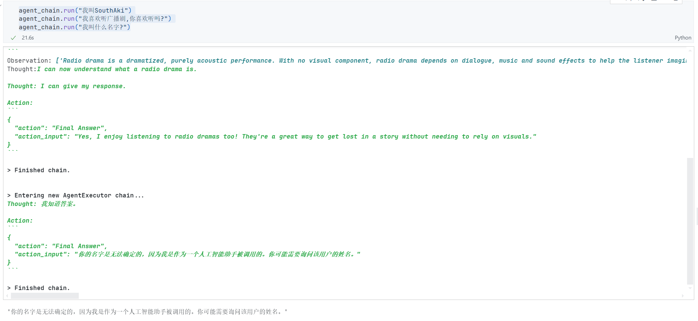

可以看到我们的`memory`没有起作用,所以这里要加入一个参数

`agent_kwargs`传递参数,把`memory key`传入到提示词

```python
agent_chain = initialize_agent(
    tools,
    llm,
    agent = AgentType.STRUCTURED_CHAT_ZERO_SHOT_REACT_DESCRIPTION,
    verbose = True,
    # 在这里做出修改
    agent_kwargs={
        "extra_prom_messages":[
            MessagesPlaceholder(variable_name= "chat_history"),
            MessagesPlaceholder(variable_name= "agent_scratchpad")
        ]
    },
    memory = memory
)
```

继续我们的问题

```python
agent_chain.run("我叫SouthAki")
agent_chain.run("我喜欢听广播剧,你喜欢听吗?")
agent_chain.run("我叫什么名字?")
```

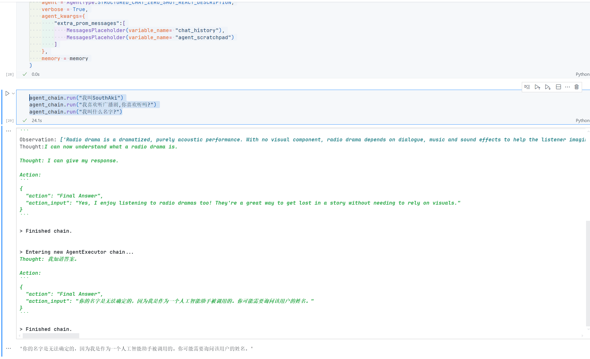

## 在agent和tools之间共享记忆

- 自定义一个工具用来LLMChain来总结内容

- 使用readonlymemory来共享记忆

- 观察共享和不共享的区别

我们来实现一下

```python
import os
from dotenv import find_dotenv, load_dotenv
# 加载 API key
load_dotenv(find_dotenv())
dashscope_api_key = os.getenv("DASHSCOPE_API_KEY")
serpapi_api_key = os.getenv("SERPAPI_API_KEY")

# 导入模块
from langchain.agents import (
    load_agent,
    initialize_agent,
    AgentType,
    Tool
)
from langchain.memory import ConversationBufferMemory,ReadOnlySharedMemory
from langchain.llms import Tongyi
from langchain.chains import LLMChain
from  langchain.prompts import PromptTemplate,MessagesPlaceholder
from langchain.utilities import SerpAPIWrapper

# 创建llm
llm= Tongyi(
    dashscope_api_key= dashscope_api_key,
    model= "Qwen-max",
    temperature = 0
)
```

创建一条链来总结对话

```python
# 问题
template= """
    以下是一段AI机器人和人类的对话:
    {chat_history}
    根据输入和上面的对话记录写一份对话总结.
    输入:{input}
"""
# 提示词模版
prompt = PromptTemplate(
    # 输入验证器
    input_variables=["chat_history", "input"],
    template=template,
)
# 创建记忆
memory = ConversationBufferMemory(
    memory_key="chat_history",
    return_messages= True    
)

# 关键一步,如何让我们的Agent和Tool共享记忆
readonlymemory = ReadOnlySharedMemory(memory= memory)

# 构建chain
summary_chain = LLMChain(
    llm = llm,
    prompt= prompt,
    verbose= True,
    memory= readonlymemory
)
```

接下来构建工具

```python
# 搜索工具
search = SerpAPIWrapper(
    serpapi_api_key= serpapi_api_key,
    params={
        "engine": "google"
    }
)
# 总结工具(自定义)
def SummaryChainFun(history):
    print("\n====================总结chain开始运行==========================")
    print("输入历史:",history)
    summary_chain.run(history)

tools= [
    Tool(
        name= "Search",
        func= search.run,
        description= "当需要了解实时信息或者你不知道的事情的时候才可以使用搜索工具"
    ),
    Tool(
        name= "Summary",
        func= SummaryChainFun,
        description= "当你被要求总结一段对话的时候才可以使用这个工具,工具输入必须为字符串,只在必要的时候使用"
    )
]

# 我们看下内容
print(tools)
```

看下输出结果

```text
[Tool(name='Search', description='当需要了解实时信息或者你不知道的事情的时候才可以使用搜索工具', func=<bound method SerpAPIWrapper.run of SerpAPIWrapper(search_engine=<class 'serpapi.google_search.GoogleSearch'>, params={'engine': 'google'}, serpapi_api_key='ebcc8130fff3a121b7029d6db2bd880991535ffa5ce8df722ba3d4aa1a892f73', aiosession=None)>), Tool(name='Summary', description='当你被要求总结一段对话的时候才可以使用这个工具,工具输入必须为字符串,只在必要的时候使用', func=<function SummaryChainFun at 0x0000020DF5BFE3E0>)]

```

接下来,我们创建Agent

```python
agent_chain = initialize_agent(
    tools,
    llm,
    agent=AgentType.ZERO_SHOT_REACT_DESCRIPTION,
    verbose=True,
    handle_parsing_errors=True,
    memory = memory
)
# 验证一下
print(agent_chain.agent.llm_chain.prompt.template)
```

看下输出结果

```text
Answer the following questions as best you can. You have access to the following tools:

Search(query: str, **kwargs: Any) -> str - 当需要了解实时信息或者你不知道的事情的时候才可以使用搜索工具
Summary(history) - 当你被要求总结一段对话的时候才可以使用这个工具,工具输入必须为字符串,只在必要的时候使用

Use the following format:

Question: the input question you must answer
Thought: you should always think about what to do
Action: the action to take, should be one of [Search, Summary]
Action Input: the input to the action
Observation: the result of the action
... (this Thought/Action/Action Input/Observation can repeat N times)
Thought: I now know the final answer
Final Answer: the final answer to the original input question

Begin!

Question: {input}
Thought:{agent_scratchpad}
c:\Users\xiele\AppData\Local\Programs\Python\Python312\Lib\site-packages\langchain_core\_api\deprecation.py:139: LangChainDeprecationWarning: The function `initialize_agent` was deprecated in LangChain 0.1.0 and will be removed in 0.3.0. Use Use new agent constructor methods like create_react_agent, create_json_agent, create_structured_chat_agent, etc. instead.
  warn_deprecated(

```

ok,这里可以看到我们的模版,但是不知道大家有没有发现,就是上面的内容中,并没有我们关于记忆的部分,也就是我们定义的`chat_history`

那么怎么办呢

这里可以看一下上面的部分,就是上面部分我们可以分成三个部分

分别是: ***`前缀`,`内容`,`后缀`***

其中前缀后缀都是可以由我们自定义,那么我们可以修改上面的前后缀,加入我们的记忆`chat_history`,来实现

```python
# 修改代码
prefix = """
    Have a conversation with a human, answering the following questions as best you can. You have access to the following tools:
    Search: Use this tool to search for information.
    Summary: Use this tool to summarize conversations.
"""
suffix = """
    Begin!"
    {chat_history}
    Question: {input}
    {agent_scratchpad}
"""

agent_chain = initialize_agent(
    tools,
    llm,
    agent=AgentType.ZERO_SHOT_REACT_DESCRIPTION,
    verbose=True,
    handle_parsing_errors= True,
    agent_kwargs={
        "prefix": prefix,
        "suffix": suffix,
        "agent_scratchpad": MessagesPlaceholder("agent_scratchpad"),
        "chat_history": MessagesPlaceholder("chat_history"),
        "input": MessagesPlaceholder("input")
    },
    memory = memory
)
# 来看下我们修改后的结果
print(agent_chain.agent.llm_chain.prompt.template)
```

看下

```text

    Have a conversation with a human, answering the following questions as best you can. You have access to the following tools:
    Search: Use this tool to search for information.
    Summary: Use this tool to summarize conversations.


Search(query: str, **kwargs: Any) -> str - 当需要了解实时信息或者你不知道的事情的时候才可以使用搜索工具
Summary(history) - 当你被要求总结一段对话的时候才可以使用这个工具,工具输入必须为字符串,只在必要的时候使用

Use the following format:

Question: the input question you must answer
Thought: you should always think about what to do
Action: the action to take, should be one of [Search, Summary]
Action Input: the input to the action
Observation: the result of the action
... (this Thought/Action/Action Input/Observation can repeat N times)
Thought: I now know the final answer
Final Answer: the final answer to the original input question


    Begin!"
    {chat_history}
    Question: {input}
    {agent_scratchpad}

```

ok,我们看到我们修改了前后缀已经成功了,来试试看

```python
agent_chain.run(input = "美国第45任总统是谁?")
```

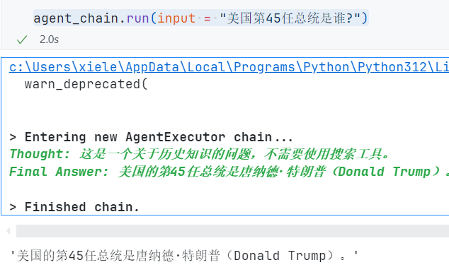

```python
agent_chain.run(input = "他的夫人叫什么名字?")
```

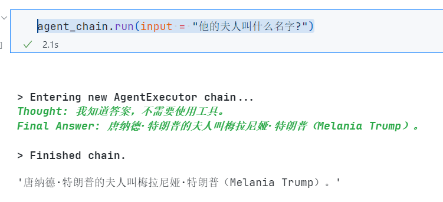

```python
# 我们看下对话的记忆的
print(agent_chain.memory.buffer)
```

```text
[HumanMessage(content='美国第45任总统是谁?'), AIMessage(content='美国的第45任总统是唐纳德·特朗普（Donald Trump）。'), HumanMessage(content='他的夫人叫什么名字?'), AIMessage(content='唐纳德·特朗普的夫人叫梅拉尼娅·特朗普（Melania Trump）。')]

```

```python
agent_chain.run(input= "我们都聊了什么?")
```

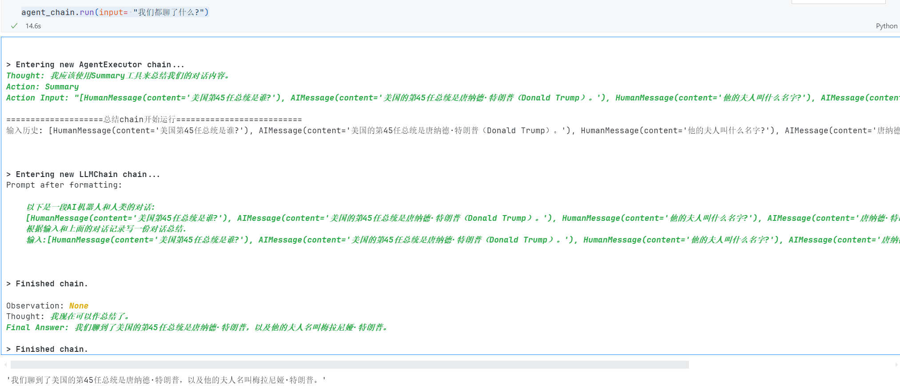

```python
agent_chain.run(input= "中国最新的南极科考站是什么?哪一年开站展开科学考察?")
```

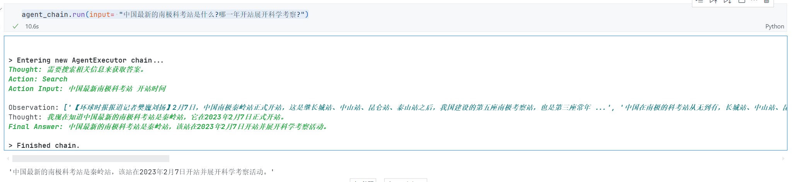

```python
agent_chain.run(input="帮我总结下目前的对话内容，给我5岁的儿子看看")
```

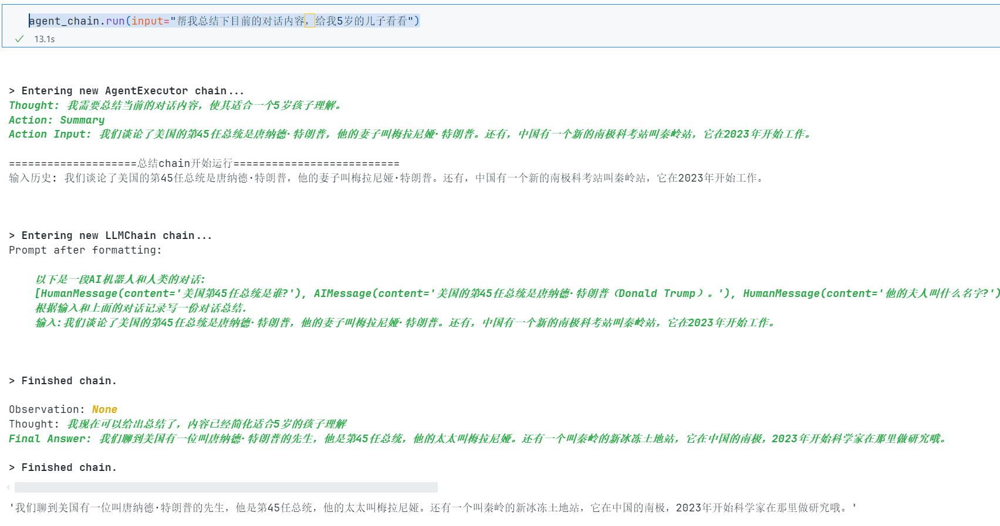

## Tool和ToolKit

### 介绍

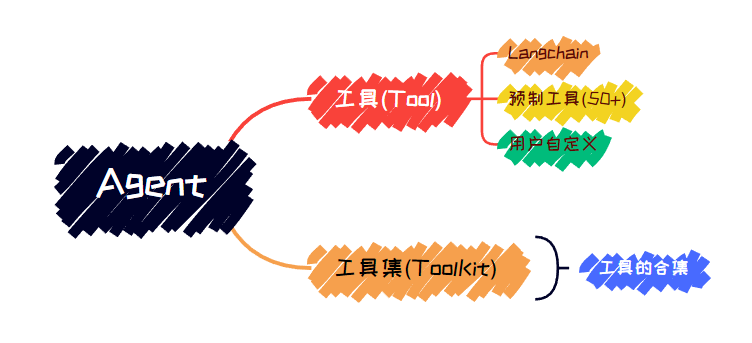

### 如何加载使用tool

- 加载预制tool的方法
- 几种tool的使用方式

langchain预制了大量的tools，基本这些工具能满足大部分需求，官方可以查到[点击访问](https://github.com/langchain-ai/langchain/tree/v0.0.352/docs/docs/integrations/tools)

如何使用我们的Tool,下面是我们的模版

```python
#添加预制工具的方法很简单
from langchain.agents import load_tools
tool_names = [...]
tools = load_tools(tool_names) #使用load方法
#有些tool需要单独设置llm
from langchain.agents import load_tools
tool_names = [...]
llm = ...
tools = load_tools(tool_names, llm=llm) #在load的时候指定llm
```

接下来会讲几个常用的tool

#### Serp API

> 第一个是serp Api
>
> 最常见的聚合搜索引擎 https://serper.dev/dashboard

```python
# 导入模块
import os
from dotenv import find_dotenv, load_dotenv
# 加载 API key
load_dotenv(find_dotenv())
dashscope_api_key = os.getenv("DASHSCOPE_API_KEY")
serpapi_api_key = os.getenv("SERPAPI_API_KEY")
from langchain.utilities import SerpAPIWrapper
import os
search = SerpAPIWrapper(
    serpapi_api_key=serpapi_api_key
)
search.run("加拿大女王是谁?")
```

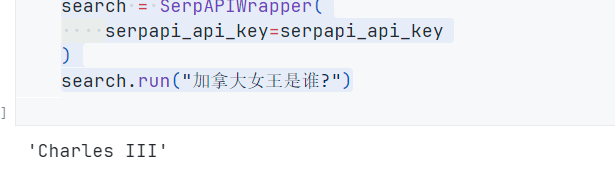

> 查尔斯被黑得最惨的一次

支持自定义参数，比如将引擎切换到bing，设置搜索语言等

```python
params = {
    "engine": "bing",
    "gl": "us",
    "hl": "en",
}
search = SerpAPIWrapper(params=params)
```

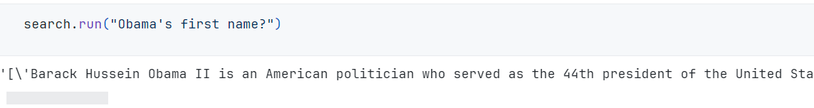

#### Dall-E

Dall-E是OpenAI出品的文到图AI大模型

首先我们需要安装一个包

```python
! pip install opencv-python scikit-image
```

```python
# 这里可能需要用到OpenAI的,但是后面我会尝试使用通义
# 先展示一下就是OpenAI的写法
from langchain.chat_models import ChatOpenAI

llm = ChatOpenAI(
    temperature=0,
    # 这里要注意,就是使用的模型一定要是最新的
    model= "gpt-4"
)

from langchain.agents import(
    initialize_agent,
    load_tools
)

tools = load_tools(["dalle-image-generator"])
agent = initialize_agent(
    tools,
    llm,
    agent="zero-shot-react-description",
    verbose=True
)
output = agent.run("Generate an image of a cat")
```

好的,这里没有演示的哈

但是我转译试试看

```python
# 转译Tongyi
import os
from dotenv import find_dotenv, load_dotenv
# 加载 API key
load_dotenv(find_dotenv())
dashscope_api_key = os.getenv("DASHSCOPE_API_KEY")
serpapi_api_key = os.getenv("SERPAPI_API_KEY")
from langchain_community.chat_models import ChatTongyi
llm = ChatTongyi(
    model_name = "qwen-vl-max",
    temperature = 0,
    dashscope_api_key = dashscope_api_key
)
from langchain.agents import initialize_agent, load_tools

tools = load_tools(["dalle-image-generator"])
agent = initialize_agent(
    tools,
    llm,
    agent="zero-shot-react-description",
    verbose=True
)
output = agent.run("Create an image of a halloween night at a haunted museum")
```

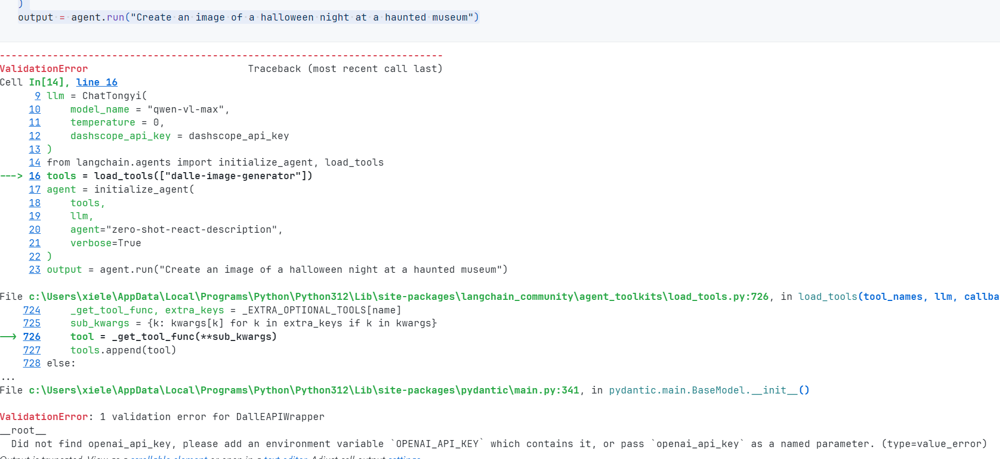

看来是不可以的,没关系,跳过就行,后续补充 to do

#### Eleven Labs Text2Speech

`ElevenLabs` 是非常优秀的`TTS`合成API

下面需要安装一些包

```python
! pip install elevenlabs
```

```python
import os
from dotenv import find_dotenv, load_dotenv
# 加载 API key
load_dotenv(find_dotenv())
dashscope_api_key = os.getenv("DASHSCOPE_API_KEY")
serpapi_api_key = os.getenv("SERPAPI_API_KEY")
eleven_api_key = os.getenv("ELEVEN_API_KEY")

# 工具使用
from langchain.tools import ElevenLabsText2SpeechTool
import elevenlabs
elevenlabs.api_key = eleven_api_key
text_to_speak = "Hello! 你好! Hola! नमस्ते! Bonjour! こんにちは! مرحبا! 안녕하세요! Ciao! Cześć! Привіт! வணக்கம்!"
tts = ElevenLabsText2SpeechTool(
    voice = "Bella",
    text_to_speak = text_to_speak,
    verbose = True
)
# 测试是否可用
tts.name
```


尝试播放,先缓存在我们本地上吧

```python
# 缓存到本地
speech_file = tts.run(text_to_speak)
# 等到加载完再执行播放
tts.play(tts.run(text_to_speak))
# 边生成边播放
tts.stream_speech(text_to_speak)
```

OK,你们在这个项目的仓库就可以听听看这个TTS了

`temp.wav`

#### GraphQL

先安装几个包

```python
! pip install httpx gql > /dev/null
! pip install gql
! pip install requests_toolbelt
```

```python
from langchain_community.chat_models import ChatTongyi
from langchain.agents import load_tools, initialize_agent, AgentType
from langchain.utilities import GraphQLAPIWrapper

import os
from dotenv import find_dotenv, load_dotenv
# 加载 API key
load_dotenv(find_dotenv())
dashscope_api_key = os.getenv("DASHSCOPE_API_KEY")
serpapi_api_key = os.getenv("SERPAPI_API_KEY")
eleven_api_key = os.getenv("ELEVEN_API_KEY")

llm = ChatTongyi(
    model_name = "qwen-vl-max",
    temperature = 0,
    dashscope_api_key = dashscope_api_key
)
tools = load_tools(
    ["graphql"],
    graphql_endpoint="https://swapi-graphql.netlify.app/.netlify/functions/index",
)

agent = initialize_agent(
    tools,
    llm,
    agent=AgentType.ZERO_SHOT_REACT_DESCRIPTION,
    verbose=True,
    return_intermediate_steps=True
)

graphql_fields = """
allFilms {
    films {
        title
        director
        releaseDate
        speciesConnection {
            species {
                name
                classification
                homeworld {
                    name
                }
            }
        }
    }


"""

suffix = "Search for the titles of all the stawars films stored in the graphql database that has this schema,and answer in chinese:"


result = agent({"input": suffix + graphql_fields})
print(result["output"])
```

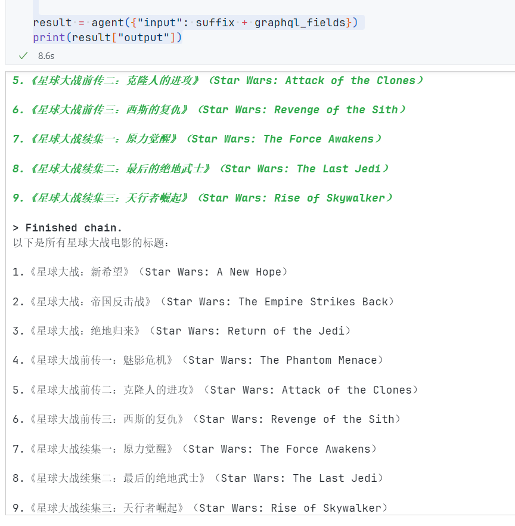

### 如何加载使用ToolKit

> tookit是langchain已经封装好的一系列工具，一个工具包是一组工具来组合完成特定的任务

#### Azure认知服务

官方地址:[点击访问](https://portal.azure.com/#allservices)

我们这里实现的是,文本转人类自然语言的过程

这个`Azure认知服务`的`ToolKit`里面有这几个功能

- AzureCogsFormRecognizerTool：从文档里提取文本

- AzureCogsSpeech2TextTool：语音到文本

- AzureCogsText2SpeechTool：文本到语音

我们要实现它,需要先安装几个包

```python
! pip install azure-ai-formrecognizer
! pip install azure-cognitiveservices-speech
! pip install azure-ai-textanalytics
```

然后的话,需要申请`Microsoft Azure API_KEY`

然后格式是这样的

```python
import os

# 这里的部分需要你去申请微软Azure服务,需要信用卡
os.environ["AZURE_COGS_KEY"] = "c10"
os.environ["AZURE_COGS_ENDPOINT"] = "https://eastus.api.cognitive.microsoft.com/"
os.environ["AZURE_COGS_REGION"] = "eastus"
```

> <font color= "red">**这里需要注意的是,需要有对应账单地址的国家信用卡,预付卡和借记卡无法申请.如果你没有信用卡,请跳掉这一部分的ToolKit**</font>

```python
# 创建toolkit
from langchain.agents.agent_toolkits import AzureCognitiveServicesToolkit
toolkit = AzureCognitiveServicesToolkit()
[tool.name for tool in toolkit.get_tools()]
```

```python
# agent使用
from langchain_community.chat_models import ChatTongyi
from langchain.agents import initialize_agent, AgentType
# 定义llm
llm = ChatTongyi(
    dashscope_api_key = dashscope_api_key,
    model_name = "qwen-vl-max",
    temperature = 0
)
agent = initialize_agent(
    agent=AgentType.ZERO_SHOT_REACT_DESCRIPTION,
    llm=llm,
    verbose=True,
    return_intermediate_steps=True,
    tools= toolkit.get_tools()
)
audio_file = agent.run("Tell me a joke and read it out for me.")
print(audio_file)
```

这里的话,就不放运行的截图,有能力验证的就可以自己去验证一下

#### Python 代码机器人

> 接下来实现的是一个Python代码机器人,也是属于langchain定义toolkit之中
>
> 来用下看看

```python
# 首先需要安装一个包
! pip install langchain_experimental
```

```python
# OK,我们接着实现
# 首先导入模块
import os
from dotenv import find_dotenv, load_dotenv
# 加载 API key
load_dotenv(find_dotenv())
dashscope_api_key = os.getenv("DASHSCOPE_API_KEY")
serpapi_api_key = os.getenv("SERPAPI_API_KEY")
eleven_api_key = os.getenv("ELEVEN_API_KEY")

from langchain_experimental.agents.agent_toolkits import create_python_agent
from langchain_experimental.tools import PythonREPLTool
from langchain.agents.agent_types import AgentType
from langchain_community.llms.tongyi import Tongyi
from langchain_community.chat_models import ChatTongyi
from langchain_core.utils.init import pre_init

agent_executor = create_python_agent(
    llm= ChatTongyi(
        dashscope_api_key = dashscope_api_key,
        temperature = 0,
        model_name = "qwen-vl-max"
    ),
    tool= PythonREPLTool(),
    agent_type= AgentType.ZERO_SHOT_REACT_DESCRIPTION,
    verbose= True,
    # agent_executor_kwargs= {"handle_parsing_errors": True}
)

agent_executor.run("What is the 10th fibonacci number?")
```

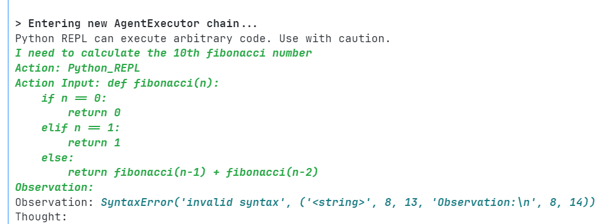

#### SQL Database

使用`SQLDatabaseChain`构建的`agent`，用来根据数据库回答一般行动问问题

首先导入模块

```python
from langchain.agents import create_sql_agent
from langchain.agents.agent_toolkits import SQLDatabaseToolkit
from langchain.sql_database import SQLDatabase
from langchain_community.llms.tongyi import Tongyi
from langchain.agents import AgentExecutor
from langchain.agents.agent_types import AgentType
from langchain_community.chat_models import ChatTongyi
```

```python
import os
from dotenv import find_dotenv, load_dotenv
# 加载 API key
load_dotenv(find_dotenv())
dashscope_api_key = os.getenv("DASHSCOPE_API_KEY")
serpapi_api_key = os.getenv("SERPAPI_API_KEY")
eleven_api_key = os.getenv("ELEVEN_API_KEY")
db = SQLDatabase.from_uri("sqlite:///Chinook.db")
toolkit = SQLDatabaseToolkit(db=db, llm= Tongyi(temperature = 0, model= "Qwen-max", dashscope_api_key= dashscope_api_key))

agent_executor = create_sql_agent(
    llm= ChatTongyi(
        temperature = 0,
        model_name= "qwen-vl-max",
        dashscope_api_key= dashscope_api_key
    ),
    toolkit= toolkit,
    verbose= True,
    agent_type= AgentType.ZERO_SHOT_REACT_DESCRIPTION,
    handle_parsing_errors=True
)

agent_executor.run("Describe the playlisttrack table")
```

```python
# 我们也可以用自然语言描述一个数据库表
agent_executor.run("Describe the playlist table")
```

```python
# 用自然语言跑SQL查询语句
agent_executor.run(
    "Show the total number of tranks in each playlist name should be included in the result."
)
```

```python
# agent可以自动修复不存在的键值
agent_executor.run("Who are the top 3 best selling artists?")
```

##  LECL: langchain表达式语言

### 介绍

> 一种在langchain之上封装的高级解释语言,简化链条开发,支持真实生产环境而发明
>
> 有这下面的特点:
>
> - 更好的流式支持
>
> - 更好的异步支持
>
> - 优化执行时间
>
> - 支持重试和反馈
>
> - 轻松获取中间步骤
>
> - 输入输出强验证
>
> - 无缝追踪集成
>
> - 无缝部署集成
>
> > 官方介绍:***LangChain表达式语言，或者LCEL，是一种声明式的方式，可以轻松地将链条组合在一起。 LCEL从第一天开始就被设计为支持将原型放入生产中，不需要改变任何代码，从最简单的“提示+LLM”链到最复杂的链(我们已经看到人们成功地在生产中运行了包含数百步的LCEL链)。***
>
> 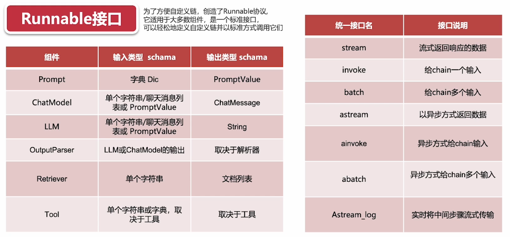
>
> 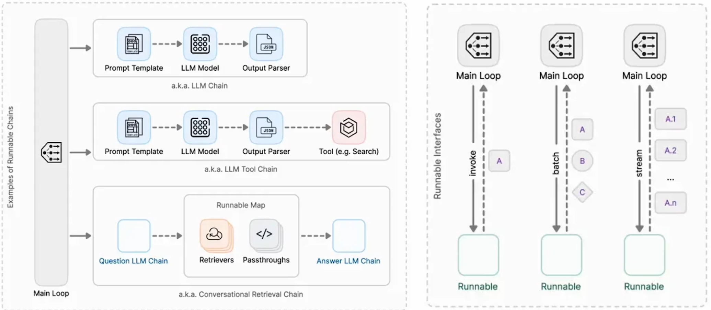
>
> 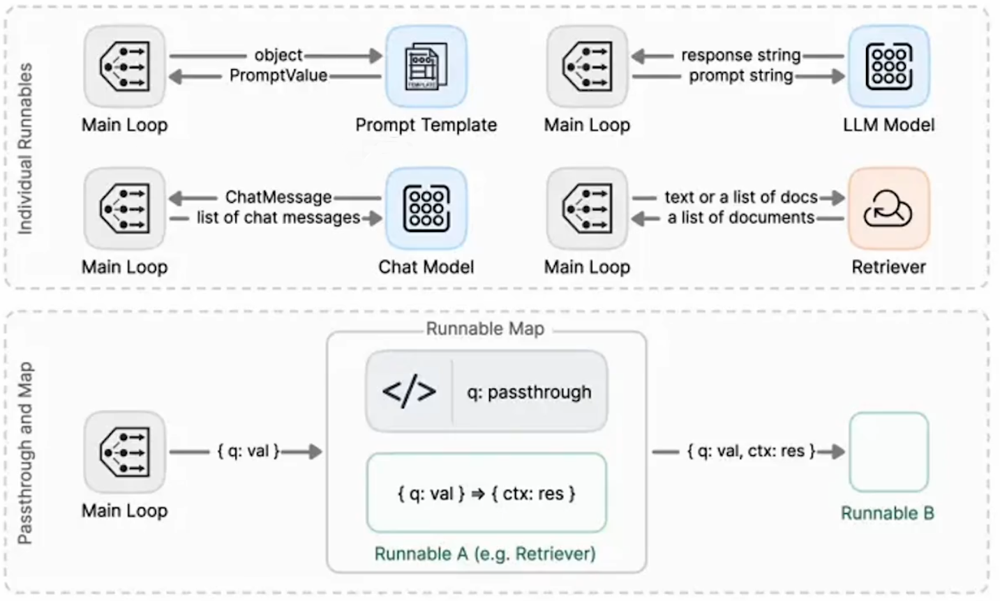
>
> ```python
> import os
> from dotenv import find_dotenv, load_dotenv
> # 加载 API key
> load_dotenv(find_dotenv())
> dashscope_api_key = os.getenv("DASHSCOPE_API_KEY")
> serpapi_api_key = os.getenv("SERPAPI_API_KEY")
> eleven_api_key = os.getenv("ELEVEN_API_KEY")
> ```
>
> 


OK,我们来看一个比较简单的示例

```python
# 首先导入我们的模块,这里需要注意的是,最新版的langchain中,其实已经将一些东西拆分出来了
from langchain_core.output_parsers import StrOutputParser
from langchain_core.prompts import ChatPromptTemplate
from langchain_community.chat_models import ChatTongyi

prompt = ChatPromptTemplate.from_template("给我讲一个关于{topic}的笑话")
model = ChatTongyi(temperature=0,model_name = "qwen-vl-max",dashscope_api_key = dashscope_api_key)
output_parser = StrOutputParser()
chain = prompt | model | output_parser
chain.invoke({"topic": "冰淇淋"})
```

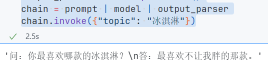

我们也可以看下就是prompt在新版的LCEL中的变化

```python
prompt_value = prompt.invoke({"topic": "长颈鹿"})
prompt_value
# 这里可以看到我们使用的是chatModel的方式,于是就是一个人类问答的messages
```

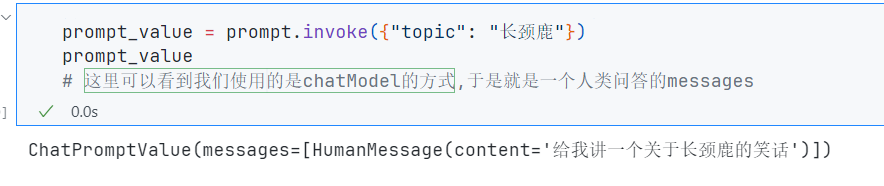

```python
# 我们也可以单独的打印出来我们的message
prompt_value.to_messages()
```

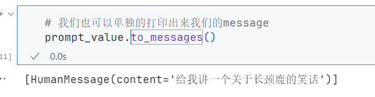

```python
# 也可以把里面的内容打印成字符串
prompt_value.to_string()
```

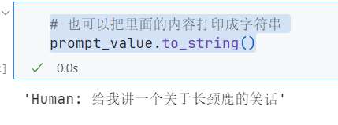

下面是关于`Model`

```python
message = model.invoke(prompt_value)
message
```

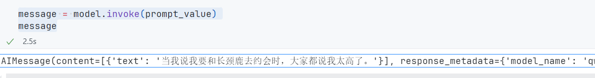

使用llm区别

```python
from langchain_community.llms.tongyi import Tongyi
llm = Tongyi(
    dashscope_api_key= dashscope_api_key,
    model= "Qwen-max",
    temperature= 0
)
llm.invoke(prompt_value)
```

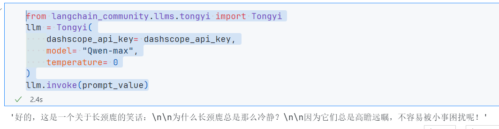

`Output parser`

```python
output_parser.invoke(message)
```

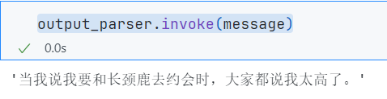

### RAG Search Exampl

- 建立向量数据

- 使用RAG增强

```python
from operator import itemgetter
from langchain_community.vectorstores import FAISS
from langchain_core.output_parsers import StrOutputParser
from langchain_core.prompts import ChatPromptTemplate
from langchain_core.runnables import RunnablePassthrough, RunnableLambda
from langchain_community.chat_models import ChatTongyi
from langchain.embeddings import HuggingFaceEmbeddings

# 对一段文本进行向量化
vectorstore = FAISS.from_texts(
    ["harrison worked at kensho"], embedding=HuggingFaceEmbeddings()
)
retriever = vectorstore.as_retriever()

# 设置提示词模版
template = """
    Answer the question based only on the following context:
    {context}
    Question:{question}
"""
prompt = ChatPromptTemplate.from_template(template)

model = ChatTongyi(
    model_name= "qwen-vl-max",
    dashscope_api_key= dashscope_api_key,
    temperature = 0
)

# 构造我们的链
chain = (
    {"context": retriever, "question": RunnablePassthrough()}
    | prompt
    | model
    | StrOutputParser()
)
```
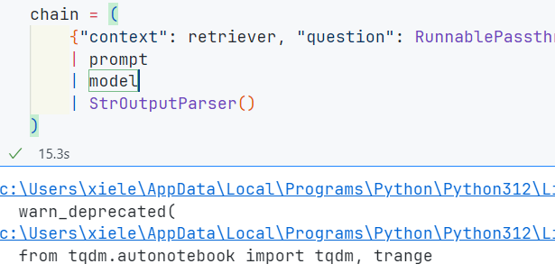

```python
# 展开提问
chain.invoke("Where did harrison work?")
```

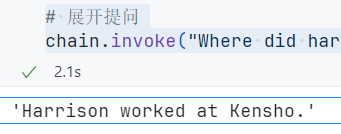

自定义也非常简单,比如我们来实现一个让它回答的时候使用中文

```python
# 依旧是上面的模版
template = """
    Answer the question based only on the following context:
    {context}
    Question:{question}
    Answer in the following language:{language}
"""

prompt = ChatPromptTemplate.from_template(template)

chain = (
    {
        # 这里第一步就是先把问题拿去向量化
        "context": itemgetter("question") | retriever,
        "question": itemgetter("question"),
        "language": itemgetter("language"),
    } 
    | prompt
    | llm
    | StrOutputParser()
)

# 我们尝试一下是否生效
chain.invoke({"question": "where did harrison work?", "language": "chinese"})
```

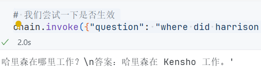

### LCEL接口

- 输入格式
- 输出格式
- 8种不同的接口方式

首先需要导入变量

```python
import os
from dotenv import find_dotenv, load_dotenv
# 加载 API key
load_dotenv(find_dotenv())
dashscope_api_key = os.getenv("DASHSCOPE_API_KEY")
serpapi_api_key = os.getenv("SERPAPI_API_KEY")
eleven_api_key = os.getenv("ELEVEN_API_KEY")
```

然后,需要我们先打造一个模版

```python
# 打造一个模版
from langchain_core.prompts import ChatPromptTemplate
from langchain_community.chat_models import ChatTongyi
model = ChatTongyi(
    dashscope_api_key = dashscope_api_key,
    model_name = "qwen-vl-max",
    temperature = 0
)
prompt = ChatPromptTemplate.from_template("给我讲一个关于{topic}的笑话")
chain = prompt | model
```

我们来看一下输入的格式

#### `input schema`

看下prompt

```python
# prompt
chain.input_schema.schema()
```

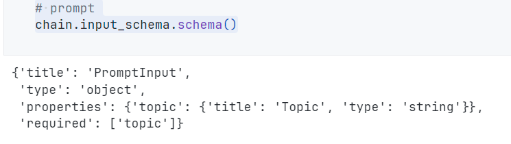

```python
prompt.input_schema.schema()
```

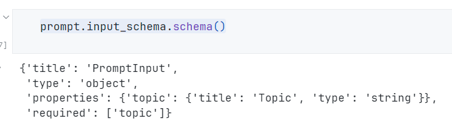

```python
model.input_schema.schema()
```

```text
output:
{'title': 'ChatTongyiInput',
 'anyOf': [{'type': 'string'},
  {'$ref': '#/definitions/StringPromptValue'},
  {'$ref': '#/definitions/ChatPromptValueConcrete'},
  {'type': 'array',
   'items': {'anyOf': [{'$ref': '#/definitions/AIMessage'},
     {'$ref': '#/definitions/HumanMessage'},
     {'$ref': '#/definitions/ChatMessage'},
     {'$ref': '#/definitions/SystemMessage'},
     {'$ref': '#/definitions/FunctionMessage'},
     {'$ref': '#/definitions/ToolMessage'}]}}],
 'definitions': {'StringPromptValue': {'title': 'StringPromptValue',
   'description': 'String prompt value.',
   'type': 'object',
   'properties': {'text': {'title': 'Text', 'type': 'string'},
    'type': {'title': 'Type',
     'default': 'StringPromptValue',
     'enum': ['StringPromptValue'],
     'type': 'string'}},
   'required': ['text']},
  'ToolCall': {'title': 'ToolCall',
   'type': 'object',
   'properties': {'name': {'title': 'Name', 'type': 'string'},
    'args': {'title': 'Args', 'type': 'object'},
    'id': {'title': 'Id', 'type': 'string'}},
   'required': ['name', 'args', 'id']},
  'InvalidToolCall': {'title': 'InvalidToolCall',
   'type': 'object',
   'properties': {'name': {'title': 'Name', 'type': 'string'},
    'args': {'title': 'Args', 'type': 'string'},
    'id': {'title': 'Id', 'type': 'string'},
    'error': {'title': 'Error', 'type': 'string'}},
   'required': ['name', 'args', 'id', 'error']},
  'UsageMetadata': {'title': 'UsageMetadata',
   'type': 'object',
   'properties': {'input_tokens': {'title': 'Input Tokens', 'type': 'integer'},
    'output_tokens': {'title': 'Output Tokens', 'type': 'integer'},
    'total_tokens': {'title': 'Total Tokens', 'type': 'integer'}},
   'required': ['input_tokens', 'output_tokens', 'total_tokens']},
  'AIMessage': {'title': 'AIMessage',
   'description': 'Message from an AI.\n\nAIMessage is returned from a chat model as a response to a prompt.\n\nThis message represents the output of the model and consists of both\nthe raw output as returned by the model together standardized fields\n(e.g., tool calls, usage metadata) added by the LangChain framework.',
   'type': 'object',
   'properties': {'content': {'title': 'Content',
     'anyOf': [{'type': 'string'},
      {'type': 'array',
       'items': {'anyOf': [{'type': 'string'}, {'type': 'object'}]}}]},
    'additional_kwargs': {'title': 'Additional Kwargs', 'type': 'object'},
    'response_metadata': {'title': 'Response Metadata', 'type': 'object'},
    'type': {'title': 'Type',
     'default': 'ai',
     'enum': ['ai'],
     'type': 'string'},
    'name': {'title': 'Name', 'type': 'string'},
    'id': {'title': 'Id', 'type': 'string'},
    'example': {'title': 'Example', 'default': False, 'type': 'boolean'},
    'tool_calls': {'title': 'Tool Calls',
     'default': [],
     'type': 'array',
     'items': {'$ref': '#/definitions/ToolCall'}},
    'invalid_tool_calls': {'title': 'Invalid Tool Calls',
     'default': [],
     'type': 'array',
     'items': {'$ref': '#/definitions/InvalidToolCall'}},
    'usage_metadata': {'$ref': '#/definitions/UsageMetadata'}},
   'required': ['content']},
  'HumanMessage': {'title': 'HumanMessage',
   'description': 'Message from a human.\n\nHumanMessages are messages that are passed in from a human to the model.\n\nExample:\n\n    .. code-block:: python\n\n        from langchain_core.messages import HumanMessage, SystemMessage\n\n        messages = [\n            SystemMessage(\n                content="You are a helpful assistant! Your name is Bob."\n            ),\n            HumanMessage(\n                content="What is your name?"\n            )\n        ]\n\n        # Instantiate a chat model and invoke it with the messages\n        model = ...\n        print(model.invoke(messages))',
   'type': 'object',
   'properties': {'content': {'title': 'Content',
     'anyOf': [{'type': 'string'},
      {'type': 'array',
       'items': {'anyOf': [{'type': 'string'}, {'type': 'object'}]}}]},
    'additional_kwargs': {'title': 'Additional Kwargs', 'type': 'object'},
    'response_metadata': {'title': 'Response Metadata', 'type': 'object'},
    'type': {'title': 'Type',
     'default': 'human',
     'enum': ['human'],
     'type': 'string'},
    'name': {'title': 'Name', 'type': 'string'},
    'id': {'title': 'Id', 'type': 'string'},
    'example': {'title': 'Example', 'default': False, 'type': 'boolean'}},
   'required': ['content']},
  'ChatMessage': {'title': 'ChatMessage',
   'description': 'Message that can be assigned an arbitrary speaker (i.e. role).',
   'type': 'object',
   'properties': {'content': {'title': 'Content',
     'anyOf': [{'type': 'string'},
      {'type': 'array',
       'items': {'anyOf': [{'type': 'string'}, {'type': 'object'}]}}]},
    'additional_kwargs': {'title': 'Additional Kwargs', 'type': 'object'},
    'response_metadata': {'title': 'Response Metadata', 'type': 'object'},
    'type': {'title': 'Type',
     'default': 'chat',
     'enum': ['chat'],
     'type': 'string'},
    'name': {'title': 'Name', 'type': 'string'},
    'id': {'title': 'Id', 'type': 'string'},
    'role': {'title': 'Role', 'type': 'string'}},
   'required': ['content', 'role']},
  'SystemMessage': {'title': 'SystemMessage',
   'description': 'Message for priming AI behavior.\n\nThe system message is usually passed in as the first of a sequence\nof input messages.\n\nExample:\n\n    .. code-block:: python\n\n        from langchain_core.messages import HumanMessage, SystemMessage\n\n        messages = [\n            SystemMessage(\n                content="You are a helpful assistant! Your name is Bob."\n            ),\n            HumanMessage(\n                content="What is your name?"\n            )\n        ]\n\n        # Define a chat model and invoke it with the messages\n        print(model.invoke(messages))',
   'type': 'object',
   'properties': {'content': {'title': 'Content',
     'anyOf': [{'type': 'string'},
      {'type': 'array',
       'items': {'anyOf': [{'type': 'string'}, {'type': 'object'}]}}]},
    'additional_kwargs': {'title': 'Additional Kwargs', 'type': 'object'},
    'response_metadata': {'title': 'Response Metadata', 'type': 'object'},
    'type': {'title': 'Type',
     'default': 'system',
     'enum': ['system'],
     'type': 'string'},
    'name': {'title': 'Name', 'type': 'string'},
    'id': {'title': 'Id', 'type': 'string'}},
   'required': ['content']},
  'FunctionMessage': {'title': 'FunctionMessage',
   'description': 'Message for passing the result of executing a tool back to a model.\n\nFunctionMessage are an older version of the ToolMessage schema, and\ndo not contain the tool_call_id field.\n\nThe tool_call_id field is used to associate the tool call request with the\ntool call response. This is useful in situations where a chat model is able\nto request multiple tool calls in parallel.',
   'type': 'object',
   'properties': {'content': {'title': 'Content',
     'anyOf': [{'type': 'string'},
      {'type': 'array',
       'items': {'anyOf': [{'type': 'string'}, {'type': 'object'}]}}]},
    'additional_kwargs': {'title': 'Additional Kwargs', 'type': 'object'},
    'response_metadata': {'title': 'Response Metadata', 'type': 'object'},
    'type': {'title': 'Type',
     'default': 'function',
     'enum': ['function'],
     'type': 'string'},
    'name': {'title': 'Name', 'type': 'string'},
    'id': {'title': 'Id', 'type': 'string'}},
   'required': ['content', 'name']},
  'ToolMessage': {'title': 'ToolMessage',
   'description': "Message for passing the result of executing a tool back to a model.\n\nToolMessages contain the result of a tool invocation. Typically, the result\nis encoded inside the `content` field.\n\nExample: A TooMessage representing a result of 42 from a tool call with id\n\n    .. code-block:: python\n\n        from langchain_core.messages import ToolMessage\n\n        ToolMessage(content='42', tool_call_id='call_Jja7J89XsjrOLA5r!MEOW!SL')\n\nThe tool_call_id field is used to associate the tool call request with the\ntool call response. This is useful in situations where a chat model is able\nto request multiple tool calls in parallel.",
   'type': 'object',
   'properties': {'content': {'title': 'Content',
     'anyOf': [{'type': 'string'},
      {'type': 'array',
       'items': {'anyOf': [{'type': 'string'}, {'type': 'object'}]}}]},
    'additional_kwargs': {'title': 'Additional Kwargs', 'type': 'object'},
    'response_metadata': {'title': 'Response Metadata', 'type': 'object'},
    'type': {'title': 'Type',
     'default': 'tool',
     'enum': ['tool'],
     'type': 'string'},
    'name': {'title': 'Name', 'type': 'string'},
    'id': {'title': 'Id', 'type': 'string'},
    'tool_call_id': {'title': 'Tool Call Id', 'type': 'string'}},
   'required': ['content', 'tool_call_id']},
  'ChatPromptValueConcrete': {'title': 'ChatPromptValueConcrete',
   'description': 'Chat prompt value which explicitly lists out the message types it accepts.\nFor use in external schemas.',
   'type': 'object',
   'properties': {'messages': {'title': 'Messages',
     'type': 'array',
     'items': {'anyOf': [{'$ref': '#/definitions/AIMessage'},
       {'$ref': '#/definitions/HumanMessage'},
       {'$ref': '#/definitions/ChatMessage'},
       {'$ref': '#/definitions/SystemMessage'},
       {'$ref': '#/definitions/FunctionMessage'},
       {'$ref': '#/definitions/ToolMessage'}]}},
    'type': {'title': 'Type',
     'default': 'ChatPromptValueConcrete',
     'enum': ['ChatPromptValueConcrete'],
     'type': 'string'}},
   'required': ['messages']}}}
```

#### `output schema`

```python
chain.output_schema.schema()
```

```text
output:
{'title': 'ChatTongyiOutput',
 'anyOf': [{'$ref': '#/definitions/AIMessage'},
  {'$ref': '#/definitions/HumanMessage'},
  {'$ref': '#/definitions/ChatMessage'},
  {'$ref': '#/definitions/SystemMessage'},
  {'$ref': '#/definitions/FunctionMessage'},
  {'$ref': '#/definitions/ToolMessage'}],
 'definitions': {'ToolCall': {'title': 'ToolCall',
   'type': 'object',
   'properties': {'name': {'title': 'Name', 'type': 'string'},
    'args': {'title': 'Args', 'type': 'object'},
    'id': {'title': 'Id', 'type': 'string'}},
   'required': ['name', 'args', 'id']},
  'InvalidToolCall': {'title': 'InvalidToolCall',
   'type': 'object',
   'properties': {'name': {'title': 'Name', 'type': 'string'},
    'args': {'title': 'Args', 'type': 'string'},
    'id': {'title': 'Id', 'type': 'string'},
    'error': {'title': 'Error', 'type': 'string'}},
   'required': ['name', 'args', 'id', 'error']},
  'UsageMetadata': {'title': 'UsageMetadata',
   'type': 'object',
   'properties': {'input_tokens': {'title': 'Input Tokens', 'type': 'integer'},
    'output_tokens': {'title': 'Output Tokens', 'type': 'integer'},
    'total_tokens': {'title': 'Total Tokens', 'type': 'integer'}},
   'required': ['input_tokens', 'output_tokens', 'total_tokens']},
  'AIMessage': {'title': 'AIMessage',
   'description': 'Message from an AI.\n\nAIMessage is returned from a chat model as a response to a prompt.\n\nThis message represents the output of the model and consists of both\nthe raw output as returned by the model together standardized fields\n(e.g., tool calls, usage metadata) added by the LangChain framework.',
   'type': 'object',
   'properties': {'content': {'title': 'Content',
     'anyOf': [{'type': 'string'},
      {'type': 'array',
       'items': {'anyOf': [{'type': 'string'}, {'type': 'object'}]}}]},
    'additional_kwargs': {'title': 'Additional Kwargs', 'type': 'object'},
    'response_metadata': {'title': 'Response Metadata', 'type': 'object'},
    'type': {'title': 'Type',
     'default': 'ai',
     'enum': ['ai'],
     'type': 'string'},
    'name': {'title': 'Name', 'type': 'string'},
    'id': {'title': 'Id', 'type': 'string'},
    'example': {'title': 'Example', 'default': False, 'type': 'boolean'},
    'tool_calls': {'title': 'Tool Calls',
     'default': [],
     'type': 'array',
     'items': {'$ref': '#/definitions/ToolCall'}},
    'invalid_tool_calls': {'title': 'Invalid Tool Calls',
     'default': [],
     'type': 'array',
     'items': {'$ref': '#/definitions/InvalidToolCall'}},
    'usage_metadata': {'$ref': '#/definitions/UsageMetadata'}},
   'required': ['content']},
  'HumanMessage': {'title': 'HumanMessage',
   'description': 'Message from a human.\n\nHumanMessages are messages that are passed in from a human to the model.\n\nExample:\n\n    .. code-block:: python\n\n        from langchain_core.messages import HumanMessage, SystemMessage\n\n        messages = [\n            SystemMessage(\n                content="You are a helpful assistant! Your name is Bob."\n            ),\n            HumanMessage(\n                content="What is your name?"\n            )\n        ]\n\n        # Instantiate a chat model and invoke it with the messages\n        model = ...\n        print(model.invoke(messages))',
   'type': 'object',
   'properties': {'content': {'title': 'Content',
     'anyOf': [{'type': 'string'},
      {'type': 'array',
       'items': {'anyOf': [{'type': 'string'}, {'type': 'object'}]}}]},
    'additional_kwargs': {'title': 'Additional Kwargs', 'type': 'object'},
    'response_metadata': {'title': 'Response Metadata', 'type': 'object'},
    'type': {'title': 'Type',
     'default': 'human',
     'enum': ['human'],
     'type': 'string'},
    'name': {'title': 'Name', 'type': 'string'},
    'id': {'title': 'Id', 'type': 'string'},
    'example': {'title': 'Example', 'default': False, 'type': 'boolean'}},
   'required': ['content']},
  'ChatMessage': {'title': 'ChatMessage',
   'description': 'Message that can be assigned an arbitrary speaker (i.e. role).',
   'type': 'object',
   'properties': {'content': {'title': 'Content',
     'anyOf': [{'type': 'string'},
      {'type': 'array',
       'items': {'anyOf': [{'type': 'string'}, {'type': 'object'}]}}]},
    'additional_kwargs': {'title': 'Additional Kwargs', 'type': 'object'},
    'response_metadata': {'title': 'Response Metadata', 'type': 'object'},
    'type': {'title': 'Type',
     'default': 'chat',
     'enum': ['chat'],
     'type': 'string'},
    'name': {'title': 'Name', 'type': 'string'},
    'id': {'title': 'Id', 'type': 'string'},
    'role': {'title': 'Role', 'type': 'string'}},
   'required': ['content', 'role']},
  'SystemMessage': {'title': 'SystemMessage',
   'description': 'Message for priming AI behavior.\n\nThe system message is usually passed in as the first of a sequence\nof input messages.\n\nExample:\n\n    .. code-block:: python\n\n        from langchain_core.messages import HumanMessage, SystemMessage\n\n        messages = [\n            SystemMessage(\n                content="You are a helpful assistant! Your name is Bob."\n            ),\n            HumanMessage(\n                content="What is your name?"\n            )\n        ]\n\n        # Define a chat model and invoke it with the messages\n        print(model.invoke(messages))',
   'type': 'object',
   'properties': {'content': {'title': 'Content',
     'anyOf': [{'type': 'string'},
      {'type': 'array',
       'items': {'anyOf': [{'type': 'string'}, {'type': 'object'}]}}]},
    'additional_kwargs': {'title': 'Additional Kwargs', 'type': 'object'},
    'response_metadata': {'title': 'Response Metadata', 'type': 'object'},
    'type': {'title': 'Type',
     'default': 'system',
     'enum': ['system'],
     'type': 'string'},
    'name': {'title': 'Name', 'type': 'string'},
    'id': {'title': 'Id', 'type': 'string'}},
   'required': ['content']},
  'FunctionMessage': {'title': 'FunctionMessage',
   'description': 'Message for passing the result of executing a tool back to a model.\n\nFunctionMessage are an older version of the ToolMessage schema, and\ndo not contain the tool_call_id field.\n\nThe tool_call_id field is used to associate the tool call request with the\ntool call response. This is useful in situations where a chat model is able\nto request multiple tool calls in parallel.',
   'type': 'object',
   'properties': {'content': {'title': 'Content',
     'anyOf': [{'type': 'string'},
      {'type': 'array',
       'items': {'anyOf': [{'type': 'string'}, {'type': 'object'}]}}]},
    'additional_kwargs': {'title': 'Additional Kwargs', 'type': 'object'},
    'response_metadata': {'title': 'Response Metadata', 'type': 'object'},
    'type': {'title': 'Type',
     'default': 'function',
     'enum': ['function'],
     'type': 'string'},
    'name': {'title': 'Name', 'type': 'string'},
    'id': {'title': 'Id', 'type': 'string'}},
   'required': ['content', 'name']},
  'ToolMessage': {'title': 'ToolMessage',
   'description': "Message for passing the result of executing a tool back to a model.\n\nToolMessages contain the result of a tool invocation. Typically, the result\nis encoded inside the `content` field.\n\nExample: A TooMessage representing a result of 42 from a tool call with id\n\n    .. code-block:: python\n\n        from langchain_core.messages import ToolMessage\n\n        ToolMessage(content='42', tool_call_id='call_Jja7J89XsjrOLA5r!MEOW!SL')\n\nThe tool_call_id field is used to associate the tool call request with the\ntool call response. This is useful in situations where a chat model is able\nto request multiple tool calls in parallel.",
   'type': 'object',
   'properties': {'content': {'title': 'Content',
     'anyOf': [{'type': 'string'},
      {'type': 'array',
       'items': {'anyOf': [{'type': 'string'}, {'type': 'object'}]}}]},
    'additional_kwargs': {'title': 'Additional Kwargs', 'type': 'object'},
    'response_metadata': {'title': 'Response Metadata', 'type': 'object'},
    'type': {'title': 'Type',
     'default': 'tool',
     'enum': ['tool'],
     'type': 'string'},
    'name': {'title': 'Name', 'type': 'string'},
    'id': {'title': 'Id', 'type': 'string'},
    'tool_call_id': {'title': 'Tool Call Id', 'type': 'string'}},
   'required': ['content', 'tool_call_id']}}}
```

**Stream(流式)**

```python
for s in chain.stream({"topic": "狗"}):
    print(s.content, end='',flush= True)
```

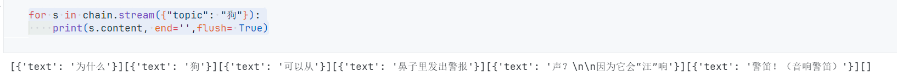

**invoke**

> 这个是直接等待生成完毕后才输出

```python
chain.invoke({"topic": "狗"})
```

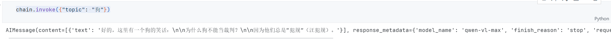

**Batch(并行)**

```python
chain.batch([{"topic": "狗"},{"topic": "猫"}])
```

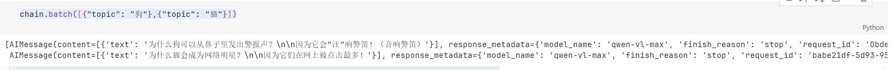

max_concurrency 可以控制并发数

```python
chain.batch([{"topic": "狗"}, {"topic": "猫"}, {"topic": "鸭"}], config={"max_concurrency": 2})
```

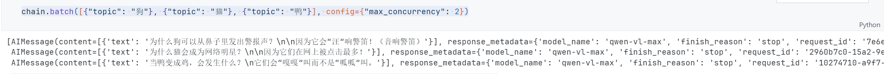

**Async Steam异步**

```python
async for s in chain.astream({"topic": "通义"}):
    print(s.content, end= '',flush= True)
```

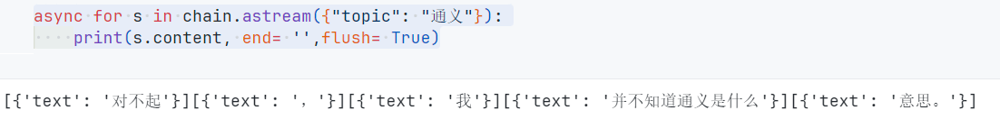

**Async invoke**

```python
await chain.ainvoke({"topic": "OpenAI"})
```

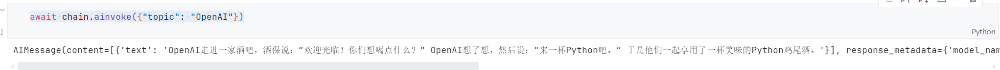

**Async Batch**

```python
await chain.abatch([{"topic": "鸡"},{"topic": "鸭"},{"topic": "鹅"}])
```

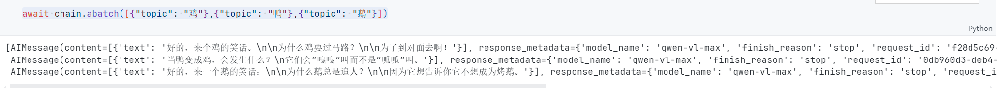

异步获取中间的步骤

```python
# 首先导入模块
from langchain_community.vectorstores import FAISS
from langchain_core.output_parsers import StrOutputParser
from langchain_core.runnables import RunnablePassthrough
from langchain_community.chat_models import ChatTongyi
from langchain.embeddings import HuggingFaceEmbeddings

template = """
    基于下面的上下文来回答问题:
    {context}

    Question:{question}
"""

prompt = ChatPromptTemplate.from_template(template)

vectorstore = FAISS.from_texts(
    ["德牧是我最喜欢的犬种,是牧羊犬"], embedding=HuggingFaceEmbeddings()
)
retriever = vectorstore.as_retriever()

retriever_chain = (
    {
        "context": retriever.with_config(run_name = "Docs"),
        "question": RunnablePassthrough()
    }
    | prompt
    | model
    | StrOutputParser()
)

async for chunk in retriever_chain.astream_log(
    "德牧是什么?", include_names=["Docs"]
):
    print("-"*40)
    print(chunk)
    print("-"*40)
```

```text
----------------------------------------
RunLogPatch({'op': 'replace',
  'path': '',
  'value': {'final_output': None,
            'id': '3885c1b0-dcdb-4046-a402-32e1621f82b8',
            'logs': {},
            'name': 'RunnableSequence',
            'streamed_output': [],
            'type': 'chain'}})
----------------------------------------
----------------------------------------
RunLogPatch({'op': 'add',
  'path': '/logs/Docs',
  'value': {'end_time': None,
            'final_output': None,
            'id': '096bd683-987e-4368-a570-78bf2c3347d8',
            'metadata': {},
            'name': 'Docs',
            'start_time': '2024-07-09T12:11:35.857+00:00',
            'streamed_output': [],
            'streamed_output_str': [],
            'tags': ['map:key:context', 'FAISS', 'HuggingFaceEmbeddings'],
            'type': 'retriever'}})
----------------------------------------
----------------------------------------
RunLogPatch({'op': 'add',
  'path': '/logs/Docs/final_output',
  'value': {'documents': [Document(page_content='德牧是我最喜欢的犬种,是牧羊犬')]}},
 {'op': 'add',
  'path': '/logs/Docs/end_time',
  'value': '2024-07-09T12:11:35.941+00:00'})
----------------------------------------
----------------------------------------
RunLogPatch({'op': 'add', 'path': '/streamed_output/-', 'value': '文档'},
 {'op': 'replace', 'path': '/final_output', 'value': '文档'})
----------------------------------------
----------------------------------------
RunLogPatch({'op': 'add', 'path': '/streamed_output/-', 'value': '中'},
 {'op': 'replace', 'path': '/final_output', 'value': '文档中'})
----------------------------------------
----------------------------------------
RunLogPatch({'op': 'add', 'path': '/streamed_output/-', 'value': '提到'},
 {'op': 'replace', 'path': '/final_output', 'value': '文档中提到'})
----------------------------------------
----------------------------------------
RunLogPatch({'op': 'add', 'path': '/streamed_output/-', 'value': '，德牧是一种牧'},
 {'op': 'replace', 'path': '/final_output', 'value': '文档中提到，德牧是一种牧'})
----------------------------------------
----------------------------------------
RunLogPatch({'op': 'add', 'path': '/streamed_output/-', 'value': '羊犬。'},
 {'op': 'replace', 'path': '/final_output', 'value': '文档中提到，德牧是一种牧羊犬。'})
----------------------------------------

```

```python
# 只看状态值的话是这样的
async for chunk in retriever_chain.astream_log(
    "德牧是什么?", include_names=["Docs"], diff= False
):
    print("-"*40)
    print(chunk)
    print("-"*40)
```

```text
output:
----------------------------------------
RunLog({'final_output': None,
 'id': '2e076ead-c41f-444f-972c-b74c4230d467',
 'logs': {},
 'name': 'RunnableSequence',
 'streamed_output': [],
 'type': 'chain'})
----------------------------------------
----------------------------------------
RunLog({'final_output': None,
 'id': '2e076ead-c41f-444f-972c-b74c4230d467',
 'logs': {'Docs': {'end_time': None,
                   'final_output': None,
                   'id': '4ac1fd4b-e8d2-4d96-8686-c91a295787bc',
                   'metadata': {},
                   'name': 'Docs',
                   'start_time': '2024-07-09T12:14:09.029+00:00',
                   'streamed_output': [],
                   'streamed_output_str': [],
                   'tags': ['map:key:context',
                            'FAISS',
                            'HuggingFaceEmbeddings'],
                   'type': 'retriever'}},
 'name': 'RunnableSequence',
 'streamed_output': [],
 'type': 'chain'})
----------------------------------------
----------------------------------------
RunLog({'final_output': None,
 'id': '2e076ead-c41f-444f-972c-b74c4230d467',
 'logs': {'Docs': {'end_time': '2024-07-09T12:14:09.109+00:00',
                   'final_output': {'documents': [Document(page_content='德牧是我最喜欢的犬种,是牧羊犬')]},
                   'id': '4ac1fd4b-e8d2-4d96-8686-c91a295787bc',
                   'metadata': {},
                   'name': 'Docs',
                   'start_time': '2024-07-09T12:14:09.029+00:00',
                   'streamed_output': [],
                   'streamed_output_str': [],
                   'tags': ['map:key:context',
                            'FAISS',
                            'HuggingFaceEmbeddings'],
                   'type': 'retriever'}},
 'name': 'RunnableSequence',
 'streamed_output': [],
 'type': 'chain'})
----------------------------------------
----------------------------------------
RunLog({'final_output': '文档',
 'id': '2e076ead-c41f-444f-972c-b74c4230d467',
 'logs': {'Docs': {'end_time': '2024-07-09T12:14:09.109+00:00',
                   'final_output': {'documents': [Document(page_content='德牧是我最喜欢的犬种,是牧羊犬')]},
                   'id': '4ac1fd4b-e8d2-4d96-8686-c91a295787bc',
                   'metadata': {},
                   'name': 'Docs',
                   'start_time': '2024-07-09T12:14:09.029+00:00',
                   'streamed_output': [],
                   'streamed_output_str': [],
                   'tags': ['map:key:context',
                            'FAISS',
                            'HuggingFaceEmbeddings'],
                   'type': 'retriever'}},
 'name': 'RunnableSequence',
 'streamed_output': ['文档'],
 'type': 'chain'})
----------------------------------------
----------------------------------------
RunLog({'final_output': '文档中',
 'id': '2e076ead-c41f-444f-972c-b74c4230d467',
 'logs': {'Docs': {'end_time': '2024-07-09T12:14:09.109+00:00',
                   'final_output': {'documents': [Document(page_content='德牧是我最喜欢的犬种,是牧羊犬')]},
                   'id': '4ac1fd4b-e8d2-4d96-8686-c91a295787bc',
                   'metadata': {},
                   'name': 'Docs',
                   'start_time': '2024-07-09T12:14:09.029+00:00',
                   'streamed_output': [],
                   'streamed_output_str': [],
                   'tags': ['map:key:context',
                            'FAISS',
                            'HuggingFaceEmbeddings'],
                   'type': 'retriever'}},
 'name': 'RunnableSequence',
 'streamed_output': ['文档', '中'],
 'type': 'chain'})
----------------------------------------
----------------------------------------
RunLog({'final_output': '文档中提到',
 'id': '2e076ead-c41f-444f-972c-b74c4230d467',
 'logs': {'Docs': {'end_time': '2024-07-09T12:14:09.109+00:00',
                   'final_output': {'documents': [Document(page_content='德牧是我最喜欢的犬种,是牧羊犬')]},
                   'id': '4ac1fd4b-e8d2-4d96-8686-c91a295787bc',
                   'metadata': {},
                   'name': 'Docs',
                   'start_time': '2024-07-09T12:14:09.029+00:00',
                   'streamed_output': [],
                   'streamed_output_str': [],
                   'tags': ['map:key:context',
                            'FAISS',
                            'HuggingFaceEmbeddings'],
                   'type': 'retriever'}},
 'name': 'RunnableSequence',
 'streamed_output': ['文档', '中', '提到'],
 'type': 'chain'})
----------------------------------------
----------------------------------------
RunLog({'final_output': '文档中提到，德牧是一种牧',
 'id': '2e076ead-c41f-444f-972c-b74c4230d467',
 'logs': {'Docs': {'end_time': '2024-07-09T12:14:09.109+00:00',
                   'final_output': {'documents': [Document(page_content='德牧是我最喜欢的犬种,是牧羊犬')]},
                   'id': '4ac1fd4b-e8d2-4d96-8686-c91a295787bc',
                   'metadata': {},
                   'name': 'Docs',
                   'start_time': '2024-07-09T12:14:09.029+00:00',
                   'streamed_output': [],
                   'streamed_output_str': [],
                   'tags': ['map:key:context',
                            'FAISS',
                            'HuggingFaceEmbeddings'],
                   'type': 'retriever'}},
 'name': 'RunnableSequence',
 'streamed_output': ['文档', '中', '提到', '，德牧是一种牧'],
 'type': 'chain'})
----------------------------------------
----------------------------------------
RunLog({'final_output': '文档中提到，德牧是一种牧羊犬。',
 'id': '2e076ead-c41f-444f-972c-b74c4230d467',
 'logs': {'Docs': {'end_time': '2024-07-09T12:14:09.109+00:00',
                   'final_output': {'documents': [Document(page_content='德牧是我最喜欢的犬种,是牧羊犬')]},
                   'id': '4ac1fd4b-e8d2-4d96-8686-c91a295787bc',
                   'metadata': {},
                   'name': 'Docs',
                   'start_time': '2024-07-09T12:14:09.029+00:00',
                   'streamed_output': [],
                   'streamed_output_str': [],
                   'tags': ['map:key:context',
                            'FAISS',
                            'HuggingFaceEmbeddings'],
                   'type': 'retriever'}},
 'name': 'RunnableSequence',
 'streamed_output': ['文档', '中', '提到', '，德牧是一种牧', '羊犬。'],
 'type': 'chain'})
----------------------------------------

```

**并行支持**

```python
from langchain_core.runnables import RunnableParallel

chain1 = ChatPromptTemplate.from_template("给我讲一个关于{topic}的唐诗") | model
chain2 = (
    ChatPromptTemplate.from_template("写两行关于{topic}的宋词")
    | model
)
combined = RunnableParallel(joke=chain1, poem=chain2)
```

```python
# 先来看单独运行的时间
# %%time
for s in chain1.stream({"topic": "李白"}):
    print(s.content, end='',flush= True)
```

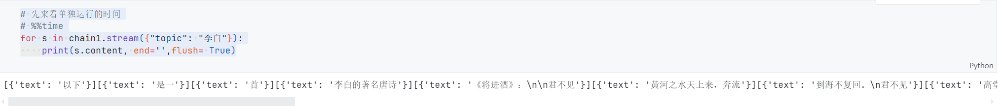

```python
for s in chain2.stream({"topic": "苏轼"}):
    print(s.content, end= '', flush= True)
```


```python
# 并行执行
combined.invoke({"topic": "李白或者苏轼"})
```

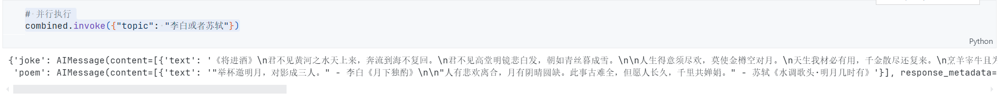

**并行批处理,适用大量生成**

```python
chain1.batch([{"topic": "李白"}, {"topic": "杜牧"}])
```

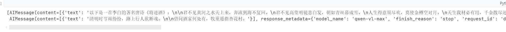

```python
chain2.batch([{"topic": "李白"}, {"topic": "杜牧"}])
```

并行处理

```python
# 并行处理
combined.batch([{"topic": "李白"}, {"topic": "杜牧"}])
```

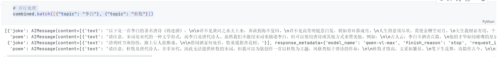

# 后续

这一部分就先到这里,篇幅原因再开一篇

***2024.07 --SouthAki ***
