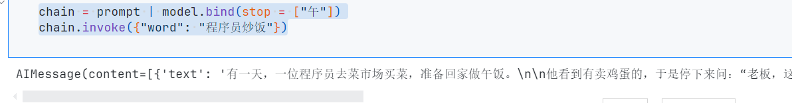
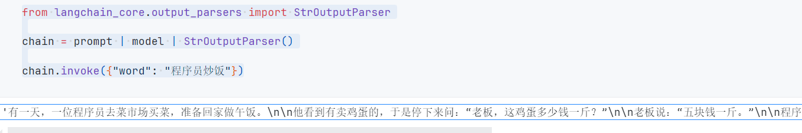
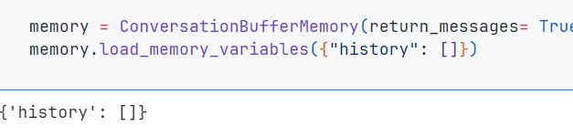

# Langchain

作者:`@xieleihan`[点击访问](https://github.com/xieleihan)

本文遵守GPL3.0开源协议

# 实现一个聊天机器人2

## `Prompt+LLM`

> 基本构成: PromptTemplate/ChatPromptTemplate -> LLM/chatModel -> Output

首先全局加载环境变量

```python
import os
from dotenv import find_dotenv, load_dotenv
# 加载 API key
load_dotenv(find_dotenv())
dashscope_api_key = os.getenv("DASHSCOPE_API_KEY")
serpapi_api_key = os.getenv("SERPAPI_API_KEY")
eleven_api_key = os.getenv("ELEVEN_API_KEY")
```
LCEL的Prompt+LLM,简单使用

```python
from langchain_core.prompts import ChatPromptTemplate
from langchain_community.chat_models import ChatTongyi

prompt = ChatPromptTemplate.from_template("请给我讲一个关于{word}的笑话")
model = ChatTongyi(
    model_name = "qwen-vl-max",
    temperature = 0,
    dashscope_api_key = dashscope_api_key
)

chain = prompt | model
chain.invoke({"word": "程序员炒饭"})
```


我们也可以设置自定义停止输出符

```python
chain = prompt | model.bind(stop = ["午"])
chain.invoke({"word": "程序员炒饭"})
```



兼容openai函数调用的方式

```python
functions = [
    {
        "name": "joke",
        "description": "讲笑话",
        "parameters": {
            "type": "object",
            "properties": {
                "setup": {"type": "string", "description": "笑话的开头"},
                "punchline": {
                    "type": "string",
                    "description": "爆梗的结尾",
                },
            },
            "required": ["setup", "punchline"],
        },
    }
]
chain = prompt | model.bind(function_call={"name": "joke"}, functions=functions)
```

测试一下

```python
chain.invoke({"word": "男人"}, config={})
```


## 输出解析器

```python
from langchain_core.output_parsers import StrOutputParser

chain = prompt | model | StrOutputParser()

chain.invoke({"word": "程序员炒饭"})
```



与函数调用混合使用

```python
from langchain.output_parsers.openai_functions import JsonOutputFunctionsParser

chain = (
    prompt
    | model.bind(function_call={"name": "joke"}, functions=functions)
    | JsonOutputFunctionsParser()
)

chain.invoke("What is the capital of France?")
```


**下面这个,需要搭配OpenAI,不然会报错**

```python
#只输出setup
from langchain.output_parsers.openai_functions import JsonKeyOutputFunctionsParser
from langchain_core.runnables import RunnableParallel, RunnablePassthrough

chain = (
    {"word": RunnablePassthrough()} #使用RunnablePassthrough()跳过prompt
    | prompt
    | model.bind(function_call={"name": "joke"}, functions=functions)
    | JsonKeyOutputFunctionsParser(key_name="punchline") # 定义输出的key
)

chain.invoke("女人")
```


## 使用Runnables来连接多链结构

```python
# 使用Runnables来连接多链结构
from operator import itemgetter

from langchain.schema import StrOutputParser
from langchain_core.prompts import ChatPromptTemplate
from langchain_community.chat_models import ChatTongyi

prompt1 = ChatPromptTemplate.from_template("{person}来自哪个城市?")
prompt2 = ChatPromptTemplate.from_template("{city}的省会或州是什么?请使用{language}来回答")

model =ChatTongyi(
    model_name = "qwen-vl-max",
    dashscope_api_key = dashscope_api_key,
    temperature = 0
)

chain1 = prompt1 | model | StrOutputParser()

chain2 = (
    {"city": chain1,"language": itemgetter("language")}
    | prompt2
    | model
    | StrOutputParser()
)

chain1.invoke({"person": "尼古拉斯特斯拉"})
```


我们也可以指定一下模型输出的语言

```python
# 使用Runnables来连接多链结构
from operator import itemgetter

from langchain.schema import StrOutputParser
from langchain_core.prompts import ChatPromptTemplate
from langchain_community.chat_models import ChatTongyi

prompt1 = ChatPromptTemplate.from_template("{person}来自哪个城市?")
prompt2 = ChatPromptTemplate.from_template("{city}的省会或州是什么?请使用{language}来回答")

model =ChatTongyi(
    model_name = "qwen-vl-max",
    dashscope_api_key = dashscope_api_key,
    temperature = 0
)

chain1 = prompt1 | model | StrOutputParser()

chain2 = (
    {"city": chain1,"language": itemgetter("language")}
    | prompt2
    | model
    | StrOutputParser()
)

# chain1.invoke({"person": "尼古拉斯特斯拉"})
chain2.invoke({"person": "尼古拉斯特斯拉", "language": "english"})
```


再举一个多链查询的荔枝

```python
from langchain_core.runnables import RunnablePassthrough
from langchain.schema import StrOutputParser

prompt1 = ChatPromptTemplate.from_template(
    "生成一个具有{attribute}属性的颜色,返回这个颜色的名字而不用做其他的事情"
)
prompt2 = ChatPromptTemplate.from_template(
    "什么水果是这个颜色的:{color},请直接只返回水果的名字,不用做其他事情"
)
prompt3 = ChatPromptTemplate.from_template(
    "哪个国家的国旗具有这个颜色:{color},请直接只返回国家名字,不用做其他事情"
)
prompt4 = ChatPromptTemplate.from_template(
    "有这个颜色的水果是{fruit},有这个颜色的国旗是{country}"
)

# 定义输出解析器
model_parser = model | StrOutputParser()

# 生成一个颜色
color_to_generator = {
    "attribute": RunnablePassthrough() | prompt1 | {"color": model_parser}
}

# 传递颜色变量给水果和国家生成器
color_to_fruit = {
    "color": color_to_generator["attribute"] | prompt2 | model_parser
}
color_to_country = {
    "color": color_to_generator["attribute"] | prompt3 | model_parser
}

# 组合生成问题
question_generator = (
    color_to_generator | {"fruit": color_to_fruit, "country": color_to_country} | prompt4
)

question_generator.invoke({"attribute": "热烈"})
```


## 唯物辩证链

一个唯物辩证链,就是一个问题分成两个分支分别处理,后面再合并起来

```python
planner = (
    ChatPromptTemplate.from_template("生成一个关于{input}的论点")
    | model
    | StrOutputParser()
    | {"base_response": RunnablePassthrough()}
)

arguments_for = (
    ChatPromptTemplate.from_template(
        "列出以下内容的优点或者积极方面:{base_response}"
    )
    | model
    | StrOutputParser()
)
arguments_against = (
    ChatPromptTemplate.from_template(
        "列出以下内容的缺点或者消极方面:{base_response}"
    )
    | model
    | StrOutputParser()
)
final_responder = (
    ChatPromptTemplate.from_messages(
        [
            ("ai", "{original_response}"),
            ("human", "积极:\n{result_1}\n消极:\n{result_2}"),
            ("human", "根据评论生成最终的回复")
        ]
    )
    | model
    | StrOutputParser()
)

chain = (
    planner
    | {
        "result_1": arguments_for,
        "result_2": arguments_against,
        "original_response": itemgetter("base_response"),
    }
    | final_responder
)

chain.invoke({"input": "如何评价计划生育?"})
```


# 实现一个简单的Agent

## 查询SQL

```python
from langchain_core.prompts import ChatPromptTemplate
from langchain.agents import create_sql_agent
from langchain.agents.agent_toolkits import SQLDatabaseToolkit
from langchain.sql_database import SQLDatabase

template = """
    Based on the table schema below, write a SQL query that would answer the user's question:
{schema}

Question: {question}
SQL Query:
"""
prompt = ChatPromptTemplate.from_template(template)
db = SQLDatabase.from_uri("sqlite:////Chinook.db")
db.get_table_info()

from langchain_core.output_parsers import StrOutputParser
from langchain_core.runnables import RunnablePassthrough
from langchain_community.chat_models import ChatTongyi

model = ChatTongyi(
    model_name = "qwen-vl-max",
    temperature = 0,
    dashscope_api_key = dashscope_api_key
)

def get_schema(_):
    return db.get_table_info()

sql_response = (
    RunnablePassthrough.assign(schema=get_schema) 
    | prompt
    | model.bind(stop = ["\nSQLResult:"])
    | StrOutputParser()
)
sql_response.invoke({"question":"How many employees are there?"})
```


```python
def run_query(query):
    print(query)
    return db.run(query)

template = """
    Based on the table schema below, question, sql query, and sql response, write a natural language response:
{schema}

Question: {question}
SQL Query: {query}
SQL Response: {response}
"""

prompt_response = ChatPromptTemplate.from_template(template)
full_chain = (
    RunnablePassthrough.assign(query=sql_response).assign(
        schema = get_schema,
        response = lambda x:(x["query"])
    )
    | prompt_response
    | model
    | StrOutputParser()
)

full_chain.invoke({"question": "How many artists are there?"})
```


## 自定义输出解析器

### Python编程助手

```python
# 首先依旧导入我们的模块
from langchain_core.output_parsers import StrOutputParser
from langchain_core.prompts import ChatPromptTemplate
from langchain_experimental.utilities import PythonREPL
from langchain_community.chat_models import ChatTongyi

template = """
    根据用户的需求帮助编写Python代码
    只需要返回Markdown格式的Python代码,比如:
    ```Python
    ...
    ```
"""

prompt = ChatPromptTemplate.from_messages(
    [
        ("system", template), ("human", "{input}")
    ]
)

model = ChatTongyi(
    model = "qwen-vl-max",
    temperature = 0,
    dashscope_api_key = dashscope_api_key
)

# 自定义解析,只返回JavaScript代码
def _sanitize_ouput(text: str):
    _,after = text.split("```Python")
    return after.split("```")[0]

# 定义链
chain = prompt | model | StrOutputParser()  | _sanitize_ouput | PythonREPL().run 

# 测试
chain.invoke({"input": "请帮我编写一个计算5的阶乘的Python代码"})
```

## LCEL:memory添加方式

```python
from operator import itemgetter

from langchain.memory import ConversationBufferMemory
from langchain_core.prompts import ChatPromptTemplate, MessagesPlaceholder
from langchain_core.runnables import RunnablePassthrough, RunnableLambda
from langchain_community.chat_models import ChatTongyi

model = ChatTongyi(
    model_name = "qwen-vl-max",
    dashscope_api_key = dashscope_api_key,
    temperature = 0
)

prompt = ChatPromptTemplate.from_messages(
    [
        ("system", "你是一个百科助手,你深知历史"),
        # MessagesPlaceholder是一个占位符
        MessagesPlaceholder(variable_name="history"),
        ("human", "{input}"),
    ]
)

memory = ConversationBufferMemory(return_messages= True)
memory.load_memory_variables({"history": []})
```



```python
# 增加一条链
chain = (
    RunnablePassthrough.assign(
        history = RunnableLambda(memory.load_memory_variables) | itemgetter("history")
    )
    | prompt
    | model
)

inputs = {"input": "你好,我是南秋SouthAki"}
response = chain.invoke(inputs)
response
```


```python
# 保存记忆
memory.save_context(inputs,{"output": response.content})
memory.load_memory_variables({})

```


```python
memory.save_context(inputs,{"output": response.content})
memory.load_memory_variables({})
inputs = {"input": "我叫什么名字?"}
response = chain.invoke(inputs)
response
```


## 使用Redis来实现长时记忆

> *****Redis**（Remote Dictionary Server）是一个使用[ANSI C](https://zh.wikipedia.org/wiki/ANSI_C)编写的支持[网络](https://zh.wikipedia.org/wiki/电脑网络)、基于[内存](https://zh.wikipedia.org/wiki/内存)、[分布式](https://zh.wikipedia.org/wiki/分布式缓存)、可选[持久性](https://zh.wikipedia.org/wiki/持久性)的[键值对存储数据库](https://zh.wikipedia.org/wiki/键值-值数据库)。根据月度排行网站DB-Engines.com的数据，Redis是最流行的键值对存储数据库。***[点击了解更多](https://zh.wikipedia.org/zh-cn/Redis)

首先安装一个包

```python
! pip install redis
```

```python
from langchain_community.chat_message_histories import RedisChatMessageHistory
from langchain_community.chat_models import ChatTongyi
from langchain_core.chat_history import BaseChatMessageHistory
from langchain_core.prompts import ChatPromptTemplate, MessagesPlaceholder
from langchain_core.runnables.history import RunnableWithMessageHistory

prompt = ChatPromptTemplate.from_messages(
    [
        ("system", "你是一个通用的人工智能助手,你深知许多知识"),
        MessagesPlaceholder(variable_name="history"),
        ("human", "{question}"),
    ]
)

chain = prompt | ChatTongyi(model_name = "qwen-vl-max",temperature = 0,dashscope_api_key = dashscope_api_key)
```

```python
chain_with_history = RunnableWithMessageHistory(
    chain,
    # 使用radis存储聊天记录
    lambda session_id: RedisChatMessageHistory(session_id,url="redis://localhost:6379/0"),
    input_messages_key = "question",
    history_messages_key = "history",
)
```

```python
# 每次调用都会保存聊天记录,需要有对应的session_id
chain_with_history.invoke(
    {"ability":"历史","question": "中国的六朝古都是哪里?十三朝古都是哪里?"},
    config={"configurable": {"session_id": "123"}}
)
```


```python
chain_with_history.invoke(
    {"ability":"历史","question": "中国的六朝古都是哪里?十三朝古都是哪里?"},
    config={"configurable": {"session_id": "123"}}
)
chain_with_history.invoke(
    {"ability": "历史", "question": "它有多少年?"},
    config= {"configurable": {"session_id": "123"}}
)
```


# LECL-agent实现

```python
# 首先导入模块
from langchain_community.chat_models import ChatTongyi
from langchain import hub
from langchain.agents import load_tools
from langchain.agents import create_openai_functions_agent # 不同的Agent有不同的调用方式
from langchain.agents import AgentExecutor

# 创建LLM
llm = ChatTongyi(
    temperature = 0,
    dashscope_api_key = dashscope_api_key,
    model_name = "qwen-vl-max"
)

# 定义agent的prompt
#https://smith.langchain.com/hub/hwchase17/openai-functions-agent 可以到这个网址看到我们的提示词模版
prompt = hub.pull("hwchase17/openai-functions-agent")

# 定义工具
tools = load_tools(["llm-math"], llm= llm)
# 创建agent
agent = create_openai_functions_agent(llm, tools, prompt)
# 定义agent的执行器,注意这里与老版本不同,不需要定义agent-tools或其他的参数
agent_executor = AgentExecutor(agent= agent, tools= tools, verbose= True)
agent_executor.invoke({"input": "你好"})
```


agent
- 中间步骤处理
- 提示词
- 模型配置(停止符必要的话)
- 输出解析器

```python
from langchain import hub
from langchain.agents import AgentExecutor, tool
# 这里我们让系统输出XML格式的文本
from langchain.agents.output_parsers import XMLAgentOutputParser
from langchain_community.chat_models import ChatTongyi

# 配置模型
model = ChatTongyi(
    model_name = "qwen-vl-max",
    temperature = 0,
    dashscope_api_key = dashscope_api_key
)

# 可用工具
# 这里我们模拟搜索的工具使用,使用注解
@tool
def search(query: str) -> str:
    """当需要了解最新的天气信息的时候才会使用这个工具。"""
    return "晴朗,32摄氏度,无风"
tool_list = [search]
tool_list
```


```python
#提示词模版
# https://smith.langchain.com/hub
# Get the prompt to use - you can modify this!
prompt = hub.pull("hwchase17/xml-agent-convo")
prompt
```

```text
output:
ChatPromptTemplate(input_variables=['agent_scratchpad', 'input', 'tools'], partial_variables={'chat_history': ''}, metadata={'lc_hub_owner': 'hwchase17', 'lc_hub_repo': 'xml-agent-convo', 'lc_hub_commit_hash': '00f6b7470fa25a24eef6e4e3c1e44ba07189f3e91c4d987223ad232490673be8'}, messages=[HumanMessagePromptTemplate(prompt=PromptTemplate(input_variables=['agent_scratchpad', 'chat_history', 'input', 'tools'], template="You are a helpful assistant. Help the user answer any questions.\n\nYou have access to the following tools:\n\n{tools}\n\nIn order to use a tool, you can use <tool></tool> and <tool_input></tool_input> tags. You will then get back a response in the form <observation></observation>\nFor example, if you have a tool called 'search' that could run a google search, in order to search for the weather in SF you would respond:\n\n<tool>search</tool><tool_input>weather in SF</tool_input>\n<observation>64 degrees</observation>\n\nWhen you are done, respond with a final answer between <final_answer></final_answer>. For example:\n\n<final_answer>The weather in SF is 64 degrees</final_answer>\n\nBegin!\n\nPrevious Conversation:\n{chat_history}\n\nQuestion: {input}\n{agent_scratchpad}"))])
```

## 中间步骤

```python
def convert_intermediate_steps(intermediate_steps):
    log = ""
    for action, observation in intermediate_steps:
        log += (
            f"<tool>{action.tool}</tool><tool_input>{action.tool_input}"
            f"</tool_input><observation>{observation}</observation>"
        )
    return log

# 将工具插入到模版中
def convert_tools(tools):
    return "\n".join([f"{tool.name}: {tool.description}" for tool in tools])
```

```python
agent = (
    {
        "input": lambda x: x["input"],
        "agent_scratchpad": lambda x: convert_intermediate_steps(
            x["intermediate_steps"]
        ),
    }
    | prompt.partial(tools=convert_tools(tool_list))
    | model.bind(stop=["</tool_input>", "</final_answer>"])
    | XMLAgentOutputParser()
)

agent
```

```text
output:
{
  input: RunnableLambda(...),
  agent_scratchpad: RunnableLambda(...)
}
| ChatPromptTemplate(input_variables=['agent_scratchpad', 'input'], partial_variables={'chat_history': '', 'tools': 'search: 当需要了解最新的天气信息的时候才会使用这个工具。'}, metadata={'lc_hub_owner': 'hwchase17', 'lc_hub_repo': 'xml-agent-convo', 'lc_hub_commit_hash': '00f6b7470fa25a24eef6e4e3c1e44ba07189f3e91c4d987223ad232490673be8'}, messages=[HumanMessagePromptTemplate(prompt=PromptTemplate(input_variables=['agent_scratchpad', 'chat_history', 'input', 'tools'], template="You are a helpful assistant. Help the user answer any questions.\n\nYou have access to the following tools:\n\n{tools}\n\nIn order to use a tool, you can use <tool></tool> and <tool_input></tool_input> tags. You will then get back a response in the form <observation></observation>\nFor example, if you have a tool called 'search' that could run a google search, in order to search for the weather in SF you would respond:\n\n<tool>search</tool><tool_input>weather in SF</tool_input>\n<observation>64 degrees</observation>\n\nWhen you are done, respond with a final answer between <final_answer></final_answer>. For example:\n\n<final_answer>The weather in SF is 64 degrees</final_answer>\n\nBegin!\n\nPrevious Conversation:\n{chat_history}\n\nQuestion: {input}\n{agent_scratchpad}"))])
| RunnableBinding(bound=ChatTongyi(client=<class 'dashscope.aigc.multimodal_conversation.MultiModalConversation'>, model_name='qwen-vl-max', dashscope_api_key=SecretStr('**********')), kwargs={'stop': ['</tool_input>', '</final_answer>']})
| XMLAgentOutputParser()
```

# 一个比较复杂的agent

- 工具

- 检索增强RAG

- 记忆

```python
#定义工具
import os

os.environ["SERPAPI_API_KEY"] = ""
# Import things that are needed generically
from langchain.pydantic_v1 import BaseModel, Field
from langchain.tools import BaseTool, StructuredTool, tool
from langchain_community.utilities import SerpAPIWrapper

@tool
def search(query: str) -> str:
    """当需要查找实时信息的时候才会使用这个工具."""
    serp = SerpAPIWrapper()
    return serp.run(query)

print(search.name)
print(search.description)
print(search.args)
search("北京今天的天气如何?")
```


```python
#RAG增强生成
from langchain.text_splitter import RecursiveCharacterTextSplitter
from langchain_community.document_loaders import WebBaseLoader
from langchain_community.vectorstores import FAISS
from langchain.embeddings import HuggingFaceEmbeddings

loader = WebBaseLoader("https://docs.smith.langchain.com/user_guide")
docs = loader.load()
print(f"Loaded {len(docs)} documents")
documents = RecursiveCharacterTextSplitter(
    chunk_size=1000, chunk_overlap=200
).split_documents(docs)
vector = FAISS.from_documents(documents, HuggingFaceEmbeddings())
retriever = vector.as_retriever()
```


```python
# 搜索匹配的文档块
retriever.get_relevant_documents("如何debug?")[0]
```


```python
# 把检索工具加入到工具中
from langchain.tools.retriever import create_retriever_tool
retriever_tool = create_retriever_tool(
    retriever,
    "langsmith_search",
    "搜索有关LangSmith的信息,关于LangSmith的问题,你一定要使用这个工具!"
)
retriever_tool
```


```python
# 可用工具集
tools = [search,retriever_tool]
tools
```


```python
# 定义模型
from langchain_community.chat_models import ChatTongyi
llm = ChatTongyi(
    model_name = "qwen-vl-max",
    dashscope_api_key = dashscope_api_key,
    temperature = 0
)

# 从hub中获取模版
from langchain import hub
# 一个最简单的模版,带记忆
prompt = hub.pull("hwchase17/openai-functions-agent")
prompt.messages
```


```python
# 创建AGENT
from langchain.agents import create_openai_functions_agent
agent = create_openai_functions_agent(llm, tools, prompt)
# 创建agent执行器AgentExecutor
from langchain.agents import AgentExecutor
agent_exceutor = AgentExecutor(agent= agent, tools= tools, verbose= True)

# 执行
agent_exceutor.invoke({"input": "Hi! I am SouthAki"})
```


```python
# 提出问题
agent_exceutor.invoke({"input": "langsmith如何帮助做项目测试?"})
# 实时信息提问
agent_exceutor.invoke({"input": "北京今天天气咋样?"})
# 前面的交互都不带记忆
agent_exceutor.invoke({"input": "前面我们都聊了什么话题?"})
```


```python
# 交互时添加记忆
agent_exceutor.invoke({"input": "Hi, I am SouthAki","chat_history": []})
```


```python
# 手动构造记忆数据
from langchain_core.messages import AIMessage, HumanMessage
agent_exceutor.invoke(
    {
        "chat_history":[
            HumanMessage(content= "hi!I I am SouthAki"),
            AIMessage(content= "Hello,SouthAki.nice to meet you!I am a aliyun tongyiModel")
        ],
        "input": "what is my name?"
    }
)
```


```python
# 使用RunnableWithMessageHistory自动构造记忆数据
from langchain_community.chat_message_histories import ChatMessageHistory
from langchain_core.runnables.history import RunnableWithMessageHistory
message_history = ChatMessageHistory()

agent_with_history = RunnableWithMessageHistory(
    agent_exceutor,
    # 注意此处的session_id没有用到,因为在这里我没使用redis的存储,只是用了一个变量
    lambda session_id: message_history,
    input_messages_key="input",
    history_messages_key= "chat_history"
)

# 调用方式
agent_with_history.invoke(
    {"input": "hi! 我是冰糖红茶"},
    config={
        "configurable": {"session_id": "foo_001"}
    }
)
```


```python
input_messages = {"role": "user",
    "content": "我叫什么名字?"}
agent_with_history.invoke(
    {"input": input_messages},
    #注意此处session_id没有用到，因为我们没用类似redis的存储,只是用了一个变量
    config={"configurable": {"session_id": "foo_001"}},
)
#调用方式
agent_with_history.invoke(
    {"input": "LangSmith如何使用?"},
    #注意此处session_id没有用到，因为我们没用类似redis的存储,只是用了一个变量
    config={"configurable": {"session_id": "foo_001"}},
)
#调用方式
agent_with_history.invoke(
    {"input": "截止目前我们都聊了什么?"},
    #注意此处session_id没有用到，因为我们没用类似redis的存储,只是用了一个变量
    config={"configurable": {"session_id": "foo_001"}},
)
```

